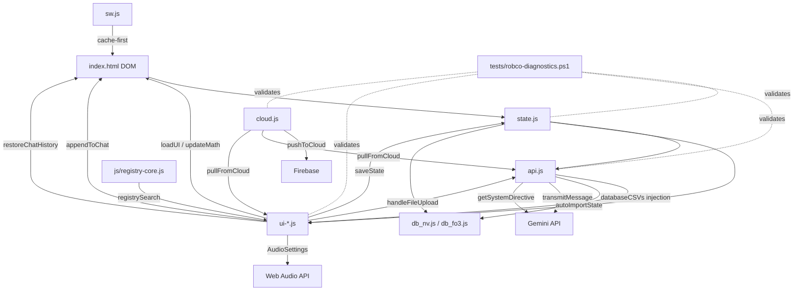

# RobCo U.O.S. — System Architecture

> **Version:** 2.7.0
> **Last Updated:** 2026-07-06
> **Purpose:** Living reference for any engineer (human or AI) working on this project.
> This document maps every system, its dependencies, its persistence contract, and the
> historical lessons that shaped it.

---

## Table of Contents

1. [Project Philosophy](#project-philosophy)
2. [File Map](#file-map)
3. [Script Load Order & Globals](#script-load-order--globals)
   3a. [Per-Game Identity Block](#per-game-identity-block-game_defsctxidentity--design-overhaul-do-k)
   3b. [Bezel Chrome + Subsystem Nav](#bezel-chrome--subsystem-nav-indexhtml--csstermincalcss--jsui-corejs--design-overhaul-do-n)
   3c. [Director Uplink — the Living Overseer](#director-uplink--the-living-overseer-jsui-corejs--jsapijs--csstermincalcss--design-overhaul-do-o)
4. [State Architecture](#state-architecture)
5. [Persistence Lifecycle](#persistence-lifecycle)
6. [Save/Load/Sync Contract](#saveloadsync-contract)
7. [AI Integration Pipeline](#ai-integration-pipeline)
8. [Audio System](#audio-system)
9. [UI Rendering Pipeline](#ui-rendering-pipeline)
10. [Time System](#time-system)
11. [Faction System](#faction-system)
12. [Undo System](#undo-system)
13. [Settings & localStorage Keys](#settings--localstorage-keys)
14. [System Dependency Map](#system-dependency-map)
15. [Historical Lessons](#historical-lessons)
16. [Service Worker Cache Protocol](#service-worker-cache-protocol)
17. [Adding a New State Field (Checklist)](#adding-a-new-state-field-checklist)
18. [Adding a New Audio Source (Checklist)](#adding-a-new-audio-source-checklist)
19. [Adding a New UI Panel (Checklist)](#adding-a-new-ui-panel-checklist)

---

## Project Philosophy

- **Stability > Features.** A healthy codebase is worth more than a feature-rich broken one.
- **Extend, don't rewrite.** Every rewrite in this project's history introduced new bugs.
- **Immersion is a feature.** The terminal must _feel_ like a real CRT machine — audio, visual effects, and timing matter.
- **One system per concern.** One state object, one save function, one import function, one UI render entry point.
- **Browser-native.** No build step, no framework, no bundler for production. Vanilla HTML/CSS/JS with `<script>` tags.

---

## File Map

```
├── index.html          ~55KB  DOM structure + all inline event handlers
├── css/terminal.css    ~16KB  All styling, animations, CRT effects
├── js/
│   ├── idb.js          ~4KB   Async IndexedDB durability engine — window.IdbStore, two object stores (meta/campaign)
│   ├── state.js        7.6KB  State definition, persistence, migration
│   ├── api.js          36.5KB System directive, autoImportState, transmitMessage
│   ├── ui-audio.js     ~16KB  Audio engine (geiger, tinnitus, CRT hum, boot/level-up sounds)
│   ├── ui-render.js    ~30KB  All render* functions, CRUD helpers, faction/map/time utilities
│   ├── ui-saves.js     ~14KB  Save slots, file import/export, rolling backups, registry autocomplete
│   ├── ui-account.js   ~3KB   Account panel, cloud save picker, undo-sync
│   ├── runtime.js      ~9KB   Ambient Runtime — lifecycle state machine + one heartbeat + observer registry (Phase 2 A1)
│   ├── ui-core.js      ~43KB  Core UI lifecycle, appendToChat, loadUI, updateMath
│   ├── test-console.js ~5KB   Developer Console — the canonical dev/debug console (Phase 2), gated by _devConsoleUnlocked()
│   ├── cloud.js        3.6KB  Firebase push/pull (ES module)
│   ├── registry-core.js ~3KB  Read-only registry engine — FALLOUT_REGISTRY + registrySearch()
│   ├── reg_nv.js       ~87KB  FNV registry data (perks/quests/locations/collectibles/traits/magazines)
│   ├── reg_fo3.js      ~46KB  FO3 registry data (perks/quests/locations/bobbleheads/Lincoln memorabilia)
│   ├── db_nv.js        ~54KB  FNV CSV data (weapons, armor, chems, vendors) + lookupItemInDb()
│   └── db_fo3.js       ~34KB  FO3 CSV data (weapons, armor, chems, vendors) + lookupItemInDb()
├── sw.js               2.0KB  Service worker (cache-first for same-origin)
├── tests/
│   ├── robco-diagnostics.ps1   28KB    2494-test pre-commit audit
│   ├── robco-diagnostics.js    36KB    2494-test Node runner (parity with .ps1)
│   ├── boot-smoke.mjs          CI boot smoke test (zero console errors, booted state)
│   ├── render-check.mjs        Mobile overflow check at 360px and 412px
│   └── run-tests.bat           (Batch launcher)
├── scripts/
│   ├── pre-commit              Versioned pre-commit hook source (installed by prepare)
│   ├── install-hooks.js        Copies pre-commit hook into .git/hooks on npm install
│   └── rollback.sh             Protocol 16 one-command hotfix rollback
├── CHANGELOG.md        ~74KB  Full version history
├── assets/              68KB  PWA icon + app-shortcut icons
├── manifest.json       592B   PWA manifest
└── ARCHITECTURE.md     THIS FILE
```

---

## Script Load Order & Globals

Scripts are loaded via `<script>` tags in `index.html` in this exact order:

```
   ── Static durability engine (index.html, before the boot manifest) ──
0. js/idb.js        → defines: window.IdbStore (async IndexedDB KV engine; two object stores
                       'meta' + 'campaign' so the two-store boundary is structural in IndexedDB).
                       Step 2 · Phase 1 · P1 durability shadow: MetaStore's set/remove mirror
                       device-pref writes here fire-and-forget; localStorage stays the sole READ
                       authority. No-ops if IndexedDB is unavailable/blocked/quota-full — the app
                       is byte-identical without it (migration-safety). Loaded before state.js so
                       MetaStore's write-through has window.IdbStore. getRaw() returns the full
                       { value, schemaVersion, checksum, mt } envelope for P2's checksum verify.

   P2 (device-pref boot hydration/reconciliation, js/ui-core.js): window.onload is `async` and
   `await`s _hydrateMetaFromIdb() BEFORE the rest of boot reads any device preference. It
   reconciles the 'meta' store against localStorage under a strict AUTHORITY RULE — localStorage is
   the source of record: a present localStorage value always wins; the sole exception is RECOVERY
   (a registered device key IndexedDB has but localStorage is MISSING is restored, and only if its
   stored checksum re-verifies — corrupt records are skipped). BACKFILL mirrors any registered
   device key localStorage has but IDB lacks into IDB (IDB-only). Both directions are gated on
   MetaStore.has() so only registered device keys are ever touched (two-store boundary; the
   'campaign' store is untouched — reserved for a later unit). The await is BOUNDED
   (Promise.race vs _META_HYDRATE_BUDGET_MS): normal boots resolve in ~0ms (the connection opened
   at page-parse time), and a slow/hung IndexedDB is capped so boot proceeds on localStorage
   exactly as today (fail-safe — never hangs, never black-screens).

   P3 (cold-store IDB-primary, js/state.js accessors): save slots + rolling backups live
   IDB-PRIMARY in the 'campaign' object store (keys slot_<n> / backup_<n>) with localStorage
   (robco_slot_<n> / robco_backup_<n>) kept as a synchronous MIRROR + FALLBACK — this is the ~5MB
   ceiling relief (a save too large for localStorage still persists to IDB; a localStorage quota
   failure is no longer fatal). `_coldWriteObj` writes IDB-primary + best-effort localStorage
   (succeeds if EITHER store accepts it); `_coldReadObj` returns the NEWER of {IDB, localStorage}
   by _coldStamp (savedAt/timestamp; IDB wins ties) so a partial-write divergence can never
   surface a stale save. saveToSlot/loadFromSlot and the cloud slot-upload route through these;
   snapRollingBackup mirrors each ring slot into IDB; restoreRollingBackup reads the IDB-primary
   union via getRollingBackupsAsync (the sync getRollingBackups stays localStorage-only for UI
   gate checks). `_migrateColdStoreToIdb` (fire-and-forget at boot) copies existing localStorage
   cold-store into IDB — ADDITIVE + IDEMPOTENT: copies only when IDB is absent or localStorage is
   strictly newer, and NEVER removes a localStorage copy (conservative — it stays a fallback), so
   an interrupted run resumes safely and union reads find every save regardless of progress.
   Two-store boundary held: cold store uses ONLY the 'campaign' object store; device prefs (P1/P2)
   stay in 'meta'.

   P5 (save version history, js/state.js accessors + js/ui-saves.js UI): each save slot retains up
   to SLOT_VERSION_CAP (5) prior revisions in the 'campaign' object store under key
   slot_<n>_versions (an array, newest-first) — IDB-ONLY (never mirrored to localStorage) so it
   rides the P3 IndexedDB headroom and can never consume the ~5MB localStorage ceiling. saveToSlot
   captures the slot's PRIOR contents (via _coldReadObj) with pushSlotVersion BEFORE overwriting;
   readSlotVersions returns the ring newest-first. The saves list (renderSavesList) shows a VER
   button only when IndexedDB is present AND the slot has ≥1 revision; viewSlotVersions lists them
   in the shared modal and restoreSlotVersion restores one — DESTRUCTIVE → confirm-gated (Protocol
   34), routed through the SAME _applySlotEnvelope core loadFromSlot uses (Protocol 22:
   verifySaveEnvelope integrity check + snapRollingBackup-before-apply + migrateState). FAIL-SAFE:
   no IndexedDB → readSlotVersions returns [], no VER affordance, and save/load is byte-identical to
   pre-P5. Two-store boundary held (version data is campaign data → 'campaign' store only).

   P6 (full backup bundle, js/state.js data layer + js/ui-saves.js UI): EXPORT FULL BACKUP writes the
   user's ENTIRE local history to one portable file — the live campaign container (robco_v8) + every
   save slot (each with its P5 version ring) + the rolling-backup ring + chat + playstyle. The
   envelope is version-stamped and checksummed with the SAME computeSaveChecksum helper as every other
   save (Protocol 22 — no forked hash); the checksum covers {robco_v8, slots, backups} + chat +
   playstyle. The bundle carries campaign/save data ONLY — device prefs (the 'meta' store / MetaStore
   keys) are deliberately EXCLUDED, so the two-store boundary holds (Protocol 23). buildFullBundle /
   verifyBundleChecksum / isValidBundleShape / _writeImportedContainer / applyBundleData are the
   data-layer functions (state.js); exportFullBundle / importBundle are the UI wrappers (ui-saves.js).
   IMPORT: handleFileUpload auto-detects a bundle (parsed.bundle === true) and routes it to
   importBundle, which is DESTRUCTIVE → confirm-gated (Protocol 34, "RESTORE ALL"). It rejects a
   bad-shape or bad-checksum bundle up front with a clear in-terminal error and NO partial apply; a
   future-version bundle prompts a force-restore confirm (reusing verifySaveEnvelope). On apply it takes
   a rolling backup of the CURRENT state first (the undo point), then restores the live container via
   the shared _writeImportedContainer core (the SAME path handleFileUpload uses) and rewrites each save
   slot VERBATIM (preserving each envelope's own checksum so a later normal load still verifies) with
   its version ring. The bundle's rolling-backup ring is exported for completeness but is NOT
   re-injected over the live 3-slot ring on import — that ring must hold the fresh undo snapshot, and it
   is a device-local ephemeral safety net, not primary portable data. FAIL-SAFE: export reads through
   the IDB-primary accessors, so with no IndexedDB it simply exports whatever localStorage holds
   (version rings empty), and import degrades to localStorage writes.

   P7 (offline cloud-push queue, js/state.js data layer + js/cloud.js orchestration): resilience for a
   USER-INITIATED manual cloud push ONLY — it NEVER auto-pushes on a state/stat change (cloud sync
   stays manual-only; guarded by Suite 23.4/23.5 + Suite 144.11). When the user taps SAVE TO CLOUD
   while offline (navigator.onLine === false) or the push fails with a connectivity error
   (_isOfflineError), THAT push is enqueued and flushed automatically when connectivity returns — the
   only thing that becomes automatic is the RETRY of an action the user already chose. The queue is
   device-local, bounded (CLOUD_QUEUE_CAP), deduped by contentHash (the same push queued twice can't
   multiply), and lives IDB-ONLY in the 'campaign' object store (key cloud_queue) because each item
   carries a campaign save payload — boundary-correct (Protocol 23), never the 'meta' device store.
   Data layer (state.js): readCloudQueue / enqueueCloudPush / writeCloudQueue. Orchestration (cloud.js):
   a single additive uploader _uploadSaveDoc (addDoc — never setDoc; Protocol 22/34) is reused by BOTH
   the direct manual push and flushCloudQueue, so there is one uploader. flushCloudQueue is triggered by
   the browser 'online' event and on sign-in (onAuthStateChanged) — never by a save path — and applies
   every guard the manual button uses: the offlineQueue kill-switch flag (Protocol 32/33, remotely
   disable-able via /config/flags), a non-anonymous auth check, an online check, a per-tab reentrancy
   flag, and uid-scoping (a queued push is stamped with the account that created it, so a different
   account signing in never flushes the previous user's queue). An item that uploads or is already in
   the cloud (contentHash duplicate) is dropped from the queue; a network failure stops the flush and
   re-persists the remaining items (bounded retry — never lost, never duplicated). FAIL-SAFE: no
   IndexedDB / kill-switch off → the queue isn't offered and a manual push behaves exactly as today
   (fails/no-ops offline). Airplane-mode operation is unaffected.

   P8 (Global Immersion dial, js/state.js gate helpers + js/ui-core.js UI): ONE device-level control
   governing how much of the atmosphere/immersion layer runs — Full / Balanced / Minimal. It is a
   DEVICE PREFERENCE (MetaStore key robco_immersion, registered in META_MANIFEST, default 'full') —
   NOT campaign state, so it never rides the campaign save/cloud (two-store boundary, Protocol 23),
   exactly like the audio mutes and optics. This is a BORN-COMPLIANT SEAM (roadmap J-6): the gate
   helpers are what the ~10 ambient consumers (Ambient Runtime, radio, weather, idle behaviors, …)
   will subscribe to in Phase 2 — those consumers do NOT exist yet; P8 only establishes the control +
   pref + helper. GATE-HELPER API (state.js, on window): getImmersionTier() → 'full'|'balanced'|
   'minimal' (fail-safe to 'full'); immersionAllows(requiredTier) → true iff rank(current) >=
   rank(requiredTier) (tiers ascend minimal<balanced<full; an unknown requirement fails open);
   setImmersionTier(tier) → persist the validated level (MetaStore only). A feature declares the
   MINIMUM level at which it runs. Default 'full' = everything runs = today's behavior. The DOM control
   (a Full/Balanced/Minimal <select> in Security & Configuration + a status readout + the boot restore
   via initImmersion) lives in ui-core.js. PROOF-OF-SEAM: the periodic memory-cycle flash
   (_startMemCycle, ui-core.js) is the one existing ambient behavior wired to the dial — it requires
   'balanced', so it runs at Full/Balanced and goes quiet at Minimal (a no-op at the default). Game-
   agnostic (Protocol 38). No pre-paint apply is needed (the dial gates ambient behaviors, not the base
   visual palette), so a normal boot restore suffices.

   P9 (SAVES LIST overhaul — local DELETE, cloud VERSION HISTORY, per-game filter, js/ui-saves.js +
   js/ui-account.js + js/cloud.js): local slots gain a confirm-gated DELETE (confirmDeleteSlot /
   _deleteSlotApply, ui-saves.js) that removes the localStorage mirror, the IDB-primary slot_<n> entry
   (P3), and the slot's P5 version ring together, so a deleted slot leaves nothing orphaned. Cloud saves
   gain their OWN version history, mirroring the local P5 ring but translated to Firestore's structural
   equivalent: an ADDITIVE subcollection users/{uid}/saves/{docId}/versions (never an embedded array
   field on the parent doc — a single Firestore document is capped at 1MB, and stacking several full
   campaign+chat snapshots into one doc could approach that ceiling). _pushCloudSaveVersion (cloud.js)
   archives the save's PRIOR contents via addDoc (Protocol 34) before every overwriteCloudSave() write,
   then prunes beyond CLOUD_SLOT_VERSION_CAP (5) via deleteDoc, oldest-first — system retention of its
   own auto-created backups, not a user-initiated destructive action, mirroring the local ring's silent
   `.slice(0, SLOT_VERSION_CAP)` cap. The resulting count is stamped as `versionCount` onto the SAME
   updateDoc write, so the SAVES LIST can gate the VER button with no extra read per save (mirrors the
   local versionCounts gate — no button until a save has ≥1 retained revision). window.listCloudSaveVersions
   / window.restoreCloudSaveVersion (cloud.js) mirror readSlotVersions/restoreSlotVersion's contract:
   fail-safe (return [] on any error/disabled/signed-out), confirm-gated (Protocol 34), and
   sanitizeImportedContainer + migrateState before applying — restoring a version replaces the LOCAL
   campaign only, never rewrites the cloud doc itself. viewCloudSaveVersions (ui-saves.js) mirrors
   viewSlotVersions's shared-modal shape exactly (Protocol 22 — no parallel viewer). deleteCloudSave now
   purges a save's version subcollection before deleting the parent doc, since Firestore does not
   cascade-delete subcollections. Separately, renderSavesList() filters BOTH local slots and cloud saves
   to the ACTIVE game (getGameContext()), degrading to SHOW — never hide — a save with no recorded
   gameContext (an older save predating that field); the empty state distinguishes "no archives for the
   active game" from "no archives on file". The row markup moved from per-row inline styles to
   .save-row/.save-row-label/.save-row-actions CSS classes, with .save-row-actions using flex-wrap so a
   growing LOAD/OVERWRITE/VER/DELETE(/NAME) button set wraps instead of clipping at 360/412px.

   ── Per-game boot manifest (GAME_FILES in index.html; order preserved via script.async = false) ──
1. js/db_nv.js / js/db_fo3.js → defines: databaseCSVs, lookupItemInDb (game-specific CSV data;
                       the active pair is selected by the GAME_FILES manifest, FNV fail-safe)
2. js/state.js      → defines: state, chatHistory, APP_VERSION, GAME_DEFS, FACTION_REGISTRY,
                       SKILL_KEYS, saveState, syncStateFromDom, generateSyncPayload,
                       exportSaveFile, migrateState (game-time helpers live in ui-render.js)
3. js/reg_nv.js / js/reg_fo3.js + js/registry-core.js → defines: FALLOUT_REGISTRY
                       (read-only game data) + registrySearch() (autocomplete search engine)
4. js/ui-audio.js   → defines: audioCtx, all audio functions (geiger/tinnitus/CRT hum,
                       limb/wake/boot/level-up sounds, runBootSequence,
                       triggerPhosphorGhost, changeOpticsColor)
5. js/ui-render.js  → defines: all render*() functions, CRUD helpers (addItem/delItem,
                       addAmmo/removeAmmo, addPerk/removePerk, etc.), FACTION_THRESHOLDS,
                       getFactionStanding, adjustFaction, game-time helpers
                       (ticksToGameTime/_resolveGameDateTime/formatGameTime/getGameDate),
                       map helpers (setMapView/zoomMapToZone/renderWorldMap),
                       _updateContextPanels, _invFilter, setInvFilter
6. js/ui-saves.js   → defines: SLOT_NAMES, saveToSlot, loadFromSlot, handleFileUpload,
                       exportCampaignLog, restoreRollingBackup, restoreChatHistory,
                       initRegistryAutocomplete (wireInput), initAmmoDatalist,
                       addQuest, triggerFileInput, triggerImageUpload
7. js/ui-account.js → defines: renderAccount, renderCloudSavePicker, undoLastSync
8. js/runtime.js    → defines: window.AmbientRuntime, window.initAmbientRuntime
                       (loaded before ui-core.js; top level defines only — see Ambient Runtime below)
9. js/ui-core.js    → defines: AudioSettings, appendToChat, loadUI, updateMath, etc.
10. js/test-console.js → defines: window.initTestConsole (loaded after ui-core.js — needs
                       _isStagingEnv; gated by _devConsoleUnlocked(), no-ops until unlocked —
                       see Developer Console below)
11. js/api.js       → defines: autoImportState, transmitMessage, fetchAuthorizedModels
12. js/cloud.js     → loaded as <script type="module"> (ES import from Firebase CDN)
                       attaches: window.pushToCloud, window.pullFromCloud
```

**Critical constraint:** Because these are `<script>` tags (not modules), all globals are shared
in the window scope. The ESLint config (`eslint.config.mjs`) declares every cross-file global
to prevent no-undef errors.

`cloud.js` is the **only** ES module — it uses `import` from the Firebase CDN. It attaches
its exports to `window.*` for the other scripts to call.

**Firebase SDK loading:** `cloud.js` imports the Firebase SDK from version-pinned gstatic CDN URLs (`https://www.gstatic.com/firebasejs/12.15.0/...`). The version pin is the primary supply-chain mitigation — updates are always deliberate, never floating to `latest`. SRI (`integrity=`) cannot be applied to ES module `import` statements in JavaScript source (no HTML element to attach the attribute to), so the pin is the only available guard. **Self-hosting was evaluated and deferred (v2.0.1-r65):** all App Check and reCAPTCHA calls must still reach gstatic/google, so self-hosting the SDK removes zero CSP origins and gains nothing for the current zero-build-step architecture. Revisit only if Firebase ships a bundleable single-origin SDK or the project adopts a build step.

**Auth (Phase 5c-i/ii):** `cloud.js` signs in anonymously on every boot (non-fatal; app stays usable offline). Firebase Auth is tracked via `onAuthStateChanged`; the current `uid` routes all Firestore reads/writes to `users/{uid}/saves/main`. Phase 5c-ii adds Google sign-in: `window.signInWithGoogle()` links the anonymous session to a Google account via popup on all platforms (redirect was removed — iOS/Android storage partitioning blocked the cross-origin iframe used to retrieve the credential, so `getRedirectResult` always returned null on mobile); `window.signOutAccount()` signs out then re-signs in anonymously; `getRedirectResult` is still called at boot to drain any in-flight redirect from a previously cached client before the anon-fallback guard runs; and `auth/credential-already-in-use` collisions fall back to `signInWithCredential`. Boot sequence is a single sequential async IIFE: `await getRedirectResult` → `await authStateReady` → anon fallback if no user. The ACCOUNT panel (`#accountPanel`, `data-tab="settings"` since the Step 2 v2.8.0 Settings-tab unit) shows sign-in status and the sign-in/sign-out button. Push to production is gated on the owner enabling the Google provider in the Firebase console.

**Dynamic ACCOUNT status words (SU-4, Step 2 v2.8.0):** `renderAccount()` (`js/ui-account.js`) paints the REG PORT / Operator Registry board entirely from live state — `window.getAccountState()`, `isFeatureEnabled('googleSignIn')`, and the SAME `_isUplinkConnected()` carrier signal the UPLINK lamp/bezel telemetry/SYSTEM STATUS panel already read (Protocol 22 — no second `navigator.onLine` check) — across four conditions (signed-out×googleSignIn-on/off, signed-in×carrier-connected/disconnected). A collapsed-state summary line (`#acctSummaryStatus`, `.panel-substatus`) sits in the panel's `<summary>` so the state reads even while collapsed. `renderAccount()` is called from `refreshOverseerCarrier()` — the same connection choke point that drives `_updateUplinkLamp()`/`_refreshBezelTelemetry()`/`renderSystemStatus()` — so none of those readouts can disagree; it's also called from `loadUI()` at boot and from the three sign-in/out/collision call sites in `cloud.js`. The summary line is set via `.textContent` (not parsed as HTML), so its name/email separator is the literal Unicode `·` character, never the `&middot;` entity used inside the `.innerHTML`-rendered board.

**Content Security Policy (CSP Stage 2 — enforcing):** The `<meta http-equiv="Content-Security-Policy">` in `index.html` is now in enforcing mode. It was run in report-only mode for Stage 1 and confirmed clean (boot + Firebase + auth + Firestore produced zero violations) before the flip. **`'unsafe-inline'` is intentionally retained** in `script-src` and `style-src`: the app has ~148 inline event handlers, and per CSP Level 2+ a `sha256-` or `nonce-` token in `script-src` silently disables `unsafe-inline`, breaking all of them. Guard 55.10 (tripwire: `'unsafe-inline'` still present) and 55.11 (tripwire: no `sha256-`/`nonce-` token) enforce this invariant. `img-src` includes `blob:` to cover canvas and screenshot-preview images. The suite-55 and suite-30 guards enforce that the enforcing policy is present and report-only is absent.

---

## Ambient Runtime (`js/runtime.js` — Step 2 · Phase 2 · A1)

`window.AmbientRuntime` is the OS-level lifecycle substrate for everything atmospheric: it owns **one canonical terminal state**, runs **one heartbeat**, and hosts an **observer registry**. Every ambient consumer (timers, UPLINK, hardware choreography, the attract/standby experiences) subscribes here rather than re-implementing its own tick or its own immersion-dial check.

**Canonical state machine.** `RUNTIME_STATES = ['OFF','COLD_BOOT','READY','ACTIVE','IDLE','STANDBY','SHUTDOWN']`. `getState()` returns the current state; `transition(to)` is validated against a legal-edge table, idempotent (`to === from` is a no-op), and fires each observer's `onExit(from)`/`onEnter(to)` when the runtime crosses out of / into that observer's state set, then emits `RobcoEvents.emit('runtime.state', {from, to})`. Illegal edges are silent no-ops. Boot moves `OFF → COLD_BOOT`; once the boot screen clears the heartbeat advances `COLD_BOOT → READY → ACTIVE`; user interaction keeps `ACTIVE` and resets an idle timer (`ACTIVE → IDLE` after `IDLE_MS`); blur / `document.hidden` → `STANDBY`; focus / visible → `ACTIVE`; `shutdown()` → `SHUTDOWN → OFF`.

**Observer registry.** `register({ id, cadenceMs, states, tier, onTick, onEnter, onExit })` returns an `unregister()` handle. Each heartbeat, an observer's `onTick` runs **iff** `states.includes(getState())` **and** `immersionAllows(tier)` **and** `cadenceMs` has elapsed since its last tick. Every callback is wrapped in `try/catch`, so one bad observer can never break the heartbeat or its siblings (the `RobcoEvents` listener-guard pattern).

**Central dial enforcement (the ONE place).** The runtime is the single point where the Immersion dial (`immersionAllows`, `js/state.js`) is enforced — re-evaluated live every beat, so a dial change takes effect immediately. No ambient feature re-implements the gate. `immersionAllows` is `typeof`-guarded and fails **open** (never suppress on a missing gate).

**A1 was purely additive; A2 migrates the timers/standby on (one behavior per commit).** A1 tracked state **in parallel** with the existing standby/timers (only the inert `runtime-selftest` observer). A2 folds them onto the runtime as observers:

- **A2.1 — standby machine.** The tab-standby dim + audio ducking is now a single **STANDBY coordinator observer** (`id:'standby'`, `states:['STANDBY']`, `tier:'minimal'` — essential feedback, never dial-quieted). `_wireStandby()` registers it; the runtime's own blur/focus/visibility listeners (A1) drive `ACTIVE↔STANDBY`, and the coordinator's `onEnter`/`onExit` run the unchanged `enterStandby`/`exitStandby` (which keep their `_standbyActive` idempotency guard). The former direct blur/focus/visibilitychange listeners are retired — the runtime is the single lifecycle driver (no double-wiring). Guarded by Suite 147 (both runners); behavior identical at every tier.

- **A2.2 — fixed-cadence timers.** The three fixed-cadence loops become `onTick` observers registered in `_startAmbientTimers()` / `initOverseerLog()`, retiring their `setInterval`s (ui-core.js now calls `setInterval` **zero** times — the runtime heartbeat is the one scheduler):
  - **uptime-clock** — `states:['ACTIVE','IDLE']`, `tier:'minimal'`, `cadenceMs:1000`. Baseline telemetry; pauses on STANDBY (state-gated), never dial-quieted.
  - **mem-cycle** — `states:['ACTIVE','IDLE']`, `tier:'balanced'`, `cadenceMs:900000`. Ambient flourish; the runtime's tier check is now the single dial gate (fires at Full/Balanced, silent at Minimal — its former `immersionAllows('balanced')` behavior exactly).
  - **overseer-flush** — `states:['READY','ACTIVE','IDLE','STANDBY']`, `tier:'minimal'`, `cadenceMs:30000`. Runs in **all** live states incl. STANDBY, so power-on accounting keeps ticking while blurred (matching the old never-cleared `setInterval`).

  Two runtime refinements make this byte-identical: `register()` seeds `_lastTick` to `now()` (a `cadenceMs>0` observer first fires one full cadence later, like `setInterval`), and `transition()` restarts an observer's cadence clock when it **re-enters** its state set (so a paused-then-resumed observer behaves exactly like a `setInterval` cleared on standby and freshly restarted on wake). Guarded by Suite 148 (both runners) + the `tests/test.html` parity assertion.

Behavior is identical at every immersion tier. If the runtime fails to start, the app is byte-identical to today. Still self-scheduling and NOT yet runtime observers: geiger (Poisson, rads-driven), radio + tinnitus (randomized, game-state/user driven), and the audio heartbeat (HP-driven) — these keep their own scheduling; the standby coordinator pauses/resumes the ones that were standby-coupled.

**A3 — the IDLE/STANDBY/SHUTDOWN ambient experiences (showcase consumers).** `_wireAmbientExperiences()` (`ui-core.js`, called from `window.onload` right after `_wireStandby()`) registers three dial-gated observers, layered on top of the A2 machinery above (unchanged). The runtime does **not** tier-gate `onEnter`/`onExit` itself (only `onTick` is re-checked every beat), so each of these checks `immersionAllows()` itself before toggling its body class, matching the convention `_wireStandby` already documents for its own `'minimal'`-tier observer:

- **idle-phosphor** — `states:['IDLE']`, `tier:'balanced'`. A gentle phosphor-preservation dim (`body.rt-idle`: `.container` brightness reduced, a small pulsing "REDUCING PHOSPHOR WEAR" corner note) — understated, since the tab is still focused and pointer events are left alone (a click both wakes AND registers, unlike STANDBY). Reverts the instant any interaction fires (`noteActivity()` already transitions `IDLE→ACTIVE`, crossing this observer's `onExit`, which unconditionally cleans up).
- **standby-deepen** — `states:['STANDBY']`, `tier:'balanced'`. An **additional** flourish layered OVER the A2 essential dim (`body.standby`, unchanged, `tier:'minimal'` — never quiets): a slow breathing vignette pulse (`body.standby-deep`, using `::before` so it coexists with `body.standby`'s own `::after` diegetic text without clobbering it). Silent at Minimal; the essential dim still shows.
- **shutdown-crt** — `states:['SHUTDOWN','OFF']`, `tier:'full'`. A proper CRT power-down: the classic collapse-to-a-line-then-dot flourish (`body.rt-shutdown`) at Full immersion, degrading to a plain instant cut (`body.rt-shutdown-plain`) at Balanced/Minimal — the terminal is never left in a broken half-state at any tier. `states` deliberately includes **both** `SHUTDOWN` and `OFF`: `AmbientRuntime.shutdown()` fires the `SHUTDOWN→OFF` cascade synchronously (back-to-back `transition()` calls), and `onEnter`/`onExit` only fire when crossing the observer's state-set _boundary_ — since both states are members, the one-shot animation trigger survives that internal hop without re-firing, and holds until the terminal is cold-booted again (`onExit` fires only on leaving the set, e.g. `OFF→COLD_BOOT`). `onEnter` also force-clears any lingering `rt-idle`/`standby-deep`/`standby` class first, so a genuine shutdown always visually wins over anything else — its full-screen cover sits at a higher z-index (100001) than `#bootScreen` (100000) for the same reason.

  A companion fix (found while verifying this unit, then hardened further after review, Protocol 42): the standby "wake" sequence — the tone, the audio ramp, and the `"COURIER RETURNED. SYNCHRONIZING TELEMETRY..."` chat line — is a return-to-active-use behavior and must fire **only** on a genuine wake, never on a power-down. A shutdown can land two different ways relative to that sequence: as a **direct** `STANDBY→SHUTDOWN` edge (reachable via the Test Console today), or **mid-window** — after a normal wake has already started, but before its 650ms delayed half runs. A single check made once, up front, only catches the first case. Instead, the shared `_isShuttingDown()` helper (`AmbientRuntime.getState() === 'SHUTDOWN' || 'OFF'`) is re-checked at **each half's own fire time**: synchronously, right before `playWakeTone()` (that half's fire time is now — since `transition()` flips `_state` before dispatching observer callbacks, this reflects the state the exit is actually happening in), and again as the **first statement inside** the 650ms `setTimeout`, before the class removal / audio ramp / chat line / `updateMath()` (that half's fire time is later — closing the mid-window race a single up-front check would miss). Either half no-oping independently is sufficient; the `shutdown-crt` observer's own `onEnter` already force-clears the `standby` class regardless, so nothing is ever left stuck. A Node `vm`-sandbox behavioral proof (Suite 150.10) executes the real `enterStandby`/`exitStandby`/`_isShuttingDown` bodies against a synthetic DOM with a synchronous-mock `setTimeout`, proving all three scenarios: direct shutdown (no tone, no chat), a normal wake (tone + chat + `updateMath`, byte-identical to before this fix), and the mid-window race (tone already fired, chat/`updateMath` suppressed).

  Every new `@keyframes` animation (`idle-breathe`, `standby-breathe`, `crt-power-off`, `shutdown-cover`, `shutdown-cover-plain`) is a plain `animation:` declaration, so the existing global `prefers-reduced-motion` block (`animation-duration:0.01ms` + `iteration-count:1` on `*`) neutralises all of them to their static/instant final frame — no bespoke per-class override needed. No durable writes anywhere (body classList toggles only). Guarded by Suite 150 (both runners).

  **Power-on affordance (Protocol 42 fix, Suite 152).** Owner bug: forcing SHUTDOWN/OFF left a
  fully black screen with no visible way back on — the `.rt-shutdown(-plain)::after` cover has
  `pointer-events:none` (clicks already reached whatever sat beneath it), but nothing was ever
  drawn to show WHERE to click. `#powerOnBtn` (`index.html`, a real `<button>`, `▶ PRESS TO POWER
ON`) fixes this: it is hidden by default and shown **only** via the SAME `body.rt-shutdown` /
  `body.rt-shutdown-plain` classes the observer above already toggles (`body.rt-shutdown
.power-on-btn { display: block; }` in `terminal.css` — Protocol 22, no separate JS visibility
  bookkeeping that could drift), and sits at `z-index:100002`, above the cover's `100001`, so it is
  always visible over the black overlay. Its click handler, `_powerOnFromShutdown()` (`ui-core.js`,
  defined immediately after the `shutdown-crt` observer), recovers using **only legal**
  `AmbientRuntime.transition()` edges — `SHUTDOWN`'s one legal edge is `OFF`, so a lone forced
  `SHUTDOWN` (e.g. via the Test Console's individual "SHUTDOWN" button) is walked through `OFF`
  first, then to `COLD_BOOT`; a plain `OFF` goes straight to `COLD_BOOT`. It never calls
  `forceState()` (the documented TEST-ONLY escape hatch reserved for the staging Developer
  Console — Suite 146.15 guards that no production path forces a state). Once `COLD_BOOT` is
  reached, the `shutdown-crt` observer's `onExit` fires (clearing the shutdown classes, which also
  hides `#powerOnBtn` again via the same CSS rule), and the runtime's own heartbeat auto-advances
  `COLD_BOOT → READY → ACTIVE` exactly as it does on a real page load. A Node `vm`-sandbox
  behavioral proof drives the real function against a minimal LEGAL-respecting mock, proving both
  starting states (`SHUTDOWN`, `OFF`) converge on `COLD_BOOT`.

**Hard atmosphere/save boundary (Phase-2 prime invariant #1).** `runtime.js` writes **nothing durable to the campaign** — it never persists the save, mutates a campaign field, appends to the Terminal Record, or touches raw local storage. State is ephemeral / in-memory; any device pref would go through MetaStore only (A1 stores none). Gate-guarded by Suite 146 (negative grep) + the Suite 18 behavioral no-write assertion in `tests/test.html`.

**Boot-order lesson (U7).** `runtime.js`'s top level only **defines** `window.AmbientRuntime` / `window.initAmbientRuntime` (inside an IIFE). Every cross-file read (`immersionAllows`, `RobcoEvents`) happens **inside** `initAmbientRuntime()` — a named `window.onload` boot phase called from `ui-core.js` **after** `_wireStandby()` — never at parse time, because `runtime.js` can be parsed before the shared state module has loaded. Structural guards: Suite 146 (both runners); behavioral proof (state machine + observer gating + live dial): Suite 18 in `tests/test.html`.

**Read-only observer introspection.** `AmbientRuntime.listObservers()` returns a plain-data snapshot of every registered observer (`{id, states, tier, cadenceMs}` only — never the `onTick`/`onEnter`/`onExit` closures), for tooling that needs to inspect what's wired without touching the registry. Consumed by the Test Console below.

---

## Developer Console (`js/test-console.js` — Step 2 · Phase 2)

**This IS the canonical developer/debug console** — the same one the roadmap's hacking minigame will later unlock in normal builds, not a separate throwaway test panel. A live inspector + trigger panel for the Ambient Runtime, built to keep pace with the accumulating Phase-2 ambient features (UPLINK, Hardware Life, etc. — each future feature adds one more trigger here).

**ONE canonical visibility gate.** `_devConsoleUnlocked()` is the single, centralized decision point (Protocol 22 — never re-derived elsewhere) for whether this console is shown:

- **Today:** it delegates verbatim to `_isStagingEnv()` (`ui-core.js`, Protocol 43) — the exact same environment signal the changelog viewer (Suite 62 / WU-C11) uses to hide `[Unreleased]` — so a dev/staging build shows the console with no minigame needed ("dev builds skip the hack"). Fail-safe to **HIDDEN**: any uncertainty (the function missing, a throw, an unrecognized host) defaults to production behavior.
- **MINIGAME-UNLOCK SEAM:** on a production build `_devConsoleUnlocked()` is false today, and stays false until the future hacking minigame is built — at which point its unlock check (e.g. a persisted unlock flag) is added to this exact function, and nowhere else. A comment on the function itself documents this seam so it can't be silently lost in a refactor (locked by Suite 149.14).

**Inert-by-default markup (the WU-E2 pattern).** The panel's HTML lives inside `<template id="testConsoleTemplate">` in `index.html` — a `<template>`'s content is parsed but never rendered or activated, so it cannot appear even if the JS gate were somehow bypassed. `initTestConsole()` (a named `window.onload` boot phase, called after `initAmbientRuntime()`) only clones the template into `#testConsoleMount` when `_devConsoleUnlocked()` returns `true`; otherwise it is a no-op.

**Surfaces (v1):** the live `AmbientRuntime.getState()` readout (refreshed via its own runtime observer, tier `'minimal'` so it is never dial-muted — a dev tool, not atmosphere); one force-transition `<button>` per canonical state (`AmbientRuntime.transition()` / `shutdown()`); an Immersion-tier `<select>` that reuses the real dial's own `onImmersionChange()`/`getImmersionTier()` setters and mirrors the real `#immersionSelect` in Security & Configuration; and a read-out of every registered observer via `AmbientRuntime.listObservers()`.

**Hard atmosphere/save boundary.** Identical invariant to the runtime itself: the console touches ONLY in-memory Ambient Runtime state and the Immersion device pref (MetaStore) — it never reads or writes the campaign save, stats, or event log, and triggers nothing automatically (every action is an explicit developer button/select). Gate-guarded (Suite 149.9).

**Extension point.** Each future ambient feature (broadcasts, weather, boot flavors, etc.) adds one more trigger control inside `#testConsoleTemplate`'s body (`index.html`) and wires it in `js/test-console.js` alongside `_renderTransitionButtons`/`_wireImmersionSelect` — calling the feature's existing entry point directly, never bypassing a confirm gate.

Guarded by Suite 149 (both runners: staging-gate fail-safe both-sides, no-durable-write boundary, template inert-by-default, reused env signal, minigame-unlock-seam comment presence) + Suite 19 in `tests/test.html` (real-browser fail-safe-to-hidden proof + `listObservers()` behavioral proof).

---

## Fallout Data Registry (`js/registry-core.js` + `js/reg_nv.js` / `js/reg_fo3.js`)

Added in v1.6.5. Read-only canonical Fallout reference data for autocomplete and future validation. The registry is now split: `js/registry-core.js` holds the read-only search engine (`FALLOUT_REGISTRY` accessor + `registrySearch()`), and the per-game data lives in `js/reg_nv.js` (FNV) and `js/reg_fo3.js` (FO3) — the active data file is chosen by the `GAME_FILES` manifest in `index.html`.

### Key Properties

- **Source of truth:** [Independent Fallout Wiki](https://fallout.wiki) — CC-BY-SA 4.0
- **NOT state:** Does not touch `state`, `localStorage`, cloud sync, undo, or the persistence audit.
- **Read-only:** Defined once at startup. Never mutated.
- **No build step:** Consistent with the project's zero-toolchain philosophy — a shared core engine plus one data file per game, loaded directly as `<script>` tags.

### Global: `FALLOUT_REGISTRY`

```js
const FALLOUT_REGISTRY = {
  version: '2.0.0',
  quests:     [ { name, type, dlc }, ... ],       // 130 entries. type: main|side|companion|unmarked
  items:      [ { name, type }, ... ],             // ~280 entries. type: weapon|armor|aid|ammo|misc
  perks:      [ { name, type, level }, ... ],      // ~110 entries. type: regular|companion|challenge|special
  locations:  [ { name, type }, ... ],             // ~120 entries. type: settlement|landmark|cave|vault|camp|other
  companions: [ { name, fullName, location }, ... ] // 10 entries (8 humanoid + Rex + ED-E)
};
```

**Data population status (as of v1.6.5):**

| Category   | Count | Source       | Status       |
| ---------- | ----- | ------------ | ------------ |
| quests     | 130   | fallout.wiki | ✅ Populated |
| items      | ~280  | fallout.wiki | ✅ Populated |
| perks      | ~110  | fallout.wiki | ✅ Populated |
| locations  | ~120  | fallout.wiki | ✅ Populated |
| companions | 10    | fallout.wiki | ✅ Populated |

### Function: `registrySearch(category, query)`

- Returns up to 7 results sorted by relevance (prefix → word-boundary → substring)
- Returns `[]` if query < 2 chars
- No fuzzy matching — deterministic, predictable
- Callers are responsible for debouncing

### What the registry does NOT do

- Does not replace the CSV databases (`db_nv.js` / `db_fo3.js` — combat/trade CSV data, a different concern)
- Does not replace `FACTION_REGISTRY` in `state.js` (drives state structure)
- Does not replace `SKILL_KEYS` in `state.js` (drives state structure)
- Does not add fields to `state` — registry data is never persisted

### Locked Decisions (see architecture_review.md)

| Decision         | Value                                                    |
| ---------------- | -------------------------------------------------------- |
| Global name      | `FALLOUT_REGISTRY`                                       |
| File name        | `js/registry-core.js` + `js/reg_nv.js` / `js/reg_fo3.js` |
| Category keys    | `quests`, `items`, `perks`, `locations`, `companions`    |
| Search function  | `registrySearch(category, query)`                        |
| Max results      | 7                                                        |
| Min query length | 2 chars                                                  |
| Keywords         | Deferred                                                 |

---

## Per-Game Data Parity & Reserved-Column Ledger (Step 2 Phase 0 U11)

Docs-only hygiene unit (FP-DATA-1 / FP-DATA-8 / FP-EXP-2). Makes the per-game data
asymmetries and the DB's authored-but-unconsumed columns legible instead of ambiguous,
and locks the skill-less (FO4-class) degradation contract before a third game is authored.
No code behavior changes; counts below were measured directly against the live source
files at commit time (superseding earlier audit-doc estimates where they had drifted).

### Parity ledger — per-game data asymmetry (gap vs genuine)

| Category                        | FNV                        | FO3                    | Verdict                                                                                                            |
| ------------------------------- | -------------------------- | ---------------------- | ------------------------------------------------------------------------------------------------------------------ |
| Weapons (`WEAPONS.CSV`)         | 192                        | 115                    | **GAP** — FO3 base+DLC roster is thinner; enrichment pass warranted                                                |
| Armor (`ARMOR.CSV`)             | 103                        | 61                     | **GAP** — FO3 DLC + variant coverage thin                                                                          |
| Chems (`CHEMS.CSV`)             | 76                         | 33                     | **GAP**                                                                                                            |
| Ammo (`AMMO.CSV`)               | 56                         | 24                     | **GAP** — FO3 genuinely has fewer calibers, but not this few                                                       |
| Vendors (`VENDORS.CSV`)         | 39                         | 8                      | **GAP** — not near-parity as previously estimated; FO3 vendor roster needs an enrichment pass                      |
| Quest items (`QUEST_ITEMS.CSV`) | 19                         | 25                     | **GENUINE** — near parity, FO3 slightly ahead                                                                      |
| Bestiary (`BESTIARY.CSV`)       | 66                         | 66                     | **GENUINE** — parity (guarded by Suite 79-adjacent structural checks)                                              |
| Weapon mods                     | 111 (`WEAPON_MODS.CSV`)    | 0                      | **GENUINE** — FO3 has no weapon-mod system; UI's MODS filter is hidden per-game via `GAME_DEFS.hasWeaponMods` (U9) |
| Quests (registry)               | 154 (OWB only)             | 64 (all 5 DLCs)        | **FNV GAP** — DM/HH/LR quest content missing; FO3's registry is the _complete_ one here                            |
| Perks (registry)                | 146                        | 62                     | Mixed — FNV+DLC genuinely has more content, but also a partial **GAP**                                             |
| Items (registry)                | 511                        | 186                    | **GAP**                                                                                                            |
| Locations (registry)            | 108                        | 90                     | **GENUINE** — near parity                                                                                          |
| Companions (registry)           | 8                          | 8                      | **GENUINE** — parity (resolves the prior "verify FNV ≥ 8" open item)                                               |
| Collectibles (registry)         | 7 (snow globes)            | 20 (bobbleheads)       | **GENUINE** — reflects the source games' own collectible-count design                                              |
| Traits / Skill Magazines        | present (16 / 14)          | —                      | **GENUINE** — FNV-only mechanic (guarded: Suite 67, Suite 87)                                                      |
| Lincoln Memorabilia             | —                          | present (9)            | **GENUINE** — FO3-only mechanic (guarded: Suite 66)                                                                |
| Craft recipes (registry)        | 25 recipes + 12 breakdowns | 7 workbench schematics | **GENUINE** — reflects each game's own crafting-system design (Suite 83)                                           |

**Reading:** FO3 is data-thinner across weapons/armor/chems/ammo/vendors/items, while FNV is
quest-content-thinner (missing three DLC's worth of registry quests). "Each game feels like its
own native terminal" fails quietly wherever one game's DATABANK/CONSULT/TRADE answers meaningfully
fewer queries than the other. Closing the GAP rows is enrichment work (fallout.wiki sourcing,
Protocol 3), not a code change — flagged here so it isn't re-discovered and re-litigated by a
future audit.

### Reserved-column register

Every `js/db_nv.js` / `js/db_fo3.js` CSV table carries a matching header comment (same content,
kept at parity between the two files). Full per-column detail lives there; summary below.
Authored-but-unconsumed columns fall into two buckets:

- **PARKED** — no unit currently scoped to read it; an intended future consumer is named so the
  data isn't silently re-audited as "why is this weight tracked."
- **PARKED-FOR-REMOVAL** — no consumer AND no plausible future one, because a competing data
  source already serves the same purpose (a genuine duplication, not a reserved seam).

| Table                        | Unconsumed column(s)                         | Disposition                                                                                                                                                                                                                              |
| ---------------------------- | -------------------------------------------- | ---------------------------------------------------------------------------------------------------------------------------------------------------------------------------------------------------------------------------------------- |
| `WEAPONS.CSV`                | `Crit_Damage`, `Crit_Multiplier`             | PARKED — no crit-chance calculator exists yet                                                                                                                                                                                            |
| `WEAPONS.CSV`                | `Req_Unarmed`, `Req_STR`, `Reach`            | PARKED — target: VATS v2 melee/strength gating                                                                                                                                                                                           |
| `WEAPONS.CSV`                | `Special_Attack_AP`, `Special_Rules`         | PARKED — target: per-weapon VATS AP-cost variance (same unsourceable-precision gap the WU-D4a-RANGED-GAP note already flags, Suite 104)                                                                                                  |
| `AMMO.CSV`                   | `DMG_Multiplier`, `DT_Modifier`              | PARKED — target: per-ammo-subtype effect modeling in VATS/THREAT                                                                                                                                                                         |
| `AMMO.CSV`                   | `Condition_Degradation`                      | PARKED — target: a weapon-condition wear system (unbuilt)                                                                                                                                                                                |
| `ARMOR.CSV`                  | `Type`, `DT`, `Effects`, `Min_CND_Threshold` | PARKED — no `lookupArmorStats()` sibling to `lookupWeaponStats()`/`lookupBestiaryEntry()` exists; **`DT` is the single highest-priority target** — equipped-armor DT is not looked up anywhere in the app today                          |
| `CHEMS.CSV`                  | `Duration`                                   | PARKED — target: a BIO-SCAN expiry countdown for active buffs/debuffs                                                                                                                                                                    |
| `RECIPES.CSV`                | **all 5 columns**, both games                | **PARKED-FOR-REMOVAL** — `doCraft`/`doScrap` read `reg_nv.js`/`reg_fo3.js` `recipes[]`/`breakdowns[]` instead; this CSV table has zero consumers anywhere in the code (a genuine Protocol-22 duplicate data source, not a reserved seam) |
| `QUEST_ITEMS.CSV`            | `Tradeable`                                  | PARKED — target: a TRADE-panel filter for sellable quest items                                                                                                                                                                           |
| `VENDORS.CSV`                | `Repair_Skill`                               | PARKED — target: a vendor repair action                                                                                                                                                                                                  |
| `VENDORS.CSV`                | `Restock_Days`, `Accepted_Currencies`        | Named target: TRADE v2 (per the original audit's own example)                                                                                                                                                                            |
| `WEAPON_MODS.CSV` (FNV only) | `Effect`                                     | PARKED — target: an equipped-mod effect readout on the weapon detail / CONSULT lookup                                                                                                                                                    |
| `BESTIARY.CSV`               | `Perception`, `Speed_Factor`                 | Named target: v2.9.0 ENCOUNTER + the BESTIARY BROWSER (FP-GP-4)                                                                                                                                                                          |

### Skill-less (FO4-class) degradation audit

FO4 has no traditional SPECIAL-skill system, so every `getSkillKeys()` consumer must degrade
cleanly to an empty array rather than assume at least one skill exists. Audited every call site
(`js/api.js`, `js/state.js`, `js/ui-core.js`, `js/ui-render.js`) that invokes `getSkillKeys()`:

| Call site                                                        | Behavior on `getSkillKeys() === []`                                                                                                            |
| ---------------------------------------------------------------- | ---------------------------------------------------------------------------------------------------------------------------------------------- |
| `renderSkills()` (ui-core.js) — `.map().join('')`                | Renders an empty `#skillsGrid` — no crash. Cosmetic gap: no "NO SKILL SYSTEM" empty-state message (acceptable for now; not a functional break) |
| `loadUI()` skill-sync loop (ui-core.js) — `.forEach()`           | No-ops cleanly                                                                                                                                 |
| `syncStateFromDom()` (state.js) — `.forEach()`                   | No-ops cleanly; any stray AI-sent skill data is simply never written                                                                           |
| `autoImportState()` skill mapping (api.js) — `.forEach()`        | No-ops cleanly; same effect                                                                                                                    |
| Skill-check highlight regex handler (ui-core.js) — `.includes()` | Always `false` — `[SkillName N]` inline markup never highlights, never throws                                                                  |
| Buff→skill name-matching (ui-render.js) — `.map()`/`.forEach()`  | No-ops cleanly                                                                                                                                 |
| `expandPanelForCategory`-adjacent guard (ui-core.js)             | Already explicitly defensive: `(typeof getSkillKeys === 'function' && getSkillKeys()) \|\| []`                                                 |

**Finding:** every consumer already degrades safely to `[]` — no code changes required for
Phase 0. The one **hard requirement for the future FO4 `GAME_DEFS` entry** (v3.0.0, FP-EXP-1):
it must explicitly declare `skillKeys: []` — **never omit the field** — because `_activeDef()`
(`state.js`) returns `GAME_DEFS[ctx].skillKeys` with no further fallback, and an omitted field
would make `getSkillKeys()` return `undefined`, which every `.forEach()`/`.map()`/`.includes()`
call site above would throw on. This single rule (`skillKeys: []`, not absent) is what makes
FO4 "data + declared stretches" for the skill system specifically. **This rule was consumed,
not just planned, by the DO-K unit below** — `GAME_DEFS.FO4` now exists with `skillKeys: []`.

---

## Per-Game Identity Block (`GAME_DEFS[ctx].identity` — Design Overhaul DO-K)

The Design Overhaul's keystone unit (`planning/DESIGN_OVERHAUL_BUILD_PLAN.md`, DO-K, built first
per its dependency spine) widens each `GAME_DEFS[ctx].theme` into a full `identity` block — the
single per-machine design-data table every later overhaul unit (bezel chrome, Overseer presence,
cartridge-swap ceremony, motion-verb grammar, sonic identity, cursor, empty/loading voice,
living-world ambient banks) will read from. `identity` is the sanctioned **Protocol 38 extension**:
per-machine design facets are data on this block, never a game literal in feature code.

**Schema** (present and complete for FNV, FO3, and FO4):

```js
GAME_DEFS[ctx].identity = {
  machine,          // 'salvaged-terminal' | 'pipboy-3000' | 'pipboy-3000-mk4'
  material,         // 'scavenged-steel' | 'vaulttec-molded' | 'vaulttec-mk4' -> future [data-game] CSS
  structuralMode,   // 'bay' — hook kept open; no alternate mode built this cycle
  theme,            // ALIASED to the game's existing top-level `theme` object (see below) — never a copy
  persona:        { texture, cadence, blipBank: [...] },        // -> future Overseer presence unit
  ceremony:       { coldStart, switchLabel },                    // -> future cartridge-swap unit
  motionTexture:  { seat, sweep, wake, fault, breathe },         // -> future motion-verb grammar unit
  cursor,           // 'amber-block' | 'pipboy-reticle' | 'mk4-pointer'
  audio:          { humFreq, humGrit, bootDrone, wakeTone, radioBed },  // -> future sonic-identity unit
  voice:          { emptyStates: {...}, loading: [...] },        // -> future empty/loading-voice unit
  ambient:        { broadcasts: [...], news: [...], weatherLabel },     // -> future living-world unit
  overseer:       { title, relay, signalStrip, states: {...}, greeting },  // DO-O: Director Uplink presence (see below)
};
```

- **NV** is populated richly and accurately from the owner-approved mockup
  (`planning/mockups/nv-machine-mockup.html` + `nv-machine-rationale.md`) — the salvaged desk
  terminal, the green-local/amber-remote phosphor split, the Mojave-uplink boot handshake, the
  oscilloscope Overseer persona.
- **FO3** gets a sensible stub (visibly distinct from NV, proving the per-game read works) — its
  real Vault-Tec-molded facets are authored from an approved mockup when the FO3 machine builds
  (DO-M).
- **FO4** is a brand-new `GAME_DEFS.FO4` entry, **design-only** (`designOnly: true`) — it exists
  and fully validates (identity included) to prove the N-game abstraction, but is unreachable in
  the live app this cycle: `onGameContextChange()` refuses a `designOnly` context,
  `wipeTerminal()`'s "SELECT GAME CONTEXT" chat prompt filters `designOnly` entries out of its
  list, and `#gameContextSelect` offers no FO4 `<option>`. Per the skill-less (FO4-class)
  degradation audit above, `GAME_DEFS.FO4.skillKeys` / `.factions` / `.combatSkills` are declared
  as empty arrays (never omitted).

**`identity.theme` aliasing (Protocol 22 — widened, never forked):** the existing
`defaultOptics`/`framing`/`pipBoyModel`/`bootFlavor`/`saveLabel` facet each game already declares
as its top-level `theme` is **not duplicated** inside `identity` — a one-line loop right after
`GAME_DEFS` finishes constructing assigns `GAME_DEFS[k].identity.theme = GAME_DEFS[k].theme` for
every game, so `identity.theme` is the exact same object reference. `changeOpticsColor()` /
`_resolveOptic()` / `_resolveDefaultOptics()` / `_opticStorageKey()` (`ui-audio.js`) and the WU-T3
save-header consumer (`ui-account.js`) all keep reading the untouched literal — zero risk of the
two ever drifting apart.

**Accessor:** `getIdentity(ctx)` (`js/state.js`) mirrors `getFactionRegistry()`/`getSkillKeys()` —
omit `ctx` to resolve the active game via `_activeDef()`, or pass an explicit `ctx` to inspect any
game's identity (including FO4's design-only entry) without switching context. Fails safe to
FNV's identity for an unknown/invalid `ctx` — never returns `undefined`.

**`data-game` root attribute:** `document.documentElement.dataset.game` is set at three sites so a
future `[data-game="FNV"|"FO3"]` CSS consumer (DO-N's bezel chrome is the first) never sees a
flash of the wrong identity: the `index.html` pre-paint `<head>` script (flash-free, alongside the
existing optics/high-lumen reads — the one other sanctioned pre-`state.js` bare read), once more
in `_restoreOpticsPreference()` once state is live, and in `onGameContextChange()` before the
reload.

**Zero behavior change at DO-K itself (Protocol 26):** DO-K shipped as pure data + one DOM
attribute, with `identity` read by no feature code yet. DO-N (bezel chrome, `--bezel-wire` +
`data-game` cursor/casing text) and DO-O (Director Uplink, `identity.overseer` +
`identity.persona.blipBank`) are the first real consumers — see their own sections below. DO-C
(cartridge-swap ceremony), DO-M (per-game machines), and DO-Q2–Q6 (remaining motion/cursor/audio/
voice/ambient facets) are still future consumers. No `state.<field>` / `saveState()` / `robco_v8`
write exists anywhere in the identity block itself. `APP_VERSION` stays 2.7.0 under `[Unreleased]`
(cache-rev bump only, current rev `-r47`). Guarded end-to-end by
Suite 157 (both runners at parity) — a Node `vm`-sandbox behavioral test that loads the real
`js/state.js` and proves the contract, the theme-alias reference equality, the `getIdentity()`
fail-safe, and the FO4 designOnly guards, plus static structural guards on the three `data-game`
write sites.

---

## Bezel Chrome + Subsystem Nav (`index.html` + `css/terminal.css` + `js/ui-core.js` — Design Overhaul DO-N)

The vertical slice's first _visible_ unit (`planning/DESIGN_OVERHAUL_BUILD_PLAN.md`, DO-N).
Replaces the flat `.tab-bar`/`.tab-btn` webpage nav with a physical-terminal bezel — a
`.casing-top` (brand plate, status lamps, uptime), a `.glass-frame` (rounded-corner CRT chrome,
curvature/vignette on the frame only, never the text), and a `.bezel` control strip carrying a
live telemetry LCD and six illuminated `.navkey` keycaps — over the **unchanged** existing router.
This unit is chrome + nav only: every subsystem's actual panels (including OPERATOR/STAT) render
exactly as before; per-subsystem visual dressing is a later DO-P unit.

**Owner-report fix (casing/CRT batch):** `.crt-overlay` (the scanline/vignette) moved from a
page-level `position:fixed` overlay (bled out over `.casing-top`/`.bezel`) to living inside
`.glass-frame` itself as `position:absolute` — clipped to exactly the screen area by
`.glass-frame`'s existing `overflow:hidden`. `.glass-frame` also gained its own explicit
`z-index`, establishing a stacking context so the overlay's `z-index:9999` is trapped inside it
rather than being compared directly against sibling `.bezel`'s `z-index:60` (mobile,
`position:fixed`) — without that, the scanline could still paint over the fixed bezel at some
scroll depths even with the geometric clip in place.

**The router is untouched, only re-presented (Protocol 25 owner-approved redesign):**

- `switchTab(tab)` (`ui-core.js`) keeps its exact `'stat'|'inv'|'data'|'campg'` contract, hotkey
  wiring, `robco_active_tab` MetaStore persistence, and `role=tab`/`aria-selected` ARIA — it gained
  exactly one behavior-preserving widening: `_DATABANK_TABS = ['data', 'campg']` means selecting
  either `'data'` or `'campg'` now shows **both** panel groups together (DATABANK merges the old
  DATA + CAMPG tabs), while STAT/INV stay mutually exclusive singletons as before. At the end of
  every call it invokes `_syncBezelNav(TAB_TO_SUBSYSTEM[tab])` to keep the bezel's LED/
  `aria-selected`/telemetry text in sync — so a hotkey, a `#go=` deep-link, or an AI-driven
  `expandPanelForCategory()` auto-navigate all stay visually consistent with the bezel, not just
  direct bezel clicks.
- `selectSubsystem(view)` (`ui-core.js`) is the ONE new click/hotkey entry point for the bezel.
  `operator`/`operations`/`databank` route through `_NAV_TAB_FOR` into the unchanged `switchTab()`.
  `uplink`/`chassis` were never gated by a tab (the Comm-Link column and the Security &
  Configuration/Module Bay panel are both `<panel:not([data-tab])>` — always visible) — these two
  scroll-and-focus their target directly, mirroring the pre-existing `SHORTCUT_ROUTES.comm`
  pattern (Protocol 22), then call `_syncBezelNav()` for the visual highlight.
- Hotkeys `[1]`–`[5]` call `selectSubsystem()`; `[0]` calls `openBezelDirectory()` — the flat
  DIRECTORY fallback (Protocol 25's required muscle-memory escape hatch), which reuses the shared
  `openModal()`/`#sysModal` driver (Protocol 22) rather than a bespoke dialog.
- `robco_bezel_subsystem` (new `META_MANIFEST` key, Protocol UI-6) persists which of the five real
  subsystems was last focused, restored on boot by `_initBezelChrome()` → `initBezelSubsystem()` —
  visual-only; it never scrolls/focuses anything on page load, only re-lights the correct keycap
  for `uplink`/`chassis` (the tab-mapped three already resync from `robco_active_tab` via
  `switchTab()`'s own call to `_syncBezelNav()`).
- `SHORTCUT_ROUTES`/`routeLaunchShortcut()` (the PWA `#go=` deep-link allow-list) are **untouched**
  — `comm` additionally calls `_syncBezelNav('uplink')` so the bezel highlight matches, but the
  routing logic and the allow-list regex are byte-identical.

**The FAULT lamp is read-only device telemetry:** `_updateFaultLamp()` reads the pre-existing
client error ring-buffer (`ERROR_LOG_KEY`) and toggles a CSS class — called from `_recordError()`,
`_clearErrorLog()`, and once at boot. No new write path.

**Owner-report batch — the casing lamps are functional, not presentational (Suite 165):** all
three `.lamp` elements are real `<button>`s (Protocol UI-5), and the FAULT lamp above is joined by
two more real controls. **PWR** (`_powerOffFromLamp()`) calls the existing
`AmbientRuntime.shutdown()` (Protocol 22 — the same SHUTDOWN path the A3 `shutdown-crt` observer
already drives); that same observer's `onEnter`/`onExit` now also call `_updatePwrLamp(false/true)`
so the lamp tracks real power state with no second observer. **UPLINK** (`_updateUplinkLamp()`,
`_openAiUplinkSlot()`) reads `_isUplinkConnected()` — a single wrapper around the Director
Uplink's own `_overseerRestState(_overseerRestSignals())` (see below), deliberately the same
lighter hasKey/aiEnabled/online check the Overseer already used, not SLOT 05's stricter
validated-key board status — and clicking it routes to `selectSubsystem('chassis')` then opens the
`data-sub-id="slot_05_uplink"` sub-panel directly. **FAULT** now also opens `showErrorLog()` on
click, reusing the existing `[LOGS]` viewer. The bezel telemetry LCD (`_bezelTelemetryText()`) is
widened the same way: every subsystem's line now ends in a common `_bezelStatusSuffix()` — VITALS
(`_vitalsTier()`, HP% plus any crippled limb, NOMINAL/WARNING/CRITICAL/CRIPPLED), RAD (the real
rads value), and CARRIER (the same `_isUplinkConnected()` signal) — recomputed from
`updateMath()` (HP/rads/limb changes) and `refreshOverseerCarrier()` (connection changes), so
nothing here can go stale without a reload. Save-boundary clean, same as the rest of this section.

**Owner-report fix — the CRT hum now follows real power state:** a new `crt-hum-power`
`AmbientRuntime` observer (`_wireAmbientExperiences()`, `ui-core.js`), scoped to the same
`['SHUTDOWN', 'OFF']` state set the PWR lamp/`shutdown-crt` observer above already key off
(Protocol 22), stops the hum's audio graph on power-off via a new `stopCrtHum()` (`ui-audio.js` —
a full stop+disconnect+null teardown mirroring `stopTinnitus()`'s pattern) and, on power-on, calls
the existing `startCrtHum()` then re-derives the correct radiation/crippled-based intensity via
`setCrtHumIntensity(rads, hasCrippled)` — `updateMath()` only re-calls that when rads/crippled
actually change, so a bare restart alone would resume at the wrong base level after a
radiation-elevated shutdown. Not tier-gated (a functional power link, not a decorative ambient
flourish); volume is still gated only by `startCrtHum()`'s own existing masterMute/hum-mute guard.

**Per-game flavor is `[data-game]` CSS, never a JS branch (Protocol 38/UI-7):** a `--bezel-wire`
custom property defaults to the local phosphor color and is overridden amber only under
`[data-game="FNV"]` (NV's "green = the machine, amber = the wire" split) — the UPLINK lamp, the
DATABANK/UPLINK keycap accents, and the telemetry LCD all read this one variable. The casing
subtitle and the custom amber-block cursor are likewise scoped to `[data-game="FNV"]` with a
generic fallback for every other game, so FO3 is never misattributed NV's fiction ahead of its own
DO-M machine build.

**SWEEP (Protocol UI-9):** `_bezelSweep()` toggles a `.sweep` class on `.glass-frame` on every
subsystem change — a plain `@keyframes` animation, so the existing global
`prefers-reduced-motion` block (which zeroes every `animation-duration`/`iteration-count` on `*`)
neutralizes it automatically with no bespoke carve-out.

**Save boundary clean (Protocol 26):** the entire nav layer (`selectSubsystem`, `_syncBezelNav`,
`_bezelTelemetryText`, `_bezelSweep`, `openBezelDirectory`, `initBezelSubsystem`,
`_initBezelChrome`, `_updateFaultLamp`) reads `state`/MetaStore but never writes `saveState()` /
`robco_v8` / `state.<field> =` anywhere — view choice and device telemetry only. Guarded by
Suite 158 (both runners at parity, 18 tests).

**Mobile bottom-dock follow-up (owner audit, Suite 160):** DO-N originally shipped the desktop
casing-top/glass-frame/bezel `order:1/2/3` flip (Desk-terminal shell, above) but had no mobile
equivalent, so the bezel rendered above the glass on phones. Mobile is not a fixed-height
single-viewport shell (it's a normal, very long document-flow page), so a plain reorder or
`position: sticky` would only move the nav to the _end_ of that page — reachable after scrolling
past every panel, which is worse than the original bug (nav visible immediately, just at the wrong
edge). Mobile (`max-width: 999.98px`) instead docks `.bezel` as a genuine `position: fixed` bottom
bar, with `.container.machine` reserving matching bottom padding so the dock never covers the last
panel's controls. DOM position is unchanged (still between `casing-top` and `.glass-frame`) so
keyboard/tab order is untouched. **Known trade-off:** three ambient-runtime body states
(`body.rt-idle`, `body.time-night`, `body.rt-shutdown`) apply `filter`/`transform` to `.container`,
which per spec makes it the containing block for its `position: fixed` descendants — while any of
those three states is active, the fixed bezel gracefully degrades to the bottom of the page instead
of staying pinned to the viewport (never broken, just temporarily not "always visible"). Closing
this fully would mean retargeting those three ambient selectors to an inner wrapper that excludes
the bezel — deferred as a separate, wider-reaching change. The same batch also (a) changed
`.nav-cluster` to `flex-wrap: nowrap` so the 5 tabs always render as one shrinking strip instead of
independently wrapping (CHASSIS was orphaning onto its own second line with DIR floating beside
it), and (b) fixed the amber connector/vent-pin strips (`details.bay-board::after`,
`.chip-card::after`) from a `repeating-linear-gradient` — whose fixed cycle length rarely divides
the strip's actual responsive width evenly, leaving a stray thin partial pin at the end — to
`background-repeat: round`, which rescales the tile so a whole number of pins always fits. Guarded
by Suite 160 (both runners at parity, 6 tests).

---

## Director Uplink — the Living Overseer (`js/ui-core.js` + `js/api.js` + `css/terminal.css` — Design Overhaul DO-O)

Reskins the Comm-Link (`.col-right`) into the mockup's **DIRECTOR UPLINK**: a phosphor
oscilloscope `<canvas id="overseerScope">` whose waveform reacts to the **real** AI/chat
lifecycle, a `.ovs-head`/`.scope-meta` status strip, and (on mobile) a self-contained UPLINK
view that fixes the pre-DO-O "infinite scroll" problem. Protocol UI-10 (Overseer Presence) is
adopted at this unit — see `CLAUDE.md`.

**A reskin, not a fork (Protocol 22):** `appendToChat()` and `transmitMessage()` are the exact
same functions as before, hooked at two points each — no parallel chat pipeline exists.

**The state machine (`js/ui-core.js`, the "DO-O" block, co-located with the A3 ambient
observers rather than a new served file):**

| Function                                        | Role                                                                                                                                                                                                                                                                                                                                                                                                                                                                                                                                                                           |
| ----------------------------------------------- | ------------------------------------------------------------------------------------------------------------------------------------------------------------------------------------------------------------------------------------------------------------------------------------------------------------------------------------------------------------------------------------------------------------------------------------------------------------------------------------------------------------------------------------------------------------------------------ |
| `setOverseerState(s)` / `getOverseerState()`    | The one state setter/getter. `s` ∈ `listening/thinking/speaking/disabled/offline`. Every `setOverseerState()` call draws one frame immediately (so reduced-motion/Minimal-dial users still see the correct frame), then arms the rAF loop iff currently allowed.                                                                                                                                                                                                                                                                                                               |
| `_overseerRestState({hasKey,aiEnabled,online})` | **Pure**, vm-testable. Decides the resting tag: offline → disabled → listening (in that priority).                                                                                                                                                                                                                                                                                                                                                                                                                                                                             |
| `_overseerRestSignals()`                        | Reads the same key (`MetaStore.get('robco_gemini_key')`), flag (`isFeatureEnabled('aiChat')`), and `navigator.onLine` signals `transmitMessage()` itself gates on — the scope's resting tag always matches reality.                                                                                                                                                                                                                                                                                                                                                            |
| `refreshOverseerCarrier()`                      | Re-reads `getIdentity().overseer` into the header/relay/status-strip text; recomputes the resting state **only** when not mid-transaction (never clobbers a genuine `thinking`/`speaking` in flight — e.g. an `online`/`offline` event firing mid-request). Owner-report batch (Suite 165): also the ONE choke point that refreshes the casing UPLINK lamp (`_updateUplinkLamp()`) and the bezel VITALS strip (`_refreshBezelTelemetry()`), and is now additionally called from `saveApiKeySilent()` (api.js) so editing the key live-flips all three together with no reload. |
| `initOverseerScope()`                           | Boot wiring — called once from `window.onload` (after `_wireAmbientExperiences()`). Sizes the canvas, paints the initial frame, wires `resize`/`online`/`offline`/`visibilitychange`/reduced-motion-change listeners, and registers the two `AmbientRuntime` observers below.                                                                                                                                                                                                                                                                                                  |
| `_scopeShouldAnimate()`                         | `!reducedMotion && immersionAllows('balanced') && _runtimeAwake && !document.hidden`. Re-checked every frame.                                                                                                                                                                                                                                                                                                                                                                                                                                                                  |

**Hooked into the real lifecycle, not a demo timer:**

- `js/api.js` `transmitMessage()`: `setOverseerState('thinking')` at the exact point the thermal-load
  window opens (`document.body.classList.add('thermal-load')`), **after** the native-router/
  feature-flag/no-key early-return gates — so a deterministic command (`[THREAT]`, TERMINAL mode)
  never touches the scope. Its `finally` block resets **only if** `getOverseerState() === 'thinking'`
  — critical, because a successful reply has already called `appendToChat(...,'ai')`, which kicks
  off an **async** typewriter that owns its own reset to `listening`; a blind reset in `finally`
  (which runs synchronously right after) would truncate a `speaking` frame that hasn't finished yet.
- `js/ui-core.js` `appendToChat(text, sender, isHistoryLoad)`: sets `speaking` at the AI typewriter's
  **start**, and `listening` at its **completion callback** — both guarded on `sender==='ai' &&
!isHistoryLoad`, so replayed chat history on reload never touches the scope. The reduced-motion /
  `isHistoryLoad`-false instant branch (no typewriter to wait on) fires `speaking` then immediately
  `listening`.
- Error/abort/429/5xx branches in `transmitMessage()` never call `appendToChat(...,'ai')` — they
  append `'sys'` — so the scope stays `thinking` until `finally` resets it to the freshly-computed
  resting state.

**`#scopeTag` is a real, conditionally-actionable `<button>` (owner-report batch, Suite 165):**
`setOverseerState()` toggles its native `disabled` attribute — enabled only in `disabled`/`offline`
(NO CARRIER), inert otherwise, so a tap mid-exchange is a no-op rather than a stray navigation.
`_scopeTagClick()` (defense-in-depth behind the native attribute) routes to `_openAiUplinkSlot()` —
the same SLOT 05 destination the casing UPLINK lamp routes to (see the Bezel Chrome section above)
— so there are never two different "fix the connection" destinations in the app.

**Runtime + dial gating (`AmbientRuntime`, A3 pattern):** `initOverseerScope()` registers an
`overseer-scope` observer for `['STANDBY','SHUTDOWN','OFF']` — `onEnter` pauses the loop and
paints a flat frame, `onExit` resumes at the current state's resting tag. `onEnter`/`onExit` are
**not** tier-gated by the runtime itself (real power-down always pauses); the Immersion dial gate
lives inside `_scopeShouldAnimate()` via `immersionAllows('balanced')` — at Minimal the scope
shows a static frame, matching every other "balanced-tier" A3 observer.

**Idle-life blips (owner-approved, locked decision):** a second, `tier:'balanced'`, `cadenceMs:
35000` observer (`states:['ACTIVE','IDLE']`) occasionally renders one line from
`getIdentity().persona.blipBank` via `appendToChat(line, 'sys', /*isHistoryLoad*/ true)` — the
`true` flag means it renders but is **never** pushed to `chatHistory`/`robco_chat` (device-template
flavor, not AI output, never persisted).

**Per-game flavor — `identity.overseer` (Protocol 38, extends DO-K):**

```js
GAME_DEFS[ctx].identity.overseer = {
  title, // panel heading, e.g. 'DIRECTOR UPLINK'
  relay, // e.g. 'LUCKY 38 RELAY · 0.417 MHz'
  signalStrip, // the SIGNAL/ENCRYPTION/VOX status-strip line
  states: { listening, thinking, speaking, disabled, offline }, // the 5 scope-tag strings
  greeting, // optional boot line (not yet wired to a consumer)
};
```

NV is populated richly from the approved mockup; FO3 gets a sensible, visibly-distinct stub; FO4's
design-only entry validates the same shape. A game with no `overseer` block (should one ever be
added without it) falls back to a literal `OVERSEER_GENERIC_FALLBACK` object in `ui-core.js` — never
another game's borrowed fiction. **Colour is deliberately NOT in `identity`** — the trace reads the
existing `--bezel-wire` CSS custom property (`[data-game]`-scoped, DO-N), so there is no JS colour
branch anywhere in this unit. Suite 157's `CONTRACT157` field list (DO-K's identity-completeness
assertion) was extended to require `overseer` on all three games, folding this into the one
existing completeness check rather than duplicating it.

**Mobile — the self-contained UPLINK view (fixes the "infinite scroll" problem):** pre-DO-O,
`.col-right` had no `data-tab`, so it rendered permanently at full length below every other
subsystem on a phone. `_syncBezelNav(subsystem)` — already the single choke point every subsystem
change routes through (hotkey, click, `#go=` deep-link, AI auto-expand) — now additionally sets
`document.body.dataset.subsystem`. CSS in the existing mobile `@media (max-width: 999.98px)` block
reads that attribute: `body[data-subsystem="uplink"]` bounds `.container.machine` to the viewport
and turns `.col-right`/`.panel.chat-panel`/`#chatDisplay` into a flex column that scrolls
internally (mirrors the pre-existing desktop `#chatDisplay{flex-grow:1;overflow-y:auto}` pattern —
Protocol 22, not reinvented), while every other subsystem hides `.col-right` entirely and shows a
`.carrier-strip` (mini CSS-keyframe waveform + the live scope tag) pinned at the top of the glass —
the Overseer never fully leaves the screen, one tap away via `selectSubsystem('uplink')`. The strip
is **not** `position: fixed` (the DO-N Suite 160 containing-block caveat doesn't apply here — it
sits in normal flow at the top of the scrollable glass). Desktop is untouched: the Director column
(`.col-right`) is already the permanently-visible wide track, and `data-subsystem` has no display
effect there — UPLINK `[4]` still just pulses the column (`.overseer.attn`-equivalent — reuses the
pre-existing focus/scroll behavior) and focuses `#chatInput`.

**Save boundary clean (Protocol 26):** the entire DO-O block reads `state`/`getIdentity()` but
never writes `saveState()` / `robco_v8` / `state.<field> =` anywhere — `_scopeState` is a transient
module variable and the idle-blip observer's `appendToChat(...,true)` call is explicitly excluded
from persistence. Guarded by Suite 162 (both runners at parity, 31 tests, including a Node
`Function`-eval behavioral truth-table proof of `_overseerRestState()`).

**DO-O follow-up — UPLINK mobile density/de-bloat/restyle (owner report):** a live-mobile
screenshot showed the oscilloscope + SIGNAL strip eating most of the viewport, the transcript
reading as a small box, the command input cut off/cramped, and an old blue/green boxy D-PAD +
native-command cluster (`[THREAT]`/`[VATS]`/`[TRADE]`/`[LOOT]`/`[CONSULT]`/V.A.T.S. CALCULATOR/
TERMLINK CONSOLE) sitting below it, clashing with the amber Director aesthetic. Root cause
(Protocol 27): `#chatDisplay` already had `flex:1 1 auto` and should have led the view, but the
always-open cluster below it consumed enough natural height to squeeze the transcript down to its
`min-height:90px` floor and push the command input/TRANSMIT button toward — or past — the fold.

The fix tucks the entire cluster into a collapsible `details.sub-panel`
(`data-sub-id="uplinkCommandTray"`, Protocol UI-1/UI-2) wrapped around the pre-existing
`.tactical-dashboard` markup — every button keeps its exact `onclick` wiring (Protocol 22). Its
default state is the one documented per-id exception in `_wirePanelPersistence()` (`ui-core.js`):
collapsed on mobile with no saved preference (freeing the space `#chatDisplay` immediately
reclaims via its existing `flex:1`), open on a real desktop (`matchMedia('(min-width:1000px) and
(hover:hover) and (pointer:fine)')`) so the desktop experience — zero added taps, cluster always
visible — is unchanged. The oscilloscope's mobile height drops from a fixed 120px to a 64px banner
and `#chatInput` gains a real 76px height (was the bare 2-row textarea default), both scoped to the
existing `body[data-subsystem='uplink']` mobile block — no wiring touched, no desktop change. The
cluster is restyled amber (`.tactical-dashboard` and `.d-pad button` move from `--robco-blue` to
`--bezel-wire`; the TRADE/LOOT/CONSULT/VATS-CALC macro buttons move from `--robco-green` to
`--bezel-wire`, Protocol 38 — token only, no game literal). Guarded by Suite 162 (162.16–162.19).

**DO-O follow-up, part 2 — the modern rounded composer (owner-supplied reference layout):** a
second owner note superseded the initial "fix the cramped input" item with a specific design: a
rounded `#composer` box holds the borderless `#chatInput` textarea on top and a bottom
`.composer-toolbar` row underneath — `[+]`
(`.composer-icon-btn`, calls the pre-existing `triggerImageUpload()`), the existing `#modePill`
(unchanged `toggleInputMode()` wiring, styling untouched — it still gets its amber color from the
pre-existing `.chat-panel .mode-pill--overseer` override, no CSS change needed since the pill lives
inside `.chat-panel` either way), a round `[?]` (`.composer-help-btn`, calls the pre-existing
`showHelpModal()`, replacing the old `[?]` bracket-text button), and a circular `↑` send button on
the far right (`margin-left:auto`) that keeps the exact `id="transmitBtn"` +
`onclick="submitCommandInput()"` the old bottom-of-panel `> TRANSMIT PROTOCOL` button had. The
image-attachment preview (`#imagePreviewContainer`) and the token-budget readout
(`#tokenBudgetDisplay`) move inside the composer too (`#tokenBudgetDisplay` sits on its own row
below the toolbar so its longer text — `~12,345 / 128K tokens (23%)` — never crowds the icon row at
360/412px); every element keeps the exact same `id`, so every JS reference (`getElementById`, no
DOM-adjacency dependencies anywhere in `triggerImageUpload`/`handleImageSelection`/
`submitCommandInput`/`updateTokenBudget`) resolves identically to before (Protocol 22 — reskin, not
a fork). The old standalone dashed `[ > VISUAL UPLOAD ]` button and the bottom `> TRANSMIT
PROTOCOL` button are both removed — their affordances are now the `[+]` and `[↑]` respectively.

`transmitMessage()`'s busy/cancel/reset button states — previously long strings (`> TRANSMITTING...`
/ `> CANCEL` / `> TRANSMIT PROTOCOL`) sized for a full-width button — are adapted to short glyphs
(`⋯` / `✕` / `↑`) plus a matching `aria-label`, so they fit the small circular button without
changing the underlying disable/abort/reset behavior. A pre-existing bug found while making this
change (Protocol 42): the `finally` block rebound `btn.onclick` straight to `transmitMessage()`
rather than back to `submitCommandInput()`, so every click on the button after the FIRST completed
AI round-trip silently bypassed `submitCommandInput()`'s TERMINAL-mode/quick-log routing and always
went through the OVERSEER path — fixed by restoring `btn.onclick = () => submitCommandInput();`,
the same entry point the button's original inline `onclick` attribute used. Guarded by the Suite
162 extension (162.20–162.23).

**DO-O follow-up, part 3 — the composer INTEGRATES into the transcript box (owner refinement):** a
third owner note refined part 2 further — the composer must not read as "a separate stack of
controls below" the transcript; it has to dock at the bottom of the SAME messenger-style card. A
new `.transcript-card` wraps BOTH `#chatDisplay` and `#composer` (source order: transcript first,
composer second) and owns the ONE visible border + 20px radius + dark background + `overflow:
hidden` (which is what the previous unit's `.composer` border/radius and `#chatDisplay`'s own
`border: 1px solid var(--robco-blue)` both are, they belong to the merged card, not the individual
pieces — `#chatDisplay` is now `background: transparent` with no border, and `.composer` keeps only
a subtle `border-top` divider). The card clips both children to its rounded corners; `#chatDisplay`
keeps its own `overflow-y: auto` so the transcript still scrolls independently inside the card,
seated flush against `.composer` with zero gap between them.

Making `.transcript-card` (not `#chatDisplay` directly) the flex-grow item inside `.chat-panel`
surfaced a real desktop crush bug (Protocol 42, found live during this unit's own desktop
verification): the command cluster tray defaults OPEN on desktop with no height cap, and
`.transcript-card`'s `min-height: 0` let `.chat-panel`'s flex algorithm shrink the card toward zero
to make room for the tray — BEFORE `.chat-panel`'s own overflow could ever engage — which in turn
crushed `#chatDisplay` against `.composer`'s fixed height inside the card's own `overflow: hidden`,
silently clipping the transcript to a sliver with no scrollbar anywhere in sight. The fix gives
desktop `.transcript-card` a real `min-height: 282px` floor — sized for `#chatDisplay`'s true
minimum footprint (its 90px content `min-height` PLUS its own 15px+15px padding, since it is not
`box-sizing: border-box`) plus `.composer`'s fixed 149px plus the card's border — and adds
`overflow-y: auto` to `.panel.chat-panel` itself (mirroring the pre-existing mobile behavior) so
any further squeeze from a tall open tray scrolls the whole panel into view instead of clipping the
transcript. Verified at 360px, 412px, and desktop from 800px through 1024px tall viewports with the
tray both open and collapsed. Guarded by the Suite 162 extension (162.20b, 162.23a–c, 162.24).

**Small-UI-polish batch — composer auto-grow, mode-pill sticky-hover fix, modernized help
button (owner report):** three follow-on fixes, none of them DO-O-scoped architecture changes,
sharing the composer/pill surface. `#chatInput`'s two fixed heights (desktop 80px, mobile 76px)
are retired in favor of auto-grow: `.composer-input` carries a small 40px `min-height` floor and a
160px `max-height` cap (`overflow-y: auto` beyond that), and `_autoGrowComposer()` (`ui-core.js`)
measures `scrollHeight` to size the box — briefly filling an empty box with its own `placeholder`
text to measure the smallest box that fits the whole example sentence, then restoring the empty
value (a plain `.value` write never fires `'input'`, so there is no feedback loop). It is wired to
`#chatInput`'s `'input'` event via `_wireComposerAutoGrow()` (boot-called from `_restoreDevicePrefs()`
alongside `_wireModeHint()`), re-invoked by `_renderModePill()` whenever the placeholder itself
changes (mode toggle), and called again by both `transmitMessage()` and `transmitTerminal()`
(`js/api.js`) immediately after they clear `#chatInput`'s value, so the box snaps back to its small
size after every send. Second: the mode pill's `:hover` fill (from the general
`button.action-btn:hover` rule) was "sticking" after a touch tap — mobile browsers apply `:hover` on
tap with no `pointerleave` event to clear it. `button.mode-pill--terminal:hover` /
`--overseer:hover` unconditionally reset `background`/`filter` back to the pill's own resting look
(same specificity as `button.action-btn:hover`, declared after it in source order to win the
cascade tie), with the real green fill restored only inside a `@media (hover: hover) and
(pointer: fine)` gate — the same signal Suite 129 already uses for desktop-only behavior — so real
mouse users keep the feedback. `toggleInputMode()` also blurs the pill after a tap as a second line
of defense. Third: the ALL SAVES bracket `[?]` help button is reskinned to the composer's round `?`
shape via a new shared `.icon-btn-round` class (Protocol 22 — the same rule the composer's `[+]`/
`?`/send buttons already use, extended rather than duplicated) driven by an `--icon-btn-color`
custom property that falls back to `--bezel-wire`; the save-menu button sets it to the existing
`--robco-blue` accent so its panel's color is unchanged. Guarded by the Suite 162 extension
(162.25–162.28) and the Suite 103 extension (103.3 updated, 103.8 added).

---

## CHASSIS — Self-Diagnostic Maintenance Bay + THE LIVING CORE (`index.html` + `css/terminal.css` + `js/ui-core.js` + `js/ui-audio.js` + `js/ui-saves.js` + `js/cloud.js` — Design Overhaul CHASSIS unit)

Rebuilds the CHASSIS `[5]` tab from one flat SYSTEM STATUS panel into three real
`.panel.bay-board` boards, and adds THE LIVING CORE — a decorative reactor glyph driven entirely
by real machine signals (Protocol UI-10, adopted a second time after Director Uplink DO-O).
Reskin only (Protocol 22/25): every existing id/handler is kept unchanged.

**The three boards:**

| Board                            | id                         | Contents                                                                                                                                                                                                                                                                                                                                                                                                                                                 |
| -------------------------------- | -------------------------- | -------------------------------------------------------------------------------------------------------------------------------------------------------------------------------------------------------------------------------------------------------------------------------------------------------------------------------------------------------------------------------------------------------------------------------------------------------- |
| BUS-22 UNIT POWER PLANT          | `unitPowerPlantPanel`      | `#overseerLogDisplay`/`renderOverseerLog()` (unchanged reader) reskinned as industrial hour meters via the BUS-21 `_odoTile()` digit-wheel helper (Protocol 22 reuse, no parallel drum-tile implementation) — CURRENT UPTIME / LONGEST SESSION / TOTAL POWER-ON / BOOT COUNT — plus THE LIVING CORE (`#chassisCore`).                                                                                                                                    |
| BUS-23 IDENTITY PLATE & BREAKERS | `systemStatusPanel`        | `#systemStatusDisplay`/`renderSystemStatus()` (unchanged reader) reskinned as a stamped serial plate (MODEL/FIRMWARE/CACHE REV/STORAGE rows) + a breaker-lever rack (CARRIER plus every `_SYSTEM_STATUS_FLAGS` entry) — read-outs only, never user-actionable (the flags are set by the remote kill-switch config, Protocol 32/33/35).                                                                                                                   |
| BUS-24 SERVICE & FAULT CONSOLE   | `serviceFaultConsolePanel` | `btnViewChangelog`→`_svcViewChangelog()` and `btnSystemStatusErrorLog`→`showErrorLog()` (unchanged handlers), dressed as a revision-log spool and an amber fault annunciator. `renderServiceFaultConsole()` (new) reads a new shared `_readErrorLog()` helper — the SAME reader `_updateFaultLamp()` and the core's fault-strain signal use — so the casing FAULT lamp, this console, and the core can never disagree on "how many faults are buffered." |

`expandPanelForCategory()`'s `log` category and `_bezelSubsystemLabel('chassis')` were both
repointed from the old single "SYSTEM STATUS" title to "UNIT POWER PLANT" / "SELF-DIAGNOSTIC BAY"
to match the split (Suite 176.8/192 both guard this).

**THE LIVING CORE (`js/ui-core.js`, the "CHASSIS CORE" block, co-located with the DO-O Overseer
block it reuses):** a shared visual shell, `.chassis-core-shape` (rings + a pulsing heart, CSS-only
— no canvas), carried by BOTH `#chassisCore` (a real `<button>`, BUS-22, Protocol UI-5) and
`#chassisCoreMini` (a decorative `aria-hidden` mirror). **Owner follow-up:** the mini mirror
originally lived in the Director Uplink's `.ovs-head` header, but read poorly squeezed next to the
Overseer waveform there — it now lives in its own dedicated readout window, `#chassisScreenMini`
(a small dark recessed "screen" matching `.telemetry`'s CRT-window language), built into the
**always-visible casing-top header** (the `ROBCO INDUSTRIES` brand plate + PWR/UPLINK/FAULT lamps +
backplane vents + uptime line) — pushed to the right of that header via `margin-left: auto` on the
same flex row as the brand plate/lamp row/vents (`.uptime-line`'s own `flex-basis: 100%` still
forces the uptime line onto its own row below, unaffected). The screen shrinks from 44×34px to
36×28px under the existing `@media (max-width: 480px)` casing-shrink block so the header never
overflows at 360/412px; `#chassisCoreMini` itself grew from 20px to 26px now that it has real room.
One choke point paints both from a single snapshot:

| Function                                | Role                                                                                                                                                                                                                                                                                                                                                            |
| --------------------------------------- | --------------------------------------------------------------------------------------------------------------------------------------------------------------------------------------------------------------------------------------------------------------------------------------------------------------------------------------------------------------- |
| `_coreRefresh()`                        | Reads every signal (`getOverseerState()`, `_readErrorLog().length`, `_radioPlaying()`, `AmbientRuntime.getState()` via `_corePowerClass()`) and toggles the resulting classes on **every** `.chassis-core-shape` element (`document.querySelectorAll`, never two separate `getElementById` calls) — so the full core and the mini mirror can never drift apart. |
| `_corePowerClass()`                     | Maps the Ambient Runtime state to one of `core-boot` (`COLD_BOOT`) / `core-idle` (`READY`/`ACTIVE`) / `core-standby` (`IDLE`/`STANDBY`) / `core-shutdown` (`SHUTDOWN`/`OFF`).                                                                                                                                                                                   |
| `_coreShouldAnimate()`                  | The gate (Protocol UI-10): `!reducedMotion && immersionAllows('balanced') && !document.hidden && runtime ∉ {STANDBY,SHUTDOWN,OFF}` — mirrors `_scopeShouldAnimate()`'s exact gate list.                                                                                                                                                                         |
| `_coreOneShot(cls, ms)`                 | The shared one-shot flourish driver (level-up flare, save/sync pulse, tap-to-poke) — no-ops when the gate is closed; otherwise removes-then-reflows-then-adds `cls` on every shell (Suite 135/162 reflow-restart pattern) and auto-removes it after `ms`.                                                                                                       |
| `initChassisCore()`                     | Boot wiring — called from `window.onload` **after** `initAmbientRuntime()` so the first paint already reads a live runtime state. Stamps `#svcRevLine`, paints the BUS-24 fault console, and re-arms the gate on `visibilitychange` + a reduced-motion `matchMedia` listener.                                                                                   |
| `_wireChassisCoreEventBusSubscribers()` | Deferred to `window.onload` (the Suite 135 U7 boot-order lesson — `RobcoEvents` may not exist at this file's parse time). Subscribes `'runtime.state'`→`_coreRefresh()`, `'level.up'`→`_coreFlare()`, `'data.write'`→`_coreDataPulse()`.                                                                                                                        |

**All 13 behaviors hook REAL signals — reused, never re-instrumented (Protocol 22):**

- **Idle heartbeat / standby dim / shutdown collapse / boot ignition** — one `AmbientRuntime`
  `'runtime.state'` bus subscription drives `_corePowerClass()`; no new observer registered.
- **AI revs / connection** — `setOverseerState()` (the DO-O Overseer's own single state setter)
  gained one line, `_coreRefresh()`, at its end — the core reacts to the exact same
  thinking/speaking/disabled/offline transitions the oscilloscope already reacts to.
- **Fault strain** — the new shared `_readErrorLog()` reader; `_updateFaultLamp()` (existing) calls
  both `renderServiceFaultConsole()` and `_coreRefresh()`.
- **Radio-reactive** — `_updateRadioUI()` (`js/ui-audio.js`, the one function both `startRadio()`
  and `stopRadio()` already call) gained one line, `_coreRefresh()`. `_radioPlaying()` is exposed
  cross-file for this read.
- **Save/sync write-pulse** — a NEW `RobcoEvents` bus event, `'data.write'`, emitted from
  `saveToSlot()` (`js/ui-saves.js`, local slot save) and `saveCurrentToCloud()` /
  `loadCloudSave()` / `overwriteCloudSave()` (`js/cloud.js`, cloud push ×2 + pull) — an event
  rather than a direct call into the core, matching the DO-O hook convention.
- **Colour follows optic** — free: the core's CSS reads `var(--robco-green)`/
  `var(--robco-green-rgb)`, the same custom property `changeOpticsColor()` already sets on
  `:root` — no JS colour branch anywhere in this unit.
- **Overclock strain** — `_coreRefresh()` counts how many of {thinking, radio-playing,
  fault-present} are simultaneously true; ≥2 adds `core-overclock` (faster spin + a red-tinted
  heart glow layered over whichever power state is active).
- **Tap-to-poke** — `_coreTapPoke()` (the button's `onclick`) fires the one-shot `core-tap`
  flourish and reuses `playChipClick(true)` (Protocol 7 hardware-SFX channel, no forked audio).

**Gate-stacking, and why one-shots survive it:** continuous motion (ring spin, heart pulse, the
fault ring, the radio shimmer) is a plain `@keyframes` `animation:`, paused as a GROUP by one CSS
rule — `.core-still, .core-still .c-ring, .core-still .c-heart, .core-still.core-fault::after {
animation-play-state: paused !important; }` — toggled by `_coreRefresh()`. The state classes
themselves (colour/opacity/overlay) are plain class toggles, unaffected by that pause, so a state
CHANGE always paints one correct frame even while `.core-still` is present. One-shot flourishes
(level-up flare, the data-write pulse, tap-to-poke, and the shutdown collapse) instead use
`transition:` on `.c-heart` (box-shadow/transform) or on `.chassis-core-shape.core-shutdown`
(opacity/scale) — `animation-play-state` has no effect on a `transition`, so these still settle
correctly to their target frame even during SHUTDOWN/OFF (exactly when `.core-still` is also
present). The existing global `prefers-reduced-motion` block's `transition-duration: 0.01ms
!important` neutralises them to instant for motion-sensitive users, same as everywhere else in the
app (Protocol UI-9) — no bespoke carve-out for either mechanism.

**The "?" explainer:** `showCoreHelpModal()` mirrors the Suite 103 `showSaveHelpModal()` pattern —
a `.icon-btn-round` button (shared class, ≥28px) renders the `CORE_HELP` array (13 plain-language
entries, one per behaviour) into the shared `#sysModal` via `openModal()`.

**Zero campaign-state write:** every signal the core reads is transient/in-memory or MetaStore
device telemetry; no function in the CHASSIS CORE block ever touches `state.*`, `saveState()`, or
`robco_v8` (Suite 192.15, a static grep across the whole block).

Guarded by Suite 192 (both runners at parity, 26 tests): the three-board split, the button/mirror
contract, the casing-top screen's placement/sizing (192.23), the `.chassis-core-shape` self-clip
regression guard (192.24 — Protocol 42, see below), the `#chassisScreenMini` aria-prohibited-attr
regression guard (192.25 — Protocol 42, see below), the compound-selector specificity regression
guard (192.26 — Protocol 42, see below), `_coreRefresh()`'s single-query behaviour, the gate's four
conditions, the `.core-still` CSS rule, every hook-point call site, the 4 `data.write` emit sites,
the one-shot reflow-restart pattern, the Protocol 7 SFX reuse, the zero-campaign-write guard, the
Protocol 17 tap-target floor, and game-agnosticism.

**Owner follow-up + three Protocol 42 fixes (same commit):** the mini-core's ring/heart children are
positioned via percentage `inset` + a `border`, and at the mini core's new 26px size that
combination could round to a couple of stray px past `.chassis-core-shape`'s own box — caught live
by the gate's populated-save render-check (an inner-overflow scan across the fully rendered app,
not a synthetic test). `.chassis-core-shape` now declares `overflow: hidden`, which is safe and
correct: it is a self-contained circular cell by design (the clip is imperceptible — the shape
already reads as a circle via `border-radius: 50%`), and `.core-help-btn` is a SIBLING of
`.chassis-core-shape` inside `.chassis-core-shell`, never a descendant, so the clip never touches
it. `overflow: hidden` alone does not change `scrollWidth`, so the actual gate-passing fix is a new
allowlist entry in `tests/render-check.mjs`'s populated-save scrollWidth scan (`cls.includes(
'chassis-core-shape')`) — the same harmless decorative-bleed category already covering the BUS-02
fader cap and the BUS-08 reputation console's pin markers. Separately, the gate's axe scan caught a
new `aria-prohibited-attr` violation: `#chassisScreenMini` is a plain, non-interactive `<div>`
whose implicit ARIA role is "generic," which does not support `aria-label` — fixed by dropping the
label in favor of `aria-hidden="true"` (matching `#chassisCoreMini`'s own decorative marker) while
keeping `title` as a harmless mouse-only tooltip (not an ARIA attribute). A third fix, also found
live during render-verify: `#chassisCoreMini` carries BOTH `.chassis-core-shape` (the shared 96px
base) and `.chassis-core-mini` (its own size) — a bare `.chassis-core-mini { ... }` rule ties in
specificity with `.chassis-core-shape { ... }`, so whichever sits LATER in the file silently wins
regardless of intent, which twice defeated the mini-core's own sizing (the 26px base, then the
20px mobile shrink) depending on where each rule happened to sit relative to the shared base.
Fixed by giving every mini-core sizing rule the compound `.chassis-core-shape.chassis-core-mini`
selector (0,2,0), which always beats the shared base (0,1,0) regardless of source order.

---

## OPERATOR Screen Hardware Dressing (`index.html` + `css/terminal.css` + `js/ui-core.js` — Design Overhaul, Phase-3 hero-three)

The STAT tab's panels are reskinned into the same labeled-hardware-board language as the Module
Bay and Director Uplink, per the owner-approved `planning/mockups/operator-combined.html` mockup.
This is a pure Protocol 22/25 reskin: every existing id, handler, and render-function contract is
preserved exactly (the fixed-id set `loadUI()`/`updateMath()` call `getElementById` on every
render — SPECIAL `s_s..s_l` + `commitStat`/`capStatMax`, `stat_hp_cur/max`, `stat_lvl`, `stat_xp`,
`c_caps`, `display_ap`, `display_weight`, `stat_rads`, the five limb toggle buttons,
`nativeLevelUp`, `renderBioScan`, `renderSkills`/`renderFactionRep`/`renderPerks`/`renderKarmaCenter`,
etc.) — new markup wraps around these elements, nothing is renamed or forked, and no state field or
campaign write was added beyond what the existing handlers already did.

**The hero three (deep-dressed):**

- **BUS-01 VITAL TELEMETRY** — HP, LVL/XP, and RAD render as CRT patient-monitor beam traces
  (`.crt-mon` > `.trace` rows) reusing the existing `hp_bar_container`/`hp_bar_fill` and
  `xp_bar_container`/`xp_bar_fill` elements (restyled via an added `.t-line` class, never replaced)
  alongside the real `stat_hp_cur`/`stat_hp_max`/`stat_lvl`/`stat_xp` inputs. A bottom
  `.readback-strip` shows MAX AP (`display_ap`, a computed readout) and
  a `button.rb-key#btnLevelUp` (still `onclick="nativeLevelUp()"`) whose label
  (`#opLevelUpKeyText`) flashes "▲ LEVEL N COMMITTED" for 1.2s on a `RobcoEvents.on('level.up', ...)`
  callback, then reverts — a new UI-only subscriber added to `_wireCoreEventBusSubscribers()`
  alongside the pre-existing HP-critical one, never a new emit site. `radAwayAlert` is restructured
  into a `.radaway-lamp` (pulsing dot + `#radAwayAlertText` span) but keeps its id and
  `style.display` toggle exactly as `updateMath()`'s existing "Radiation Treatment Alert" block
  already drove it.
- **BUS-02 S.P.E.C.I.A.L. TUNING** — the 7 `s_s..s_l` inputs are each wrapped in a `.fader` (a
  `.fd-ladder` of 10 segment `<i>` marks, lit up to the current value with the top lit segment
  carrying an `.top` amber accent, plus a `.fd-cap` position marker) with the original input
  (`class="num-sm fader-input"`, `oninput="capStatMax(this); updateMath();"`,
  `onchange="commitStat(this)"` all unchanged) and a new `.fd-steps` pair of `±` buttons calling a
  new `_bumpSpecialStat(key, delta)` helper (`js/ui-core.js`) that only writes the input's `.value`
  and dispatches the same `change`/`input` events `commitStat`/`capStatMax` already listen for —
  never a parallel state-write path.
- **BUS-03 SKELETAL HARNESS** — an SVG anatomical zone plate (`.zone[data-limb="hd|la|ra|ll|rl"]`,
  `role="button"`, `tabindex="0"`) sits beside the original `btn_l_hd/la/ra/ll/rl` limb-toggle
  buttons (unchanged, just re-parented into `.zone-chips`). `_syncBioHarnessZones()` (called from
  `loadUI()`) toggles a `.crippled` class on the matching zone from `state[limb] !== 'OK'`, which
  drives a `zoneCriBlink` red-hatch animation; `_wireBioHarnessZones()` (called once from
  `window.onload`) wires each zone's click/keydown to the same `toggleLimb(limb)` handler the chip
  buttons already call — one state mutation path, two input surfaces. The board also carries a
  read-only RAD EXPOSURE mirror (`#opHarnessRadBar`/`#opHarnessRadMirror`) kept in sync with the
  real, editable `stat_rads` input on BUS-01 by `_syncOperatorTelemetry()` — `stat_rads` is
  intentionally the ONE real id (Suite 181 locks it appearing exactly once file-wide); the mockup
  shows a rad readout on both boards using a non-unique attribute, which isn't possible with real
  DOM ids, so BUS-03 gets a synced read-only mirror instead of a second editable field. RUN
  BIO-SCAN ADVISORY reuses the existing `onclick="renderBioScan()"` button unchanged.

**Light-framed boards (Protocol 25 scope-limited — not deep-redesigned this pass):** PERKS/TRAITS,
CHRONO/POSITION FIX, and KARMA CENTER gain the same `bay-board` header treatment (a `.board-led`
dot, a `BUS-0N` `.bay-slot-tag`, an arbitrary non-count-derived `.bay-part-no`, and a
`.panel-substatus` "0i status row" in the `<summary>`) but their inner rendered markup (`perksList`,
`karmaCenterDisplay`) is untouched. SKILL MATRIX, STATUS EFFECTS, and FACTION STANDING were later
ground-up reskinned (Phase 3 OPERATOR batch 2, Suite 186 — see below) — their inner templates
changed, not just their board frame. All nine boards' `<h2>` headings keep the mandatory `>` glyph
(Protocol UI-1); `.bay-board`/`.bay-slot-tag`/`.bay-part-no`/`.panel-substatus` are the same classes
already established by the Module Bay and ACCOUNT panel (Protocol 22 — extended, not forked).

**Ground-up reskinned boards (Phase 3 OPERATOR batch 2):** `renderSkills()` (`ui-core.js`) now
builds a `.vu-rows` container of 13 horizontal VU meter rows (`.vu-row`/`.vu-track`/`.vu-fill`),
still emitting the exact `sk_<key>` inputs (`class="skill-row vu-row"`, dual class so
`_applyChemHighlights()`'s `.skill-row` selector needs no change) — a drag/keyboard affordance on
each `.vu-track` (`_wireSkillVuDrag()`, `_skillVuSet()`, `_onSkillVuInput()`) routes through the
same `syncStateFromDom()` 0-100 clamp + `saveState()` the typed field always used; channel count
comes from `getSkillKeys()` (Protocol 38). `renderStatus()` (`ui-render.js`) now builds
`.stlamp-grid` compound lamp tiles (`.stlamp-tile.buff`/`.debuff`/`.neutral`, dark standby tiles for
the empty state) with a tick countdown + pip meter and a `✕` purge key that still calls the
unchanged `removeStatusEffect(i)`; a new `_statusLampSummary()` helper computes the live 0i
board-status line, read by `_syncOperatorTelemetry()`. `renderFactionRep()` (`ui-render.js`) now
builds a single shared INFAMY◂▸FAME console (`.facon-selector`/`.facon-meter-wrap`/`.facon-strip`)
instead of the old per-card `.faction-card` grid — the channel selector spans the FULL
`getFactionRegistry()` (major+minor together, retiring the old collapsed MINOR FACTIONS sub-panel,
since the console adds no extra disclosure tap over it), the selected channel's wide meter keeps the
same four `adjustFaction(key, field, delta)` ±5 keys, and an all-faction mini-pin strip
(`.facon-mini`) means no faction's standing is ever hidden behind the selector. The last-picked
channel persists via the registered `robco_faction_channel` MetaStore device pref (`setFactionChannel()`).
An owner follow-up restored the pre-reskin card grid's MAJOR FACTIONS / MINOR FACTIONS
categorization on the selector: `selectorSection(list, label)` wraps each tier's keycaps in its own
labeled `.facon-section` (`.facon-section-label` + a `.facon-selector` row), splitting
`getFactionRegistry()` by the same data-driven `f.tier` field the retired grid used (declared on
every entry in both `FACTION_REGISTRY` and `FACTION_REGISTRY_FO3`, Protocol 38) — plus a defensive
`OTHER FACTIONS` bucket (`f.tier !== 'major' && f.tier !== 'minor'`) so a faction with an
unrecognized tier is still rendered, never silently dropped. No disclosure/collapse was
reintroduced — both sections stay always-visible (zero added taps, Protocol 25); only the mini-pin
strip (`stripHtml`) stays flat/ungrouped.

**`_syncOperatorTelemetry()`** (`js/ui-core.js`, called from `updateMath()`) is the one new
central sync function driving every derived OPERATOR readout: the HP condition word
(`#opCondWord`, NOMINAL/IMPAIRED/CRITICAL) and its critical-state pulse, the RAD trace/bar widths
and the BUS-03 mirror, each SPECIAL fader's lit-segment count and cap position, the limb-fault LED,
and every board's `.panel-substatus` 0i status line (via a local `setStatus(id, text, alert)`
helper) — all read from existing `state`/DOM values, none of it introduces a new write path.

**A real Protocol 42 fix landed in the same commit:** `expandPanelForCategory()`'s `map` lookup
table (`js/ui-core.js`) still targeted the old `'> BIO-METRICS'`/`'> BIO-SCAN'` heading strings for
the `special`/`bio` categories — since those headings were renamed to `'> VITAL TELEMETRY'`/
`'> SKELETAL HARNESS'` in this same unit, the Comm-Link's panel-expand-on-mention behavior (driven
by `PANEL_NAV_ALIASES` in `js/api.js` — e.g. typing "stats" or "bio scan") would have silently
stopped finding these panels. Fixed alongside the rename, with the pre-existing regression tests
covering it (123.7, 168.7) updated to the new strings rather than left stale.

Guarded by Suite 181 (both runners, 20 tests): id/handler preservation, the `stat_rads`
single-instance invariant, `>` glyph presence on all nine board headings, `_syncOperatorTelemetry()`
status-row wiring, the `_bumpSpecialStat`/zone-click/`level.up`-subscriber wiring, the Protocol 38
part-number fix, and the `expandPanelForCategory()` string-literal fix.

**Owner interactivity fold-in (Phase 3 OPERATOR follow-up):** the hero-three controls are genuinely
interactive, not display-only readouts beside an editable number field:

- **HP/XP bars are draggable.** `setupHpBarInteraction()`/`setupXpBarInteraction()` (`js/ui-core.js`)
  already existed (the "C11" mouse+touch drag pattern, pre-dating this reskin) and target the exact
  same `hp_bar_container`/`xp_bar_container` ids the CRT-trace markup reused verbatim — no new code
  was needed here, only live verification that the reskin didn't break the existing drag wiring.
- **SPECIAL faders are draggable.** `_wireFaderDrag()` (boot-called from `window.onload`) attaches
  mouse/touch listeners to every `.fd-ladder[data-fd-ladder]`; `_applyFaderDragValue()` computes a
  1–10 value from vertical pointer position and writes through the EXACT SAME `commitStat(el)` the
  typed field and `_bumpSpecialStat()` steppers already use (Protocol 22 — one clamp/state-write/save
  path for all three input methods). `.fd-ladder` was widened from 22px/20px (base/mobile) to 28px in
  both rules to clear the Protocol 17 tap-target floor now that it is itself a drag target, with
  `touch-action: none` scoped to the ladder only so the page still scrolls everywhere else.
- **Skeleton zones are clickable** — this was already the BUS-03 behavior (`_wireBioHarnessZones()`
  routes click + Enter/Space keydown through the existing `toggleLimb()`), now additionally proven
  with a genuine event-dispatch behavioral test (Suite 182) rather than only the prior structural grep.
- **RAD EXPOSURE max-rads clamp (pre-existing bug, fixed in this unit):** the RAD field had no upper
  bound. `GAME_DEFS.FNV/FO3/FO4` each gained a `maxRads: 1000` field (fallout.wiki-sourced, Protocol
  3 — 1000 rads is the documented fatal radiation-poisoning threshold in both live games). A new
  `capRadsMax(el)` (`js/ui-core.js`, mirrors `capStatMax()`'s upper-clamp-on-input pattern) reads
  `GAME_DEFS[ctx].maxRads` — never a bare hardcoded 1000 — and is wired into `#stat_rads`'s `oninput`
  alongside `updateMath()`. The same `[0, GAME_DEFS[ctx].maxRads]` clamp is applied at two more
  layers for defense in depth: `syncStateFromDom()` (`js/state.js`, mirroring the adjacent SPECIAL-stat
  clamp) and `autoImportState()` (`js/api.js`, so an AI response can't push rads above the per-game max
  either).
- **RAD EXPOSURE bar is draggable** (`#radDragTrack` on BUS-03 SKELETAL HARNESS, wrapping
  `#opHarnessRadBar`) — `setupRadBarInteraction()` (`js/ui-core.js`) mirrors
  `setupHpBarInteraction()`/`setupXpBarInteraction()` byte-for-byte (mouse+touch, pct-of-width, writes
  `#stat_rads` + `state.rads`, scales to `_resolveMaxRads()` instead of a fixed max). An owner report
  that the drag still didn't work despite this landing (and its own mock-event regression test
  passing) led to a Protocol 27 live-browser investigation: the mock test calls the listener functions
  directly, so it can prove the clamp math but never exercises real browser touch-scroll arbitration
  or CSS transition timing. Two real, verifiable defects surfaced — `#radDragTrack` was the one drag
  surface in the whole OPERATOR redesign missing `touch-action: none` (every sibling — `.fd-ladder`,
  `.vu-track`, the tempo/immersion dial knobs — already declares it, so a real touch-drag on RAD alone
  could be reinterpreted as a page scroll before `touchmove` ever ran), and `.bar-fill.rad` carried a
  0.9s `cubic-bezier` transition versus `.hp-bar-fill`'s 0.3s, visibly lagging the fill behind a
  real-time drag. Both are fixed to match their siblings exactly (Protocol 22); re-verified live via a
  real `elementFromPoint` hit-test followed by dispatched `mousedown`/`mousemove`/`mouseup` (never a
  direct-to-element dispatch, which would bypass the hit-test the fix depends on).

Guarded by Suite 182 (both runners, 12 tests): behavioral proofs (via a Node `vm` sandbox executing
the REAL function bodies against a synthetic DOM, mirroring the Suite 137.6/177.4 technique) that
dragging the HP/XP bars and the SPECIAL faders actually drives `stat_hp_cur`/`stat_xp`/`commitStat`,
that a zone click/Enter/Space calls `toggleLimb()` (and an unrelated key does not), and that
`capRadsMax()` clamps to whichever game's `maxRads` is active (not a fixed literal) — plus structural
guards for the `GAME_DEFS` fields, the `#stat_rads` wiring, the `syncStateFromDom()`/`autoImportState()`
clamps, the widened `.fd-ladder` tap target, and a no-new-write-site guard.

**Owner polish pass — OPERATOR collapsed-board frames + two bundled owner-reported fixes.** An
earlier attempt at this same polish pass over-scoped into content changes (per-limb labels, RAD-row
centering) the owner explicitly did not ask for; those were reverted in the same unit (below) so the
push stays frame/layout-only, per the owner's scope correction. Live rendered-bounding-box
measurement (not just static CSS reading) confirmed the real root cause behind the owner's
"OPERATOR doesn't match Settings" report, traced to how a top-level `<details class="panel
bay-board">` (OPERATOR) differs from a `<details class="sub-panel bay-board">` (Module Bay SLOT
board) even though both already share the `.bay-board` machine-language class (Protocol 22):

- **Connector-strip bleed.** OPERATOR boards stack in a plain block-flow column (`.col-left`/
  `.col-right`, no CSS Grid), while Module Bay SLOT boards sit in `.bay-grid` (`gap: 12px`). With
  `details.bay-board { margin-top: 0 }` universal to both variants, OPERATOR boards had a literal 0px
  gap between them — measured live — so each board's `::after` connector-strip pseudo-element
  (protrudes 6px below) bled straight onto the next board's top border. Fixed with a single scoped
  rule, `.panel.bay-board { margin-top: 12px }` (specificity (0,2,0) beats the base rule's (0,1,1)
  regardless of source order), giving OPERATOR boards the exact same 12px clearance the Module Bay
  already had. `.sub-panel.bay-board` is untouched — it keeps getting its spacing from the grid gap.
- **`.bay-slot-tag` crowding the header.** A `.panel`'s `<h2>` carries a full-bleed colored background
  bar via negative margins (`.panel h2 { margin: -10px -10px 10px -10px }`), a treatment meant for an
  ordinary panel with no corner label. Combined with `.bay-slot-tag`'s reserved top-right corner, this
  read as cluttered (e.g. "BUS-03" crowding the SKELETAL HARNESS title). `.panel.bay-board > summary
h2` now neutralizes that treatment (no background/margin/padding, `display: inline`) to match the
  Module Bay's plain-text `.sub-panel > summary h3` header exactly — same machine, no more collision.
  The element is still a real `<h2>` (Protocol UI-1/Suite 88 unaffected); only its decorative styling
  changed. Both fixes were verified live against the Module Bay reference at 360/412/desktop, in the
  boards' actual COLLAPSED state (not force-opened) — a 27px+ gap between collapsed boards and a
  fully transparent, plain-text header, matching the SLOT boards' own measured geometry exactly.
- **Reverted (owner scope correction):** the per-limb `.zc-name` labels on the SKELETAL HARNESS zone
  chips and the `.rad-row`/`.rr-meter` centering fix from the prior attempt were both rolled back —
  `loadUI()`'s limb loop is back to a bare `btn.innerText` assignment, the chips are back to
  `[████] OK`/`[░░░░░░] CRIP` with no visible label, and `.rad-row` has no `justify-content` again.
  The owner was explicit that panel CONTENT is fine and this pass is frames only.

Two independent owner-reported fixes were bundled into the same push (Protocol 19 — batch related
work, one gate run):

- **BOTTLE CAPS readback value left-skewed.** Confirmed live: MAX AP/WEIGHT/GRADE ADVANCE were
  already perfectly centered (`.rb-val`'s box center exactly matched its tile's center), but
  `#c_caps` (the only `<input type="number">` among the four readback tiles) was not. First attempt
  (this same unit) added `#c_caps` to the existing HP/XP/LVL spinner-suppression rule, reasoning the
  native spin button was reserving space on the right — this did NOT fix it (confirmed via a follow-up
  screenshot: the "0", and a typed "123", both still rendered flush left). Live geometry comparison
  (not just computed style, which showed `text-align: center` applying fine) found the REAL cause: a
  pre-existing mobile-only rule, `input[type='number'] { max-width: 56px }` inside
  `@media (max-width: 480px)` (added long ago to stop the HP/LVL/XP number fields inside
  `.input-group` rows from ballooning), also clamped `#c_caps` to 56px wide — so the glyph centered
  correctly WITHIN that narrow box, but the box itself never stretched to fill the ~150px tile, and
  sat flush-left of the tile as a whole. `.rb-tile input` now asserts `max-width: 100%` — identical
  `(0,1,1)` specificity to the mobile rule, but later in source order, so it wins the tie; confirmed
  live that `#c_caps`'s rendered width and center now match its sibling `.rb-val` tiles to the pixel
  at 360px/412px/desktop, for both a single digit and a multi-digit value. The spinner-suppression
  rule from the first attempt is harmless and left in place, but was not the actual fix.
- **OPERATIONAL TEMPO dial detent hit-area overlap.** Root cause confirmed by live bounding-box
  measurement: `.detent2` never overrode the global `button { width: 100% }` rule (the documented
  Protocol UI-5 override, missed on this control), so every one of the 5 position buttons stretched
  to the full width of `.dial-assembly` (~316px measured) instead of shrinking to its own label —
  massively overlapping every other position (confirmed: the right-side positions' oversized boxes
  covered the left-side ones) and revealing a large stray `.detent2:hover` highlight fill across the
  whole dial on press. Fixed with `width: auto` plus a bounded `max-width` (52px mobile / 68px
  desktop, tuned below the ~60px/~73px true chord distance between adjacent 42°-apart ring positions
  at each breakpoint's `--rl` radius) and `white-space: normal` so the longest label
  ("COMPLETIONIST") wraps instead of forcing the button wide. Verified live with real 2D
  rectangle-intersection math (not just an x-axis projection, which is misleading on a curved ring
  layout) that none of the 5 positions overlap each other at 360px/412px/desktop, that every position
  is independently hit-testable via `elementFromPoint` (including the previously-unreachable
  left-side ones), and that a click on any position still drives `state.playthroughType` through the
  unchanged `_setTempo()`/`onPlaythroughTypeChange()` path. The hover fill is additionally gated
  behind `@media (hover: hover) and (pointer: fine)` (Protocol 22 — the same touch-safety gate
  already shipped for the mode pill), since an ungated `:hover` fill can stick visibly after a tap on
  a touch device.

Guarded by Suite 183 (both runners, 8 tests): the `.panel.bay-board` margin-top rule and its scoping
away from `.sub-panel.bay-board`, the neutralized `h2`/`h2::after` header treatment, a regression
guard that the reverted `.zc-name`/`.rad-row` content changes stay gone, the `#c_caps` spinner
suppression, the `.rb-tile input` `max-width: 100%` override (the actual BOTTLE CAPS fix), the
`.detent2` `width: auto` + bounded `max-width` at both breakpoints, and the `.detent2:hover`
touch-safety gate. CSS/markup only — no id, handler, or state-write changed; every control (HP/XP/
fader drag, skeleton-zone click, RAD clamp, tempo dial drag/arrow-keys) verified unchanged.

---

## OPERATIONS Screen Hardware Dressing (`index.html` + `css/terminal.css` + `js/ui-core.js` + `js/ui-render.js` — Phase 3 · Piece 2, quartermaster's freight console)

The INV tab's five panels (BACKPACK INVENTORY, COLLECTIBLES, CRAFTING, TRADE, SQUAD STATUS) are
reskinned into six `bay-board` panels — BUS-10 through BUS-15, continuing the OPERATOR BUS-01…09
part-number series on the same freight bus — per the owner-approved
`planning/mockups/operations-console.html` mockup (the BEAM bridge variant + Variant A "CARGO TAG"
row style). Same Protocol 22/25 reskin discipline as OPERATOR: every shipped id/handler is
preserved (`invFilterBar`/`invFilterMods`/`invList`, `ammoSubPanel`/`ammoList`, the `newItemName…Type`
add-item fields, `craftPanel`/`craftRecipeList`/`craftScrapList`, `tradePanel`/`tradeHeader`/
`tradeVendorSelect`/`tradeStats`/`tradeBuySearch`/`tradeBuyList`/`tradeSellList`, `squadList`/
`newSquadName`, `collectiblesSubPanel`/`collectiblesDisplay`, `lincolnSubPanel`/
`lincolnMemorabiliaDisplay` — and `setInvFilter`/`addItem`/`delItem`/`addAmmo`/`removeAmmo`/
`doCraft`/`doScrap`/`setTradeVendor`/`doBuy`/`doSell`/`addSquadMember`/`adjustAffinity`/
`removeSquadMember`/`toggleCollectible` all unchanged).

**BUS-10 LOAD-CELL WEIGH BRIDGE** (new hero board) — a read-only mirror of the exact `curWt`/
`maxWeight` `updateMath()` already computes, painted by one new function, `_paintWeighBridge(curWt,
maxWeight)` (`js/ui-core.js`), called from `updateMath()` right after the pre-existing
`weight-heavy`/`weight-critical`/`weight-over` body-class toggle — a read-only second projection,
never a second computation (Module Bay bay↔schematic precedent). It drives a load-beam SVG
(`#opsBeamPath`/`#opsBeamBlock`/`#opsBeamPct`) that bends **continuously** in proportion to real
load%, via a plain CSS `transition: d`/`transition: y` (not 4 discrete frames) — the existing global
`prefers-reduced-motion` block (`transition-duration: 0.01ms !important`) collapses this to an
instant snap automatically, no bespoke carve-out. Three visual tiers ride the same body classes:
nominal (green), heavy/critical ≥75% (amber, `--robco-alert`), and SEIZED ≥100% (red,
`--robco-danger` + a `⚠ SEIZED` stamp + a `body.weight-over .beam-instrument` shudder keyframe).
`#display_weight`'s color also now rides these same body classes via CSS (the old two-tier inline
`style.color` set directly in `updateMath()` was removed) so the bridge and OPERATOR's own weight
readout can never visually disagree. `#c_caps` and `#display_weight` — previously on OPERATOR's
readback strip — **moved verbatim onto this board** (same ids, same `updateMath()`/`doBuy`/`doSell`
references; `#c_caps` stays the ONE editable caps input in the whole app). A SEIZED bridge also flags
the board's own `.board-led` red and appends "⚠ CARGO SEIZED" to the bezel telemetry strip
(`_bezelStatusSuffix()`, `js/ui-core.js`) — reading the same `body.weight-over` class, never a second
weight computation.

**BUS-11 CARGO MANIFEST** (new hero board, ex-BACKPACK INVENTORY) — the flat inventory filter bar
becomes a **six-drawer pull-bank** (WEAPONS/APPAREL/AID/MODS/MISC/AMMO — deliberately no "All"
drawer; the physical pull-drawer design has no such category, and every item type is exactly one
drawer away). One drawer open at a time via the unchanged `setInvFilter(cat)` — extended (not
forked) to also toggle the drawer bank's `.pulled` visual state, show/hide the AMMO tray vs the item
list, and persist the choice to a new `robco_cargo_drawer` MetaStore device pref (Protocol UI-6,
restored at boot by `_restoreDevicePrefs()` via a `_syncDrawerButtons()` helper shared with
`setInvFilter()`). Each drawer button carries a live `.d-count` badge (`_updateManifestChrome()`,
called from both `renderInventory()`/`renderAmmo()`). The open drawer's `invList` scrolls in a
bounded `max-height` region (`.tray-list`, 342px mobile / 420px desktop) with an on-theme phosphor
scrollbar — **no render cap**, every item reachable by scrolling (an owner revision superseding the
BARTER-style "+N more" pattern) — plus an optional in-drawer search field (`#invDrawerSearch`,
client-side substring filter only). The AMMO drawer folds the existing AMMO RESERVES tray
(`ammoSubPanel`/`ammoList`/`addAmmo`/`removeAmmo`, ids kept) in place of the item list via the same
display toggle; `expandPanelForCategory('ammo')` now calls `setInvFilter('ammo')` instead of the
retired `ammoSubPanel.open` dance. Rows use the approved **Variant A "CARGO TAG"** style — a
punched-freight-tag `clip-path` + eyelet `.hole`, dashed perforation rail above the row's controls,
and an amber "IN SERVICE" stamp (`.iseq::after`) on the equipped item — with **no condition
indicator** (the app never tracked item condition, so none was added). Two new native write paths:
`adjItemQty(idx, delta)` (a per-row qty ± stepper, clamped ≥0, removing the row entirely at 0 — Protocol
13 regression-tested) and `toggleEquipItem(idx)` (the first **native EQUIP control**, closing the U10
audit gap — `state.equipped.weapon`/`.armor` one-per-slot-family, toggle-off on re-tap;
`autoImportState()`'s own AI-write equip path in `js/api.js` is untouched, Protocol 14/24 additive,
not a fork). `_updateContextPanels()`'s FO3 no-mods fallback now resets to `'weapon'` instead of the
retired `'all'`.

**BUS-12 FIELD FABRICATION** (ex-CRAFTING) — `renderCraftCard()` gains a HAVE/NEED **meter-fill bar**
per ingredient (`.ing`/`.hn-meter`, short = red `.ing.short`) alongside the existing have/need
numbers, via a plain `animation: opsMeterFill` (reduced-motion-safe). `doCraft`/`doScrap` and their
confirm gates are untouched.

**BUS-13 BARTER UPLINK** (unchanged panel id `tradePanel`) — leans amber "over the wire" via a new
`.wireboard` board modifier riding the existing `--bezel-wire` CSS custom property (Protocol 38 —
amber under NV, falls back to local phosphor for a game that hasn't authored its own wire accent).
Distinct from the fixed-amber `.bay-board.uplink` (SLOT 05 AI Uplink), which is a locked identity,
not a `--bezel-wire` read. `doBuy`/`doSell`/`renderTrade*` unchanged.

**BUS-14 SQUAD ROSTER** (ex-SQUAD STATUS) — a real bug fix: the `#newSquadName` ENLIST `<select>`
was a hardcoded 8-name FNV companion list shown even in FO3 campaigns (a Protocol 38 violation). A
new `_populateSquadEnlistOptions()` (`js/ui-render.js`) populates it from `FALLOUT_REGISTRY.companions`
— the active game's registry, already swapped in at boot — filtering out already-enlisted companions,
mirroring `renderCollectibles()`'s `FALLOUT_REGISTRY.collectibles` read pattern. `renderSquad()` now
also renders `.sq-card` roster cards (HP bar, HP/AMMO/CND/WPN/DT row, an affinity meter with the
unchanged `adjustAffinity(idx, ±5)` nudge buttons) instead of inline-styled `<div>`s — same handlers,
restyled markup.

**BUS-15 CURIO ARCHIVE** (ex-COLLECTIBLES) — originally a wrapper-only dress; superseded by the
Suite 191 themed-object ground-up redesign (Protocol 25 owner-approved exception, mockup
`planning/mockups/curio-display-case.html`). Every collectible now renders as its recognizable
Fallout object — NV snow globes as a glass dome + skyline scene on a brass-trimmed base, FO3
bobbleheads as a Vault-Boy figure on a VAULT-TEC base (a plain `@keyframes curioBob` bobble,
auto-neutralised by the global reduced-motion block), FO3 Lincoln relics as per-item typed
artifacts (rifle/hat/cylinder/figure/poster/book/coin) — via a new `_curioObjectIconHtml(kind)`
helper (`ui-render.js`) dispatched on a data-driven token: `GAME_DEFS[ctx].collectibleCategory`
(`'snowglobe'`/`'bobblehead'`) for the uniform per-game collectible type, and a new per-item
`shape` field on every `reg_fo3.js` `lincolnMemorabilia` entry for the non-uniform Lincoln relics
— never a JS ctx branch (Protocol 38). The objects rest on plank shelves (the BUS-05a skill-books
DNA) mounted INSIDE one sealed glass display case — a first pass shipped a switchable CASE ⟷
SHELF view toggle, but the owner clarified that a sealed display case naturally has shelves
inside it, so the toggle (`setCurioView()`/`_applyCurioView()` and the `robco_curio_view`
MetaStore pref) was fully retired in favor of ONE unified vitrine: `.curio-display` carries the
case's border + dark backlit interior + box-shadow unconditionally, and the glass sheen
(`::before`, z-index 2) + the `◈ SEALED EXHIBIT` latch plate (`::after`, z-index 3) paint above the
shelves/objects (which set no z-index of their own), so the shelves and everything on them read as
sitting BEHIND the glass. **Owner report fix (shelf/scroll desync):** the plank-shelf was
originally one repeating-gradient background painted on `.curio-caselist` (the scroll viewport) —
CSS backgrounds default to `background-attachment: scroll`, anchoring a background to the element
it's declared on rather than to that element's own overflow content, so the shelf stayed fixed in
place while the objects (the actual scrolled content) moved past it. Moving the background to the
scrolled content box would fix the general case, but live measurement showed the Lincoln sub-case's
rows are NOT uniform height (a "found" relic's row grows to fit the disposition `<select>`), so a
single shared repeating-gradient would still drift row-to-row there. The fix instead gives every
object its OWN shelf plank via a `button.curio-obj::after` pseudo-element attached to the button
itself — immune to both scroll position and row-height variance by construction — with `.curio-cell`'s
gap widened to 12px so the plank (protruding 11px below the button) can never overlap a following
Lincoln disposition `<select>`. **Owner report fix (disposition clipping):** `.curio-linc-disposition`
was a fixed `width: 88px` (matching the button above it), clipping longer labels mid-glyph; changed
to `width: auto` (sizes to its own content) with `min-width: 88px` and `max-width: 260px`.
**Owner report fix (disposition box too spacious):** `width: auto` alone let the control render
using the browser/OS's own native form-control chrome (padding, minimum touch height, arrow gutter)
instead of this rule's box model — live-measured, even Chromium alone rendered ~8px wider than an
`appearance: none` version at identical content, which is what spread the acquired Lincoln rows
apart. `appearance: none` (+ vendor prefixes) now strips that native chrome so the box is driven
purely by its own tight `padding: 1px 16px 1px 4px` and a from-scratch CSS-drawn dropdown arrow (two
gradient triangles, no extra DOM element); `min-width` dropped to 64px, though every browser's
widest-option sizing for a `<select>`'s closed box means it renders at the same ~234px regardless of
which disposition is picked. `font-size` stays exactly at the Protocol 17 floor (16px, prevents iOS/
Android focus auto-zoom) and `min-height` stays exactly at the Protocol 17 tap-target floor (28px) —
neither mobile-baseline rule is loosened to chase compactness. `renderCollectibles()`'s
`.tracker-row`/`.tracker-toggle` contract (Suite 88) and
`renderLincolnMemorabilia()`'s FO3-only nesting, disposition `<select>`, and `.panel-substatus`
(`#opsCurioStatus`) + part-number text (game-specific `collectibleLabel`) are all unchanged —
every curio button carries `tracker-row`/`tracker-toggle`/`tracker-toggle--active`/`--inactive`
alongside its new `curio-obj` reskin class, the same dual-class pattern `button.spine`/`button.mag`
already established. The display surface (`.curio-caselist`) is a bounded, phosphor-scrollbar,
edge-faded scroll region (max-height 430px) — no infinite scroll. Zero new campaign-state field.

Every board carries a live `.panel-substatus` 0i collapsed-summary line (the same standard every
other bay-board in the app follows) — `opsBridgeStatus`/`opsManifestStatus` (painted by the bridge
mirror + manifest render path), `opsFabStatus`/`opsBarterStatus`/`opsSquadStatus`/`opsCurioStatus`
(painted by `renderCraft()`/`_renderTradeStats()`/`renderSquad()`/`renderCollectibles()`
respectively). Mobile default-open is the two heroes only (BUS-10/11); BUS-12–15 default collapsed —
same `<details open>` HTML-attribute convention `_wirePanelPersistence()` already reads for every
other panel, no new persistence code. Desktop stacks all six in the same single-column `.col-left`
flow OPERATOR already uses (not a `.bay-grid` two-column grid — that pattern is reserved for the
Module Bay's SLOT sub-panels, per existing precedent). Zero new campaign-state field: the drawer
choice is a MetaStore device pref (`robco_cargo_drawer`), not `state.*`.

Guarded by Suite 185 (both runners, 24 tests): the id/handler-preservation contract, the caps/weight
relocation (exactly one `#c_caps`/`#display_weight`, both inside `#opsBridgePanel`), the beam
transition + SEIZED shudder (plain animation/transition, reduced-motion-safe), the 6-drawer-no-"All"
contract, the bounded in-panel scroll (no render cap), the `robco_cargo_drawer` MetaStore round-trip,
`adjItemQty`/`toggleEquipItem`'s native write paths, the registry-driven ENLIST fix, the 6
`.panel-substatus` summary lines, the `--bezel-wire` `.wireboard` accent, the centering rule, the
Protocol 17 tap-target floor, and the bezel-telemetry SEIZED flag.

---

## DATABANK Screen Hardware Dressing (`index.html` + `css/terminal.css` + `js/ui-render.js` + `js/ui-core.js` + `js/state.js` — Phase 3 · Piece 3, "The Records Bay" archival cartography station)

The DATA/CAMPG tab's six panels (WORLD MAP, QUEST LOG, DATABANK search, CAMPAIGN NOTES, CAMPAIGN LOG,
CAMPAIGN RECORD) are reskinned into six `bay-board` panels — BUS-16 through BUS-21, continuing the
OPERATOR/OPERATIONS BUS-01…15 part-number series — per the owner-approved
`planning/mockups/databank-records-bay.html` mockup. Same Protocol 22/25 reskin discipline as
OPERATOR/OPERATIONS: every shipped id/handler is preserved (`worldMapDisplay`/`renderWorldMap`/
`zoomMapToZone`/`resetMapZoom`/`setMapView`/`markLocationVisited`, `questsList`/`renderQuests`/
`addQuest`/`removeQuest` + `newQuestName`/`newQuestStatus`/`newQuestObjective`, `databankPanel`/
`databankSearch`/`databankResults`/`renderDatabankPanel`, `campaignNotesList`/`newCampaignNote`/
`addCampaignNote`/`removeCampaignNote`, `campaignLogPanel`/`sessionStatsList`/`resetSessionStats`,
`campgPanel`/`campaignStatusPanel`/`campaignStatusDisplay`/`crossroadsDisplay`/`incidentDisplay`/
`renderCampaignStatus` — all unchanged).

**BUS-16 CARTOGRAPHY TABLE** (new hero board, ex-WORLD MAP) — the "Phosphor Cartography" remake
(`planning/FEATURE_REMAKES.md`): `renderWorldMap()`'s strategic view was rewritten from a boxed 6×6
CSS grid into one inline SVG, built with a single `map().join('')` bulk assignment (never
`innerHTML +=` in a loop). Nodes plot at each zone's real `gridRow`/`gridCol` (`nx`/`ny` helpers,
`MARGIN + (z.gridCol - 1) * STEP`) — zero new registry data, the registry stays read-only (Protocol
23). Status is computed per node: `isCur` (the same `scoreZoneForLoc` fuzzy-match logic as before,
unchanged), `isVisited` (`zoneVisited()`, unchanged), and `fog = !isCur && !isVisited` — a fog node
never emits its `<text class="lbl">` label at all (not a hidden element) and renders dashed/dim via
CSS (`g.node.fog .dot/.halo`). A known-route trail connects consecutive DISTINCT zones from
`state.locationHistory` in actual discovery order (capped at the most recent 25 transitions, deduped)
— turning the fog-of-war history into a visible exploration path. Typed signal-return glyphs mark an
uncollected pickup: ★ or ◆ driven entirely by the existing per-game `collectibleLabel` field
(`/BOBBLEHEAD/.test(...)`, no ctx branch), or ▲ for an uncollected `lincolnMemorabilia` entry
(FO3-only via `tracksLincoln`, but the check is purely data-driven — `lincolnMemorabilia` is simply
empty for a game without it). A `[YOU]` reticle blinks at the current-zone match (PLOT-FIX) and a
rotating amber conic-gradient overlay sweeps the chart (SURVEY-SWEEP) — both plain CSS `animation:`,
auto-neutralized by the existing global `prefers-reduced-motion` block. `state.mapView` keeps its
exact meaning (`'full'` = STRATEGIC, else CORE) but now drives an SVG `viewBox` crop over the SAME
node set, rather than physically excluding off-crop zones from the DOM as the old grid did. Real
per-node keyboard traversal: every `<g class="node">` is `tabindex="0"` with an `onkeydown` wired to
a new `_mapNodeKeyNav(event, zoneName)` (`js/ui-render.js`) — arrow keys move focus to the nearest
node in the pressed direction by real grid coordinate (reading a module-level `_mapLastNodes` cache
set at render time), Enter/Space pulls the sector sheet. The zoom-detail view is reskinned as a
"sector sheet" (`.sheet`/`.loc-row`/`.loc-st`) — same `_mapActiveZone`/`zoomMapToZone`/`resetMapZoom`
logic, only the markup changed; the MARK SURVEYED key (renamed from LOG VISIT, class `.mark`) still
routes through the unchanged `markLocationVisited()` → `recordLocationVisit()` single source
(add-only, permanent fog-of-war). The dead `_mapAbbrev`/`_MAP_ABBREV` hand-maintained abbreviation
table is deleted entirely — nodes are keyed by coordinate identity now, not a name-shortening lookup
— along with every now-orphaned boxed-grid CSS rule (`.map-cell*`, `.map-detail-*`, `.map-legend`,
`.map-toggle-btn`, `.map-you-marker`); `.map-back-btn` and `.map-collectible-badge` are kept, still
reused verbatim by the reskinned sector sheet. The map caption reads the new `identity.databank`
per-game facet (below) via `getIdentity()` — e.g. `MOJAVE WASTELAND` (FNV) vs `CAPITAL WASTELAND`
(FO3) — with a generic fallback for an unauthored game.

**BUS-17 DIRECTIVE REGISTRY** (new hero board, ex-QUEST LOG) — `renderQuests()` rewritten into
numbered directive slots (`SLOT 01…`, `.dir-slot`) inside a bounded `.tray-scrollwrap`, each with a
physical status lamp (`.dir-lamp`, amber-active/green-complete/red-failed). A status **drawer bank**
(ALL/ACTIVE/COMPLETE/FAILED, one open at a time, the OPERATIONS CARGO drawer mechanic reused
verbatim) is a pure display-only filter over `state.quests` — never mutates it — with the last-open
choice persisted via a new registered `robco_databank_qdrawer` MetaStore device pref (`setQuestDrawer()`,
Protocol UI-6). An in-tray search field (`#questSearch`) narrows the list client-side. The owner-locked
**⟳ CYCLE key** (`cycleQuestStatus(idx)`, `js/ui-render.js`) is the ONE new native write path this unit
adds: advances a directive's status ACTIVE→COMPLETE→FAILED→ACTIVE with no AI involved, proven by a
real Node `vm`-sandbox behavioral test (both runners) that actually executes the function body across
three calls on the same quest slot. `autoImportState()`'s own AI-write quest-status path (`js/api.js`)
is completely untouched — this is a second, additive entry point onto the same `state.quests[i].status`
field (Protocol 14/24), exactly like the existing native affinity/mark-visited setters. `addQuest`/
`removeQuest`/the add-form ids are unchanged.

**BUS-18 CAMPAIGN CHRONICLE** (ex-CAMPAIGN RECORD, `#campgPanel`) — a tape-spool chronicle/ledger dress
over the SAME `campaignStatusDisplay`/`crossroadsDisplay`/`incidentDisplay` reads. `renderCampaignStatus()`
now builds a `.stat-head` counter trio (DIRECTIVES ACTIVE/COMPOUNDS LIVE/EVENTS LOGGED, reusing
`.cs-box`), `.standing-chips` (`.stch`/`.stch.bad`, "bad" derived from `getFactionStanding()`'s own
`color === 'var(--robco-danger)'` — never a label-text string match), a reeled `.spool-list`/`.rec-line`
crossroads record, and stamped `.incident`/`.incident.milestone-fac.bad` milestone entries — same
`state.eventLog`/`_recordLine()` reads, template-only edit. The 3 nested sub-panels
(`campaign_status`/`crossroads_record`/`incident_log`) keep their exact `data-sub-id`s (Protocol UI-2).
No longer defaults open (the plan's mobile 0i-collapsed standard — the two CARTOGRAPHY TABLE/DIRECTIVE
REGISTRY heroes are the only default-open boards).

**BUS-19 CATALOG QUERY** (unchanged panel id `databankPanel`) — leans amber "reference retrieval over
the wire" via the same `.wireboard`/`--bezel-wire` modifier BUS-13 BARTER UPLINK already established
(Protocol 22 reuse, game-agnostic fallback for an unauthored game). The shared CONSULT engine
(`_consultSearch`/`_consultRenderHTML`) is byte-identical — reused by both this panel and the CONSULT
modal elsewhere, never forked; the amber skin is CSS-only, scoped to `#databankPanel #databankResults`
so the CONSULT modal keeps its own green treatment. `renderDatabankPanel()` gains one additive line: a
`.panel-substatus` status readout (`dbCatalogStatus`) reporting the query/result count.

**BUS-20 FIELD NOTES** (ex-CAMPAIGN NOTES) — a courier's field-ledger dress: `renderCampaignNotes()`
now renders `.note-row`/`.note-row.autolog` ledger rows inside a bounded `.tray-scrollwrap`, with a new
in-tray search field (`#notesSearch`, display-only client-side filter) — the auto-log `[T…]` dimming
distinction and `addCampaignNote`/`removeCampaignNote` are unchanged.

**BUS-21 SERVICE TALLY** (ex-CAMPAIGN LOG, unchanged panel id `campaignLogPanel`) — `renderSessionStats()`
rewritten into a mechanical odometer/counter bank (`_odoTile()` helper builds one digit-cell tile per
stat: CONFIRMED KILLS/CAPS EARNED/DAMAGE DEALT/CURRENT SITTING/TICKS ELAPSED/LOCATIONS FIXED/CURIOS
FOUND) — same `state.stats`/`state.ticks`/`state.locationHistory` reads. The reset button is renamed
ZERO CAMPAIGN COUNTERS but still calls the unchanged `resetSessionStats()`.

A new `identity.databank` facet (`mapCaption`/`mapCaptionSub`/`recordsLabel`) extends the DO-K
per-game identity keystone (`js/state.js`, Protocol 38) on all three `GAME_DEFS` entries (FNV/FO3/FO4)
— read by BUS-16's map caption via `getIdentity()`. Every board carries a live `.panel-substatus` 0i
collapsed-summary line (`dbMapStatus`/`dbQuestStatus`/`dbChronStatus`/`dbCatalogStatus`/`dbNotesStatus`/
`dbTallyStatus`), each painted by its own owning render function. Mobile default-open is the two heroes
only (BUS-16/17); BUS-18–21 default collapsed — the same `<details open>` HTML-attribute convention
`_wirePanelPersistence()` already reads. Zero new campaign-state field: the quest-drawer choice is a
MetaStore device pref (`robco_databank_qdrawer`), not `state.*`.

Guarded by Suite 189 (both runners, 20 tests): the deleted `_mapAbbrev` table, the SVG node-map's
gridRow/gridCol positioning, the fog-of-war label-suppression + CSS styling, the typed signal-glyph
data-driven logic, the known-route trail, the `_mapNodeKeyNav` keyboard contract, the sector-sheet
handler preservation, `cycleQuestStatus()`'s real behavioral ACTIVE→COMPLETE→FAILED→ACTIVE proof, the
`autoImportState()` non-fork guard, the `robco_databank_qdrawer` MetaStore round-trip, the
`#questSearch` display-only-filter guard, the `identity.databank` completeness proof (all 3 games), the
full id/handler-preservation contract across all six boards, the BUS-16…21 slot tags + bay-board frame,
the 6 `.panel-substatus` summary lines, the two-heroes-open/four-collapsed default, the centering rule,
and the game-agnostic guard (no hardcoded FNV/FO3/region literal in the new render code).

---

## State Architecture

### The `state` Object (js/state.js)

```javascript
let state = {
  // --- Primitives (synced from DOM inputs) ---
  lvl, xp, hpCur, hpMax,           // Character progression
  s, p, e, c, i, a, l,             // S.P.E.C.I.A.L. stats (1-10)
  caps, loc, rads, karma, ticks,    // Economy, location, bio, time

  // --- Limbs (string: "OK" | "CRIPPLED") ---
  la, ra, ll, rl, hd,

  // --- Structured Objects ---
  factions: { ncr: {fame,infamy}, ... },   // 14 factions via FACTION_REGISTRY (pending C6 → 11)
  skills: { barter: 15, ... },              // 13 skills via SKILL_KEYS
  equipped: { weapon, armor, headgear },    // Currently equipped gear
  stats: { kills, capsEarned, damageDealt, sessionStart }, // Session stats
  ammo: {},                                 // Ammo type → count mapping

  // --- Arrays ---
  status: [],           // Active buffs/debuffs [{name, ticks, type}]
  inventory: [],        // Items [{name, qty, wgt, val, type}]
  squad: [],            // Companions [{name, hp, hpMax, weapon, ammo, condition, dt, affinity}]
  campaign_notes: [],   // P4: PURELY MANUAL user notebook (strings) — no longer AI-writable
  eventLog: [],         // P4 Terminal Record: structured campaign history [{t,rt,type,text}] (code-authored)
  perks: [],            // [{name, rank, level_taken}]
  quests: [],           // [{name, status, objective, factions}]

  // --- v1.6.8+ fields ---
  locationHistory: [],  // Last 10 distinct locations visited (string[])

  // --- v2.0 fields (C3–C4) ---
  gameContext: 'FNV',       // 'FNV' | 'FO3' — governs FACTION_REGISTRY, SKILL_KEYS, AI context
  collectibles: [],         // Collected item names (game-context-aware, flat string[])
  campaignMode: 'standard', // 'standard' | 'rng' — Complete RNG opt-in flag (binary; Protocol 4)
  playthroughType: 'standard', // 'standard' | 'minmaxed' | 'completionist' | 'casual' | 'speedrun' (Protocol 4)

  // --- Design Overhaul: Tool Deck / Quick-Draw Holster ---
  padBindings: { up: null, down: null, left: null, right: null }, // gear quick-slots — player-authored only, never AI-writable (Protocol 24)
};
```

### Adding a New Field

Adding a new top-level key to `state` requires changes in **4 files**. The pre-commit
persistence audit will block the commit if any step is missed:

1. **state.js** — Add the field to `let state = { ... }` with its default value
2. **state.js** — Add migration in `migrateState()` for older saves: `if (!s.newField) s.newField = default;`
3. **api.js** — Add import handling in `autoImportState()` so AI responses update the field
4. _(If applicable)_ **ui-render.js** — Add rendering in the appropriate `render*()` function

The pre-commit hook (`tests/robco-diagnostics.ps1`) auto-discovers all keys in `state.js`
and verifies that every key appears in `autoImportState()`.

---

## CAMPG Tab System

Added in C3 (v2.0). A 4th top-level tab alongside STAT, INV, and DATA. Since the Step 2
(v2.8.0) SETTINGS-tab unit, `campg` holds only the campaign **record** sub-panels — the
campaign lifecycle **config** controls documented below moved to the SETTINGS tab.

### Tab Architecture

```
TAB_NAMES = ['stat', 'inv', 'data', 'campg', 'chassis', 'settings']   // declared in ui-core.js

switchTab(tab)                                   // ui-core.js
  → adds/removes .active class on [data-tab="{tab}"] panels
  → updates [data-tab="{tab}"] button active state
  → persists to localStorage('robco_active_tab')
  → restores on page load
```

`chassis` and `settings` are real, independently tab-gated subsystems exactly like
`stat`/`inv`/`data`/`campg` — `chassis` used to be a bespoke "always visible, scroll to
`#moduleBay`" hack in `selectSubsystem()`; that hack is retired now that the Module Bay
lives under `settings` (see the Bezel Subsystem Nav section).

**Bezel hotkeys** (DO-N; supersedes the old raw tab-number shortcuts): `1` = OPERATOR
(stat), `2` = OPERATIONS (inv), `3` = DATABANK (data+campg), `4` = UPLINK (Comm-Link),
`5` = CHASSIS (system status), `6` = SETTINGS (config + account), `0` = the flat
DIRECTORY fallback.

**`#securityConfigPanel` (Module Bay)** now carries `data-tab="settings"` — it is no
longer an always-visible, tab-less panel (see the Module Bay section for the hatch/
first-visit-ceremony implications of this).

### CAMPG Panel Content — record-only (config moved to SETTINGS)

`#campgPanel` (`data-tab="campg"`, heading **CAMPAIGN RECORD**) holds only the three
campaign **record** sub-panels: Campaign Status (`campaignStatusPanel`), Crossroads
Record (`crossroads_record`), Incident Log (`incident_log`).

The campaign lifecycle **config** controls live in `#campaignConfigPanel`
(`data-tab="settings"`, heading **CAMPAIGN CONFIGS**) instead:

| Control                 | ID                      | Storage                                      | Handler                         |
| ----------------------- | ----------------------- | -------------------------------------------- | ------------------------------- |
| Game Context select     | `gameContextSelect`     | `state.gameContext`                          | `onGameContextChange(ctx)`      |
| Playstyle select        | `playstyleInput`        | `localStorage.robco_playstyle`               | `changePlaystyle(style)`        |
| Playthrough Type select | `playthroughTypeSelect` | `state.playthroughType`                      | `onPlaythroughTypeChange(type)` |
| Complete RNG checkbox   | `completeRngToggle`     | `state.campaignMode` (`'standard'`\|`'rng'`) | `onCampaignModeChange(checked)` |
| Wipe Terminal button    | `wipeTerminalBtn`       | —                                            | `wipeTerminal()`                |

**Complete RNG and Playthrough Type are independent.** All combinations are valid (e.g. Completionist + RNG, Speedrun + RNG). The playthrough type directive and RNG directive are both injected into the AI system prompt and concatenated when both are active.

**Two-board hardware reskin (SU-3, Step 2 v2.8.0) — reuses these exact ids/handlers, no behavior change.** The five controls above are all real, native elements that stay in the DOM — visually hidden via `.bay-visually-hidden-input` (the same technique `#immersionSelect` already used), so a keyboard/AT user can still reach any of them directly — while two new hardware boards provide the visible interaction:

- **CAMPAIGN PROFILE** (`#b-profile`-equivalent sub-panel, green): GAME is two seatable PROGRAM CARTRIDGE buttons (`#cart-fnv`/`#cart-fo3`); PLAYSTYLE is a 2-position ENGAGEMENT DOCTRINE rocker (`#rk-any`/`#rk-melee`); PLAYTHROUGH TYPE is a **centered rotary dial** (`#tempoDialAssembly`/`#tempoKnob`, SU-3 follow-up, owner-approved mockup `planning/mockups/tempo-dial.html`, Suite 180) — the 5 positions (STANDARD/MIN-MAXED/COMPLETIONIST/CASUAL/SPEEDRUN) ring the knob on a `−84°…+84°` gauge arc (`_TEMPO_ARC_MIN`/`_TEMPO_ARC_STEP`, 42° apart, 0°=up), and the knob's own rotation (`_TEMPO_ROT[idx]`) always points the needle at the active position. Only short `.detent2` labels sit on the ring; the active option's full name + description renders on the `.tempo-readout` panel directly under the knob (`#tempoReadoutName`/`#tempoReadoutDesc`) — the mobile-legibility fix the mockup solves. Three input paths converge on `_setTempo()`: dragging the knob (`_tempoPointerDown`/`_tempoPointerMove`/`_tempoPointerUp`/`_tempoPointerCancel` — angle-based, sharing the Immersion dial's drag _pattern_ but not its pixel-step math, since the geometries differ), tapping a `.detent2` position directly, or arrow/Home/End keys (`_tempoKeyDown`; the knob is a real `role="slider"`). **Tapping the knob body itself does nothing** (owner directive) — no `onclick`, no click listener at all, unlike the Immersion dial's tap-to-cycle. New wrapper functions (`_seatGameCartridge`/`_confirmGameContextChange`, `_setDoctrine`, `_setTempo`) sync the hidden real control's `.value` then call the exact unchanged setter — one truth, two/three entry points (Protocol 22). `_syncCampaignProfileUI()` repaints the cartridges/rocker/dial (needle angle + tick/detent lit-state + readout)/summary line from state; called from both `_restoreDevicePrefs()` (boot) and `loadUI()`, and wires `_wireTempoDialDrag()` once at boot.
- **RANDOMIZER INTERLOCK · PURGE** (`#b-interlock`-equivalent sub-panel, red `dangerboard`): COMPLETE RNG is a breaker (`_interlockThrowBreaker()`) under an amber safety cover (`_interlockLiftCover()`) in a hazard-striped well — two deliberate taps to arm from SAFE (lift cover, then throw lever); an always-visible commit-sequence legend (`SAFE ▸ ARMED — reversible ▸ + WIPE ▸ SEALED — permanent`) lights the current step via `[data-rng]` on `#interlockWrap` (`safe`/`armed`/`locked`, derived from `state.campaignMode`). SEALED (`rng-locked`) shows a red wire-seal `✕` + lead disc welded over the lever, gated purely by CSS on `[data-rng='locked']` — the seal literally _is_ the disabled toggle, no separate JS-toggled class. WIPE TERMINAL sits on the same board as its commit point (`.purge-btn`), `wipeTerminal()`'s double-confirm and RNG-armed warning unchanged. `_syncInterlockUI()` is the single repaint function for the WHOLE board — well/cover/seal/title/desc/summary/sequence-legend AND the `#rngModeBanner`/`#rngLockedBanner` banners — called from `_restoreDevicePrefs()`/`loadUI()` **and** from `onCampaignModeChange()` itself, so a direct toggle of the hidden `#completeRngToggle` (bypassing the breaker button) still repaints the whole board, not just the banner (a Protocol 42 fix — the banners used to be toggled redundantly in 3 separate places).
- **Owner-approved confirm gate:** unlike every other reskinned control, a game-cartridge swap is gated behind `confirmAction()` inside `_confirmGameContextChange()` — confirm proceeds to the unchanged `onGameContextChange()` (still reboots the terminal); cancel reverts the hidden select to the still-active game and re-syncs the profile UI, never touching `onGameContextChange()` — so an accidental cartridge tap can no longer reload unprompted.

**Complete RNG's permanent lock, and the owner-report wipe-dialog batch:** checking the box only sets `state.campaignMode = 'rng'` (freely toggleable — nothing gates it to "only right before a wipe"); the commitment is permanent only if `wipeTerminal()` actually runs while it's checked, at which point the fresh state is stamped `'rng-locked'` instead of `'rng'`. `onCampaignModeChange()` is what makes that stick: once `campaignMode === 'rng-locked'`, it refuses to uncheck/re-enable the control for the rest of that save, forcing the checkbox back to checked+disabled. `wipeTerminal()`'s first confirm gate now also warns explicitly when RNG is armed (`state.campaignMode === 'rng'` — the same signal the lock-commit check reads a few lines later, so the warning and the lock can never disagree) that continuing will make the lock permanent. Separately, `confirmAction()` (the shared driver behind this dialog and every other destructive confirm — craft/scrap, save delete/overwrite, cloud save/version restore) gained `openModal({hideCloseBtn: true})`: the modal's always-present static `[ CLOSE INTERFACE ]` button used to sit alongside `confirmAction()`'s own labeled CANCEL button, both just dismissing — a duplicate cancel. `hideCloseBtn` toggles a `.confirm-mode` class (the same idiom the pre-existing `wide` option already uses) that hides the redundant static button via CSS; `closeModal()` always resets the class, so no other modal (help, error log, changelog, save help) is ever affected.

---

## Registry Autocomplete System

Added in v1.6.5. A singleton autocomplete panel (`#acPanel`) wired to text inputs in `ui-saves.js`.

### Architecture

```
initRegistryAutocomplete()  ← called once in window.onload
  → creates a single <div id="acPanel"> autocomplete panel
  → wireInput(inputId, category) attaches to each registry-backed input:
      - 'newQuestName' → 'quests'
      - 'newItemName'  → 'items'
      - 'newPerkName'  → 'perks'
  → each input gets: oninput (150ms debounce), onkeydown (arrow/enter/escape),
                     onblur (120ms grace for click-to-select)
  → registrySearch(category, query) drives results (max 7, min 2 chars)
  → panel positions dynamically via getBoundingClientRect()
  → repositions on window scroll and resize
```

### Adding a new autocomplete-backed input

1. Add `<input type="text" id="newXxxName" ...>` in **index.html**
2. In `initRegistryAutocomplete()` in **ui-saves.js**, add: `wireInput('newXxxName', 'category');`
3. If the category is new, add it to `FALLOUT_REGISTRY` in the per-game data files (**reg_nv.js** / **reg_fo3.js**)
4. If it has an add action, create `addXxx()` in **ui-render.js** mirroring `addPerk()`

---

## Persistence Lifecycle

### Save Flow

```
User interaction / AI sync
  → syncStateFromDom()          // Reads DOM inputs → state object (immediate)
  → saveState()                 // Debounced (500ms) localStorage.setItem('robco_v7', ...)
  → beforeunload handler        // Flushes pending save immediately on tab close
```

### Load Flow (window.onload in ui-core.js)

```
localStorage.getItem('robco_v7')
  → JSON.parse
  → migrateState(version, savedState)     // Upgrades old save structure
  → state = { ...state, ...savedState }   // Merge (preserves defaults for missing keys)
  → faction migration (nf/ni/lf/li → state.factions)
  → loadUI()                              // Push state → DOM
```

**`window.onload` composition (Step 2 Phase 0 / U2):** the former ~568-line
monolithic boot block is now 12 named, order-preserving phase functions in
`ui-core.js` (`_hydrateStateFromStorage`, `_restoreApiKeyAndChatHistory`,
`_wireRotaryDialClick`, `_wireStandby`, `_wirePanelPersistence`,
`_restoreOpticsPreference`, `_restoreDevicePrefs`, `_wireKeyboardShortcuts`,
`_runBootSequenceAndBriefing`, `_startAmbientTimers`, `_wireInputHistoryNav`,
`_wireUnloadFlush`), called from a slim `window.onload` in the exact original
source order — zero logic added, removed, or reordered. The standby-mode
shared state (`_standbyActive`/`_uptimeInterval`/`_memCycleInterval`/
`sessionStart`) and its four functions (`_startUptimeClock`/`_startMemCycle`/
`enterStandby`/`exitStandby`) moved to true module scope so `_wireStandby()`
(listener wiring) and the later `_startAmbientTimers()` (boot-time timer
kickoff) share one set of double-start guards, matching the original
DUP-3/DUP-4 invariant. A static structural suite (Suite 132, both runners)
guards the function list, the call order, the module-scope promotion, and
that `window.onload` stays a slim composition; the decomposition was also
verified live via the full Playwright gate (boot-smoke + 360/412 render-check)
with zero console errors and no black screen.

### Export Flow (exportSaveFile in state.js)

```
syncStateFromDom()
  → Build envelope: { version, state, chat, playstyle }
  → JSON.stringify → data URI → download
```

### Import Flow (handleFileUpload in ui-saves.js)

```
FileReader → JSON.parse
  → Detect envelope (has .version + .state) vs legacy bare state
  → autoImportState(JSON.stringify(stateData))
  → restoreChatHistory(parsed.chat)
  → Restore playstyle
```

### Cloud Push (pushToCloud in cloud.js)

```
setDoc(firestore, {
  version: APP_VERSION,
  savedAt: Date.now(),
  state: stateObj,
  chat: JSON.parse(localStorage.getItem('robco_chat')),
  playstyle: localStorage.getItem('robco_playstyle')
})
```

### Cloud Pull (pullFromCloud in cloud.js)

```
getDoc(firestore)
  → Conflict check (cloud vs local timestamp)
  → Detect envelope vs legacy
  → autoImportState(JSON.stringify(stateData))
  → restoreChatHistory(data.chat)
  → Restore playstyle
```

### Save Slots (saveToSlot / loadFromSlot in ui-saves.js)

```
3 slots: robco_slot_1, robco_slot_2, robco_slot_3
Envelope format: { version, state, chat, playstyle, savedAt, slotName }
Load calls: migrateState() → state merge → restoreChatHistory → loadUI
```

---

## Save/Load/Sync Contract

**Every persistence path must:**

1. Serialize the full `state` object (not a subset)
2. Include `chatHistory`, `playstyle`, and `version` in the envelope
3. Call `migrateState()` on load to handle version upgrades
4. Call `autoImportState()` for AI-originated data
5. Call `restoreChatHistory()` for chat data
6. Never silently drop unknown fields (spread operator preserves them)

---

## Terminal Record (P4 — structured event log)

`state.eventLog` is the ONE canonical campaign history: an append-only array of
`{ t: ticks, rt: wallclock ms, type, text }` records, written by the single
`_logEvent(type, text)` helper in `state.js` (Protocol 22) and capped at
`EVENTLOG_CAP` (1000). The RobcoEvents auto-log subscribers (level-up, collectible,
craft/scrap, trade, sleep) and the faction/quest loggers in `api.js` all emit
through it. **`campaign_notes` is now a purely MANUAL, user-authored notebook** —
`addCampaignNote()` writes it and it is never AI-overwritten.

**Player authority:** eventLog is code-authored — `autoImportState()` never lets the
AI write it directly. The AI's `campaign_notes` (its narrative event log) are routed
into eventLog as deduped `type:'log'` events, and the manual notebook is left
untouched.

**`[T#]` migration (`_migrateEventLog`):** legacy `campaign_notes` held a mix of
`[T#]`-prefixed auto-log strings and manual notes. The migration non-lossily SPLITS
them — every `[T#]` string MOVES into eventLog (tick parsed, type inferred); every
non-`[T#]` note STAYS in the notebook. It is idempotent (a re-run moves nothing) and
runs from both `migrateState()` and the ui-core v8 boot fast-path (so existing v8
saves migrate on load). A manual note is never lost.

**Views** are cheap filters over the record: CROSSROADS RECORD (all recent events)
and INCIDENT LOG (milestone types only — level/faction/quest). The `[CROSSROADS]`
native command variant of this analysis (`_nativeCrossroads()`) was retired (owner
cleanup batch) now that the record is a standing panel — the function itself remains
as an internal helper but is no longer reachable from the command line (see the
Suite 113 RETIRED-macro list). **Cloud-sync path:** serialized-whole via the campaign
container (`robco_v8`) — eventLog rides the save/export/rolling-backup/cloud push and
is coerced by `sanitizeImportedContainer()` → `migrateState()` on pull (Protocol 34);
no dedicated Firestore doc.

## AI Integration Pipeline

### Outbound (transmitMessage in api.js)

```
User types command → chatInput
  → appendToChat(userText, 'user')
  → generateSyncPayload()                    // Deep clone of current state
  → Token triage: strip inventory if not needed
  → Attach databaseCSVs (always present)
  → Build apiContents from chatHistory        // Full conversation context
  → Inject: [CURRENT STATE] + [COMMAND] into last user message
  → fetch(Gemini API) with:
      - systemInstruction: getSystemDirective()
      - contents: apiContents
      - temperature: 0.2
      - responseMimeType: 'application/json'
  → Parse response as JSON
  → Handle modal (TEXT / GPS / TRADE)
  → appendToChat(narrative, 'ai')            // Typewriter animation
  → autoImportState(parsedNode.state)         // Apply state changes
```

**`getSystemDirective()` composition (Step 2 Phase 0 / U1):** the directive is
assembled from 8 module-scope per-section builder functions in `api.js`
(`_directivePersonaAndContract`, `_directiveCoreTracking`, `_directiveSkills`,
`_directiveFactions`, `_directiveSystems`, `_directiveTrackers`,
`_directiveInjectionBoundary`, plus the internal `_directiveConstraints` helper),
composed via a single array-join in original section order. The per-game tracker
text (FNV: Traits + Skill Magazines; FO3: Lincoln Memorabilia) is no longer an
inline `ctx === 'FO3'/'FNV' ?` ternary — it is data-driven via
`GAME_DEFS[ctx].ai.trackerDirectives` (`state.js`), read by `_directiveTrackers()`.
A future game with no trackers supplies `trackerDirectives: ''` (or omits the
field) — zero code changes to the builders. A Protocol 14 golden-master test
(Suite 131, both runners) evaluates the real builders + real `GAME_DEFS` across
an 11-point state matrix (both games × every playstyle/playthroughType/
campaignMode branch) and asserts SHA-256 equality against the pre-refactor
output, proving the decomposition is byte-identical.

### Inbound (autoImportState in api.js)

```
JSON string → parse
  → Snapshot current state (for undo)
  → Map primitives with case fallback (_g helper)
  → Map SPECIAL stats (clamped 1-10)
  → Map limbs (validated "OK"/"CRIPPLED")
  → Map factions via FACTION_REGISTRY.forEach
  → Map skills via SKILL_KEYS.forEach
  → Map status effects (normalize to {name, ticks, type})
  → Map inventory (direct array replace)
  → Map squad (direct array replace)
  → Map campaign_notes (direct replace)
  → Map perks (normalized {name, rank, level_taken})
  → Map quests (normalized {name, status, objective, factions})
  → Map equipped ({weapon, armor, headgear})
  → Map stats (DELTA accumulation: kills += parsed.kills)
  → Map ammo (direct object replace + auto-expand if changed)
  → State diff display (DELTA log to chat)
  → Status effect tick-down (#7)
  → Faction consequence triggers (#4)
  → Location history tracking (#5)
  → Faction change auto-logging to campaign_notes
  → loadUI()
  → playSyncTone()
  → Auto-expand changed panels (#31)
  → Show undo button
```

### Native-Input-Path Audit (Player Authority — Step 2 Phase 0 U10)

**Principle:** the AI is never the sole source of truth for durable state (Protocol 24). Every
field `autoImportState()` can write must also have a NATIVE input/edit path — the player must
never be stuck depending on the AI to create, correct, or initialize a value.

Audited every `state.X` write inside `autoImportState()` (`js/api.js`) against the app's native
UI/CRUD surface:

| Field(s)                                                                | Native path                                                                                                                                                                                | Status                                                                                                                                                    |
| ----------------------------------------------------------------------- | ------------------------------------------------------------------------------------------------------------------------------------------------------------------------------------------ | --------------------------------------------------------------------------------------------------------------------------------------------------------- |
| `lvl`/`xp`/`hpCur`/`hpMax`/`caps`/`loc`/`karma`/`rads`/`ticks`          | `stat_*`/`c_caps`/calendar+time inputs → `syncStateFromDom()`                                                                                                                              | OK                                                                                                                                                        |
| `s`/`p`/`e`/`c`/`i`/`a`/`l` (SPECIAL)                                   | `s_*` inputs → `commitStat()`                                                                                                                                                              | OK                                                                                                                                                        |
| `la`/`ra`/`ll`/`rl`/`hd` (limbs)                                        | `toggleLimb()` buttons                                                                                                                                                                     | OK                                                                                                                                                        |
| `skills`                                                                | `sk_*` inputs → `syncStateFromDom()`                                                                                                                                                       | OK                                                                                                                                                        |
| `factions[key].{fame,infamy}`                                           | `adjustFaction()` ±5 buttons                                                                                                                                                               | OK                                                                                                                                                        |
| `status`                                                                | `addStatusEffect()` / `removeStatusEffect()`                                                                                                                                               | OK                                                                                                                                                        |
| `inventory`                                                             | `addItem()` / `delItem()`                                                                                                                                                                  | OK                                                                                                                                                        |
| `ammo`                                                                  | `addAmmo()` / `delAmmo()`                                                                                                                                                                  | OK                                                                                                                                                        |
| `squad` (name/hp/weapon/ammo/condition)                                 | `addSquadMember()` / `removeSquadMember()`                                                                                                                                                 | OK                                                                                                                                                        |
| `squad[].affinity`                                                      | **was AI-write-only** — no native control existed                                                                                                                                          | **FIXED (U10):** `adjustAffinity()` ±5 buttons, always rendered per squad row (previously the affinity bar was invisible until the AI happened to set it) |
| `campaign_notes`                                                        | `addCampaignNote()`                                                                                                                                                                        | OK                                                                                                                                                        |
| `perks`                                                                 | `addPerk()` / `removePerk()`                                                                                                                                                               | OK                                                                                                                                                        |
| `quests`                                                                | `addQuest()` / `removeQuest()`                                                                                                                                                             | OK                                                                                                                                                        |
| `collectibles` / `lincolnItems` / `traits` / `skillBooks` / `magazines` | dedicated tracker toggles (`toggleCollectible`/`setLincolnDisposition`/`toggleTrait`/skill-book+magazine toggles)                                                                          | OK                                                                                                                                                        |
| `locationHistory`                                                       | `markLocationVisited()` (WU-F11) + automatic on location change                                                                                                                            | OK                                                                                                                                                        |
| `campaignMode` / `playthroughType` / `mapView`                          | CAMPG dropdowns are authoritative; `autoImportState()` only accepts these on the shared file-import/cloud-pull round-trip — the AI system directive never instructs the model to emit them | OK (not actually AI-driven in practice)                                                                                                                   |
| `equipped.{weapon,armor,headgear}`                                      | **none** — `renderEquipped()` is read-only, no setter UI anywhere                                                                                                                          | **GAP — not fixed in U10** (out of the scoped "affinity" fix; flagged for a future unit)                                                                  |
| `stats.{kills,capsEarned,damageDealt}`                                  | delta-accumulated by the AI; native path is `resetSessionStats()` (zero all three) only, no per-field edit                                                                                 | Acceptable — scorekeeping/flavor telemetry, not a mechanical-authority field                                                                              |
| `gameContext`                                                           | intentionally **never** read from AI responses (prevents cross-campaign corruption); native `gameContextSelect` dropdown only                                                              | OK (by design)                                                                                                                                            |
| `padBindings` (Quick-Draw Holster)                                      | intentionally **never** read from AI responses (player authority — Protocol 24); native `_nativePadBind()` via the Tool Deck's holster UI or a typed `[BIND: gear, DIR]` only              | OK (by design — the strongest case here, since `autoImportState()` has no read path for it at all)                                                        |

**U10 fix landed:** squad/companion affinity now has native `[+]`/`[-]` buttons on every squad row
(`adjustAffinity()`, `js/ui-render.js`), clamped 0–100, always visible (defaults an unset member to
0% instead of hiding the bar). `addSquadMember()` now seeds `affinity: 0` for newly-added members.

**Known gap (documented, not fixed this unit):** `state.equipped` has no native setter — a courier's
tracked weapon/armor/headgear can currently only be set by the AI. Scoped out of U10 (which fixed the
one violation the unit named — affinity); worth a dedicated small unit later (an "equip from inventory"
action on each inventory row would close it using the same pattern as the other CRUD helpers above).

---

## Command-Line MODE (`js/api.js` + `js/ui-core.js` — Step 2 · Phase 2 · B1)

A single mode pill (`#modePill`, in the Comm-Link input toolbar) chooses which of two
paths the Comm-Link input takes on submit — a device preference (`robco_input_mode`,
MetaStore-backed via `getInputMode()`/`setInputMode()`/`otherInputMode()` in
`state.js`, default `'overseer'`), never campaign state.

```
[TRANSMIT PROTOCOL] click / Ctrl+Enter → submitCommandInput()   // the ONE choke point
  → attachedImageData present?  → transmitMessage()             // AI is the only visual-analysis path
  → _resolveCommandInput(raw)                                    // persisted mode, or an override — precedence:
      raw.charAt(0) === '/'   → target = 'terminal' (whole line); strip the prefix + one optional space
      raw.indexOf('@') !== -1 → target = 'overseer'; text = everything AFTER the FIRST '@' (text before it dropped);
                                 strip one optional space right after '@'. Checked ONLY if no leading '/' —
                                 a '/'-prefixed line's later '@' is literal terminal text.
      otherwise                → target = persisted mode; text unchanged
  → target === 'terminal' ? transmitTerminal(text) : transmitMessage(text)
```

- **OVERSEER mode** — `transmitMessage(overrideText)` is unchanged from before B1 except for the
  new optional parameter (every pre-B1 call site passes no argument and behaves byte-identically —
  it still runs `_routeNativeCommand()` first, so every `[TOKEN]` command keeps working, before
  falling through to the Gemini call).
- **TERMINAL mode** — `transmitTerminal(overrideText)` (`api.js`) never calls the AI. It tries
  `_routeNativeCommand()` first, on the **whole, unsplit** line (a `[TOKEN]`'s own arguments are
  never comma-split — muscle memory preserved exactly), then `_routeQuickLogMulti()`.
- **Comma-separated multi-action quick-log** — `_routeQuickLogMulti(userText)` splits on commas,
  trims each segment, and routes every segment through `_routeQuickLog()` **independently**, so one
  line — `killed 3 raiders, +50 caps, arrived Novac, rep ncr up` — applies **all four** actions, not
  just the first. A message with no comma is simply one segment, so single-action input is
  unchanged. It collates to ONE combined `[TERM]` hint if any segment goes unrecognized (never one
  hint per segment) as long as at least one segment matched. `_routeQuickLog()` itself (single
  segment) is unchanged — the pattern table (`QUICK_LOG_PATTERNS`) still matches natural one-liners
  onto **existing** native setters, never a forked duplicate:
  - `killed <target>` / `killed N <target>` → `_logEvent('kill', …)` (Terminal Record)
  - `+N caps` / `-N caps` → mutates `state.caps`, mirrors `#c_caps` (the same WU-N2 idiom
    `doBuy`/`doSell` use so the change survives the next `saveState()`)
  - `arrived <location>` / `at <location>` → `markLocationVisited()` (the single-source helper,
    unchanged)
  - `rep <faction> up|down` → `adjustFaction(key, 'fame'|'infamy', 5)`, validated against
    `getFactionRegistry()` (game-agnostic, Protocol 38) — an unknown faction key falls through
    Anything matching neither shows a gentle `[TERM] UNRECOGNIZED` hint pointing at `[FEATURES]`
    instead of silently doing nothing.
- **The `/`/`@` override hint** (`#modeHintPopup`) is an inline reveal (not a floating overlay, to
  guarantee no 360/412px overflow), driven directly by `_resolveCommandInput(input.value).override`
  — shown whenever a leading `/` OR an inline `@` (anywhere) is present, naming the mode the message
  will actually go to. Single source of truth: the hint can never disagree with what
  `submitCommandInput()` will actually do.
- **Content-aware autocomplete** — `_commandSuggestions()` (`api.js`) first checks
  `_quickLogContentSuggestions(text)`: once the (post-prefix) input matches a recognized quick-log
  verb's lead-in, it suggests registry/DB **content** for the next token instead of re-suggesting
  verbs — `killed de` → creature names from `getBestiaryNames()` (`db_nv.js`/`db_fo3.js`, a thin
  enumerator over the same lazy cache `lookupBestiaryEntry()` already builds — Protocol 22, no
  second CSV parse); `arrived `/`at ` → `FALLOUT_REGISTRY.locations` names; `rep ` → faction keys
  from `getFactionRegistry()`, then `rep <key> ` → `up`/`down`. Every list is read from the
  **active** game's registry/DB (game-agnostic, Protocol 38) — a new game needs no autocomplete
  code change. Falls back to the plain native-token/quick-log-verb suggestions (unchanged) when no
  verb lead-in matches. Every suggestion preserves whatever prefix `_resolveCommandInput` stripped
  (e.g. a `/` override), so picking one never silently drops the user's explicit override.
  `wireInput()` (`js/ui-saves.js`, the shared `#acPanel` singleton documented under "Registry
  Autocomplete System" below) accepts this resolver **function** in addition to a registry category
  string; `#chatInput` is wired to `_commandSuggestions()`, which returns `[]` whenever the message
  would resolve to OVERSEER.
- Documented in `COMMAND_REGISTRY`'s `COMMAND-LINE MODE` group (`ui-core.js`), so `[FEATURES]`
  always shows the pill, both override prefixes, the comma multi-action syntax, and all four
  quick-log verbs.

---

## Audio System

### Architecture

All audio is procedurally synthesized via the Web Audio API. **No audio files exist.**

```
audioCtx (single AudioContext, created at module load in ui-audio.js)
  ├── playClack()           — Typing sound (square wave, 100-150Hz, 50ms)
  ├── playGeigerClick()     — Radiation Geiger (white noise, bandpass 2200Hz, 3ms)
  ├── scheduleGeiger(rate)  — Poisson-distributed click scheduler
  ├── startTinnitus()       — 5200Hz sine, swells every 12-30s
  ├── stopTinnitus()        — Kills oscillator + timeout
  ├── startCrtHum()         — 60Hz sine with 0.08Hz LFO modulation
  ├── setCrtHumIntensity()  — Shifts freq/gain based on rads + cripple
  ├── playLimbCrippleSound()— Arm: sawtooth 380→60Hz; Leg: sine 75→30Hz
  ├── playHeadCrippleSound()— Triangle 550→40Hz + sine 3800Hz ring
  ├── playLimbRestoreSound()— Ascending arpeggio 440→880→1760Hz
  ├── playWakeTone()        — Square wave arpeggio 220→440→880Hz
  └── playSyncTone()        — Sine 880Hz→1320Hz confirmation
```

### Mute Chain

Every audio function checks TWO guards before playing:

```
if (AudioSettings.masterMute) return;   // Global kill switch
if (AudioSettings.<specific>) return;   // Per-system toggle
```

### AudioSettings Cache (ui-core.js)

```javascript
const AudioSettings = {
  typing: localStorage('robco_sfx_muted'),
  hum: localStorage('robco_hum_muted'),
  geiger: localStorage('robco_geiger_muted'),
  tinnitus: localStorage('robco_tinnitus_muted'),
  ambient: localStorage('robco_ambient_muted'), // Limb SFX
  wake: localStorage('robco_wake_muted'),
  masterMute: localStorage('robco_master_muted'),
};
```

Read once at startup. Updated in-memory by `toggleAudio()` and `toggleMasterMute()`.
**Never call localStorage.getItem() in an audio hot path.**

### Change Guards (ui-core.js)

```javascript
let _lastRads = -1,
  _lastCrippled = false;
```

Audio system updates in `updateMath()` only fire when these values actually change,
preventing redundant oscillator creation on every keystroke.

---

## UI Rendering Pipeline

### Entry Point: `loadUI()` (ui-core.js)

Called after any state change. Pushes state → DOM, then calls all render functions:

```
loadUI()
  → Set all input values from state
  → Decompose ticks → D/H/M time inputs
  → Set skills from state.skills
  → Set limb buttons (OK/CRIPPLED class + text)
  → updateKarmaUI()
  → renderInventory()
  → renderSquad()
  → renderStatus()
  → renderCampaignNotes()
  → renderFactionRep()
  → renderPerks()
  → renderQuests()
  → renderSessionStats()
  → renderEquipped()
  → updateMath()        ← triggers: HP bar, XP bar, karma flash, radiation
                           effects, carry weight, day/night, Geiger, tinnitus,
                           CRT hum, RadAway alert, panel badges, saveState()
  → triggerPhosphorGhost()
  → Radiation SPECIAL debuff coloring
```

### Key Render Functions

| Function                | State Source           | UI Target                                                          |
| ----------------------- | ---------------------- | ------------------------------------------------------------------ |
| `renderInventory()`     | `state.inventory`      | `#invList` — event-delegated click handlers                        |
| `renderAmmo()`          | `state.ammo`           | `#ammoList` — sorted grid, X remove buttons                        |
| `renderSquad()`         | `state.squad`          | `#squadList` — HP bars, affinity, weapon                           |
| `renderStatus()`        | `state.status`         | `#statusList` — compound lamp tiles (buff/debuff/neutral)          |
| `renderPerks()`         | `state.perks`          | `#perksList` — rank, level taken                                   |
| `renderQuests()`        | `state.quests`         | `#questsList` — color by status                                    |
| `renderSessionStats()`  | `state.stats`          | `#sessionStatsList` — grid layout                                  |
| `renderEquipped()`      | `state.equipped`       | `#equippedDisplay` — weapon/armor/head                             |
| `renderCampaignNotes()` | `state.campaign_notes` | `#campaignNotesList`                                               |
| `renderFactionRep()`    | `state.factions`       | `#factionContainer` — shared reputation console + channel selector |

All render functions use `.innerHTML = items.map(...).join('')` (single assignment,
not `+=` loop) for O(n) performance instead of O(n²).

---

## Time System

```
1 tick = 6 minutes in-game
10 ticks = 1 hour
240 ticks = 1 day

gameTimeToTicks(day, hour, min) → tick count
ticksToGameTime(ticks) → "D1 08:30" string

UI: 3 separate inputs (Day/Hour/Min) with onTimeInputChanged()
    + hidden #stat_ticks for backward compat
```

---

## Faction System

### Registry (state.js)

```javascript
FACTION_REGISTRY = [
  { key: 'ncr', name: 'NCR', tier: 'major' },
  { key: 'legion', name: "Caesar's Legion", tier: 'major' },
  // ... 14 total (6 major, 8 minor)
];
```

### Standing Calculation (ui-render.js)

Canonical FNV 2D fame/infamy matrix. Fame and infamy are independent axes.
Per-faction thresholds sourced from GECK `GetReputationThreshold` documentation (fallout.wiki).

```javascript
// FACTION_THRESHOLDS (ui-render.js) — GECK-sourced, per-faction
const FACTION_THRESHOLDS = {
  ncr: { t1: 4, t2: 20, t3: 50, t4: 80 }, // t4 = Idolized/Vilified threshold
  legion: { t1: 4, t2: 25, t3: 50, t4: 100 },
  house: { t1: 3, t2: 10, t3: 25, t4: 50 },
  bos: { t1: 2, t2: 3, t3: 10, t4: 20 },
  // ... (11 FNV factions + 11 FO3 factions in table)
};

// getFactionStanding(key, fame, infamy) → { label, color }
// Ranks each axis 0–4 against per-faction thresholds, then resolves title:
```

| fameRank | infamyRank | Title              |
| -------- | ---------- | ------------------ |
| 4        | 0          | Idolized           |
| 4        | 1–2        | Merciful Thug      |
| 4        | 3–4        | Wild Child         |
| 3        | 0–1        | Liked              |
| 3        | 2          | Unpredictable      |
| 3        | 3–4        | Wild Child         |
| 2        | 0          | Accepted           |
| 2        | 1          | Mixed              |
| 2        | 2          | Unpredictable      |
| 2        | 3–4        | Dark Hero          |
| 1        | 0          | Accepted           |
| 1        | 1          | Soft-Hearted Devil |
| 1        | 2          | Mixed              |
| 1        | 3–4        | Dark Hero          |
| 0        | 0          | Neutral            |
| 0        | 1          | Sneering Punk      |
| 0        | 2          | Shunned            |
| 0        | 3          | Hated              |
| 0        | 4          | Vilified           |

### Channel Selection (Phase 3 OPERATOR batch 2 + owner follow-up)

`renderFactionRep()` no longer has a minor-factions collapsible to preserve —
the console's channel selector spans the FULL `getFactionRegistry()` (major +
minor together), so no faction needs a disclosure tap to reach. The selector is
grouped into labeled MAJOR FACTIONS / MINOR FACTIONS sections (an owner
follow-up restoring the pre-reskin card grid's categorization), split by the
same data-driven `f.tier` field the retired grid used — never a hardcoded key
list — via `selectorSection(list, label)`; an `OTHER FACTIONS` fallback bucket
catches any faction whose tier isn't `'major'`/`'minor'` so it's still
rendered, never silently dropped. Both sections stay always-visible (no
disclosure reintroduced). The last-picked channel (`_facChannel`,
module-scope) persists across re-renders via the registered
`robco_faction_channel` MetaStore key; `setFactionChannel(key)` is the one
function that updates it and re-renders.

### Faction Console Display

The selected channel's meter shows `FAME {fame}` / `INFAMY {infamy}` — fame and
infamy stay independent values, never collapsed to a single net score — while
the pin position on the shared 0-100 scale is `fame / (fame + infamy)`, the
same ratio the retired bar chart used. The all-faction mini-pin strip below
plots every faction (major + minor) on the same ratio so no standing is
hidden behind the selector.

### Auto-Logging

`autoImportState()` diffs faction values before/after each AI sync.
Any change is auto-appended to `state.campaign_notes` via `_logCampaignEvent()`
(state.js — the single append+200-cap helper, Step 2 U7):
`"[T{ticks}] {FactionName}: fame +N, infamy +N"`

As of Step 2 (v2.8.0) Phase 0 U8, `_logCampaignEvent()` is also the target of
auto-log subscribers on the OS Event Bus (see below) for level-ups, collectible
acquisitions, crafts, trades, and sleeps — see [OS Event Bus](#os-event-bus-robcoevents).

### Consequence Triggers (#4)

When any faction (`getFactionRegistry()` — every faction in the active game,
not a fixed subset) crosses Vilified (-500 net) or Idolized (+750 net), the
detector in `autoImportState()` emits `'faction.threshold'` on the OS Event Bus;
a subscriber in `api.js` appends the sys alert to chat and fires sound/haptic.
Prior to Step 2 U7 this iterated a hardcoded FNV-only key array
(`['ncr','legion','house','bos','boomers','khans']`), so FO3 campaigns never
triggered the alert — a Protocol 38 leak, fixed by reading the game-agnostic
registry instead.

### OS Event Bus (RobcoEvents)

`js/state.js` declares a tiny synchronous pub/sub, `RobcoEvents.on(event, fn)` /
`RobcoEvents.emit(event, payload)`, added in Step 2 (v2.8.0) Phase 0 Unit 7. It
decouples STATE CROSSING DETECTION from the code that reacts to it: a detector
calls `emit()` once when it observes a crossing; any number of independent
listeners `on()` it without the detector knowing who's listening. A throwing
listener is caught and swallowed so it can never break the emitter or a sibling
listener.

Three previously-inline crossing detectors were migrated to emit through the
bus (behavior preserved — only the wiring changed):

| Event               | Detected in                  | Subscriber(s)                                               |
| ------------------- | ---------------------------- | ----------------------------------------------------------- |
| `level.up`          | `autoImportState()` (api.js) | `ui-audio.js` — jingle + haptic; `state.js` — campaign note |
| `faction.threshold` | `autoImportState()` (api.js) | `api.js` — chat alert + sound + haptic                      |
| `hp.critical`       | `updateMath()` (ui-core.js)  | `ui-core.js` — `crit-hp-flash` + haptic                     |

Unit 8 added five new emit points for actions that previously went unlogged —
`collectible.acquired` (`toggleCollectible`), `craft.completed` /
`craft.scrapped` (`doCraft` / `doScrap`), `trade.bought` / `trade.sold`
(`doBuy` / `doSell`), and `sleep.completed` (`_nativeSleep`) — each consumed
by a `state.js` auto-log subscriber that writes to `state.campaign_notes` via
`_logCampaignEvent()`.

**Subscriber-wiring constraint:** `ui-audio.js`, `ui-core.js`, and `api.js` are
static `<script>` tags that can execute **before** `state.js` — which is
injected dynamically, context-conditionally (see [Script Load Order](#script-load-order--globals))
— has finished loading, so a bare top-level `RobcoEvents.on(...)` call in any of
those three files can throw `"RobcoEvents is not defined"`. Every cross-file
subscriber registration is therefore wrapped in a named `_wire*EventBusSubscribers()`
function (`_wireAudioEventBusSubscribers`, `_wireCoreEventBusSubscribers`,
`_wireApiEventBusSubscribers`) and called from `window.onload`, once `state.js`
is guaranteed to have run. `state.js`'s own auto-log subscribers are exempt —
they run inside the same script that defines `RobcoEvents`, so no cross-file
ordering hazard applies.

---

## Undo System

### Snapshot

Before `autoImportState()` applies any changes:

```javascript
window._lastStateBeforeSync = JSON.stringify(state);
```

### Restore (undoLastSync in ui-account.js)

```javascript
let prev = JSON.parse(window._lastStateBeforeSync);
state = { ...state, ...prev };
window._lastStateBeforeSync = null;
loadUI();
```

**Only one level of undo.** Each AI sync overwrites the previous snapshot.
The undo button appears after every sync and hides after use.

---

## World Map (G6)

`renderWorldMap()` in `ui-render.js` — a registry-driven CSS grid that shows the Mojave as a 4×4 or 6×6 zone grid.

### Size: state-driven, not viewport-measured

Grid size is a pure function of `state.mapView` ∈ `{'auto','full','core'}` (persisted to `localStorage`). No `offsetWidth` or `window.innerWidth` measurements are made in the size decision.

| `state.mapView`    | Grid     | Rows/Cols          |
| ------------------ | -------- | ------------------ |
| `'auto'` (default) | Core 4×4 | rows 2–5, cols 2–5 |
| `'core'`           | Core 4×4 | rows 2–5, cols 2–5 |
| `'full'`           | Full 6×6 | rows 1–6, cols 1–6 |

The toggle button (`setMapView('full')` / `setMapView('core')`) is always visible and writes `state.mapView` + saves before re-rendering.

### Why state-driven matters

`offsetWidth` is 0 inside a collapsed `<details>` panel, and `window.innerWidth` varies by browser and entry path (cold load vs tab switch). Measuring at render-time caused the grid to flip size on every location change or reload depending on which code path triggered it. Now size is stable across all paths because it is read from the save — not measured.

### Current-zone matching

`scoreZoneForLoc(zone, loc)` scores a zone against the current location string:

- `100` = exact string match
- `50+len` = whole-word token match (at least one word > 2 chars equals a word in zone name/locations)
- `10` = substring-only match (intentionally below the threshold)

The grid highlights **only zones with score ≥ 50** to prevent coincidental substring matches (e.g. "springs" in "goodsprings" wrongly matching Bitter Springs). The detail view uses the same threshold to pick a single-winner [CURRENT] marker per location list.

### AI exclusion

`mapView` is excluded from `getSystemDirective()` — it is a client-side UI preference that the AI has no reason to set or read.

---

## Settings & localStorage Keys

Two separate stores, kept apart on purpose (Protocol 23 boundary, locked structurally by the Suite 134 / U6 boundary gate):

### MetaStore — device preferences (`js/state.js`)

`MetaStore.get(key)` / `.set(key, val)` / `.remove(key)` / `.has(key)` / `.keys()` is the single choke point for every `robco_*` key that describes **this device's** preferences — never campaign data. A registered-key `META_MANIFEST` (41 keys) is the boundary: a key is a "device preference" if and only if it is listed there. Every read/write of these keys across `js/ui-audio.js` / `js/ui-render.js` / `js/ui-core.js` / `js/api.js` / `js/cloud.js` routes through `MetaStore` (never bare `localStorage`). The one sanctioned exception is the two `index.html` `<head>` pre-paint scripts (flash-free optics + high-lumen), which run before `state.js` — and therefore `MetaStore` — has loaded; Suite 134.7 proves they sit strictly before the first `js/*.js` `<script>` tag.

| Key                            | Type   | Owner        | Description                                                                                                                                                                                                                                                                            |
| ------------------------------ | ------ | ------------ | -------------------------------------------------------------------------------------------------------------------------------------------------------------------------------------------------------------------------------------------------------------------------------------- |
| `robco_gemini_key`             | string | api.js       | Gemini API key                                                                                                                                                                                                                                                                         |
| `robco_gemini_key_sync`        | bool   | cloud.js     | Whether the Gemini key syncs to the user's Firebase account                                                                                                                                                                                                                            |
| `robco_gemini_model`           | string | api.js       | Selected model name                                                                                                                                                                                                                                                                    |
| `robco_gemini_validated_key`   | string | api.js       | The key string that LAST passed a live `fetchAuthorizedModels()` 200 response — lets SLOT 05's uplink status tell "validated" apart from "a key was typed"                                                                                                                             |
| `robco_sfx_muted`              | bool   | ui-audio.js  | Typing sound mute                                                                                                                                                                                                                                                                      |
| `robco_hum_muted`              | bool   | ui-audio.js  | CRT hum mute                                                                                                                                                                                                                                                                           |
| `robco_geiger_muted`           | bool   | ui-audio.js  | Geiger counter mute                                                                                                                                                                                                                                                                    |
| `robco_tinnitus_muted`         | bool   | ui-audio.js  | Tinnitus mute                                                                                                                                                                                                                                                                          |
| `robco_ambient_muted`          | bool   | ui-audio.js  | Limb SFX mute                                                                                                                                                                                                                                                                          |
| `robco_wake_muted`             | bool   | ui-audio.js  | Tab-return wake tone mute                                                                                                                                                                                                                                                              |
| `robco_panelclick_muted`       | bool   | ui-audio.js  | Rotary-dial panel-click mute                                                                                                                                                                                                                                                           |
| `robco_bootdrone_muted`        | bool   | ui-audio.js  | Boot drone mute                                                                                                                                                                                                                                                                        |
| `robco_levelup_muted`          | bool   | ui-audio.js  | Level-up jingle mute                                                                                                                                                                                                                                                                   |
| `robco_heartbeat_muted`        | bool   | ui-audio.js  | Low-health heartbeat mute                                                                                                                                                                                                                                                              |
| `robco_questcomplete_muted`    | bool   | ui-audio.js  | Quest-complete chime mute                                                                                                                                                                                                                                                              |
| `robco_questfail_muted`        | bool   | ui-audio.js  | Quest-fail tone mute                                                                                                                                                                                                                                                                   |
| `robco_factionthreshold_muted` | bool   | ui-audio.js  | Faction-standing alert mute                                                                                                                                                                                                                                                            |
| `robco_hardwaresfx_muted`      | bool   | ui-audio.js  | Module Bay hardware SFX mute (B2c — chip click + board thunk on install/eject)                                                                                                                                                                                                         |
| `robco_master_muted`           | bool   | ui-audio.js  | Global audio kill switch                                                                                                                                                                                                                                                               |
| `robco_radio_on`               | bool   | ui-audio.js  | Pip-Boy Radio ON state (WU-F5 — ON-semantics player, not a mute; opt-in)                                                                                                                                                                                                               |
| `robco_wakelock_enabled`       | bool   | ui-core.js   | Screen Wake Lock toggle (WU-F1)                                                                                                                                                                                                                                                        |
| `robco_haptic_enabled`         | bool   | ui-audio.js  | Haptic solenoid toggle (WU-F2, default OFF)                                                                                                                                                                                                                                            |
| `robco_high_lumen`             | bool   | ui-core.js   | High-Lumen (AA+ contrast) toggle (WU-F8)                                                                                                                                                                                                                                               |
| `robco_overseer_log`           | JSON   | ui-core.js   | Device telemetry — boot count, total/longest power-on (WU-F7)                                                                                                                                                                                                                          |
| `robco_error_log`              | JSON   | ui-core.js   | Local-only client error ring buffer                                                                                                                                                                                                                                                    |
| `robco_panel_state`            | JSON   | ui-core.js   | Panel/sub-panel open-closed memory                                                                                                                                                                                                                                                     |
| `robco_scroll_positions`       | JSON   | ui-core.js   | Per-subsystem exact scroll offset (`operator`/`operations`/`databank`/`uplink`/`chassis`/`settings`), restored on every switch and full reload                                                                                                                                         |
| `robco_active_tab`             | string | ui-core.js   | Last active tab (`'stat'`/`'inv'`/`'data'`/`'campg'`)                                                                                                                                                                                                                                  |
| `robco_typer_speed`            | float  | ui-core.js   | Typewriter speed multiplier                                                                                                                                                                                                                                                            |
| `robco_version`                | string | ui-core.js   | Last seen version (triggers changelog)                                                                                                                                                                                                                                                 |
| `robco_optics`                 | string | ui-audio.js  | _(deprecated)_ legacy site-wide color theme; migrated once into `robco_optic_<ctx>`                                                                                                                                                                                                    |
| `robco_optic_<ctx>`            | string | ui-audio.js  | Per-game optic color pick (dynamic family key, one per game context)                                                                                                                                                                                                                   |
| `robco_booted_before`          | bool   | ui-audio.js  | First-power-on flag (WU-F6 — gates the one-time cold-start POST)                                                                                                                                                                                                                       |
| `robco_feature_flags`          | JSON   | cloud.js     | Last-known-good cache of the remote kill-switch config                                                                                                                                                                                                                                 |
| `robco_sw_installed`           | bool   | index.html   | Records that a service worker has ever controlled the page                                                                                                                                                                                                                             |
| `robco_input_mode`             | string | state.js     | Command-Line MODE pill selection (`'overseer'`/`'terminal'`, B1)                                                                                                                                                                                                                       |
| `robco_bay_opened`             | bool   | ui-core.js   | Module Bay hatch first-visit flag (B2a) — once true, the bay opens directly                                                                                                                                                                                                            |
| `robco_bay_view`               | string | ui-core.js   | Module Bay Bay-vs-Schematic view choice (`'bay'`/`'schematic'`, B2b) — restored on every reload                                                                                                                                                                                        |
| `robco_bezel_subsystem`        | string | ui-core.js   | Last-focused bezel subsystem (`'operator'`/`'operations'`/`'databank'`/`'uplink'`/`'chassis'`/`'settings'`, DO-N + Step 2 SETTINGS-tab unit) — `chassis`/`settings` are now real tabs restored by `initTabs()`; only the `uplink` highlight still needs the cosmetic boot-time re-sync |
| `robco_cargo_drawer`           | string | ui-render.js | Last-open CARGO MANIFEST drawer (`'weapon'`/`'armor'`/`'aid'`/`'mod'`/`'misc'`/`'ammo'`, Phase 3 · Piece 2 OPERATIONS reskin) — restored at boot by `_restoreDevicePrefs()`, written by `setInvFilter()`                                                                               |

### Module Bay (`js/ui-core.js`, B2a/B2b) — settings as installable hardware

The SECURITY & CONFIGURATION panel's _contents_ are reframed as a chassis of hardware boards — an owner-approved redesign (Protocol 25 sanctioned exception). As of the Step 2 (v2.8.0) SETTINGS-tab unit the panel itself also carries `data-tab="settings"` (it moved out of its old always-visible, tab-less placement into the SETTINGS subsystem) — the hatch/schematic/re-sync mechanics below are otherwise unchanged. **One-truth model:** the bay and the permanent Schematic View fallback are both projections of the same MetaStore-backed prefs above; every control still calls the exact setter it always called (`changeOpticsColor`, `toggleHighLumen`, `toggleMasterMute`, `toggleRadio`, `toggleWakeLock`, `toggleHaptic`, `onImmersionChange`, `setGeminiKeySync`, `toggleAudio`) — zero new persistence paths, zero AI involvement. `renderModuleBay()` is the single re-sync point: it re-syncs every boolean control's `.checked` from MetaStore (so a change made via the Schematic View's separate DOM checkboxes always pushes back to the bay's own controls), refreshes the two combined status lines (SLOT 01 optics+high-lumen, SLOT 02 channel-count+radio), and regenerates the Schematic View if it's open — called after every bay/schematic control change and once at boot from `initModuleBay()`. `initModuleBay()` (called from `window.onload`, after `_restoreOpticsPreference()`/`_restoreDevicePrefs()`) decides whether the first-visit hatch ceremony (`#bayHatch`, `releaseBayHatch()`) shows at all, then applies whichever of Bay/Schematic was last viewed. The first-visit hatch now fires from a genuine `selectSubsystem('settings')` visit (which re-opens `#securityConfigPanel`, firing its own once-only toggle listener) rather than the old CHASSIS scroll-to-bay branch, which is retired — `initTabs()`'s boot-time restore never calls `selectSubsystem()`, so a reload landing on SETTINGS never re-triggers the ceremony (Protocol 42). The bay's `.bay-grid` is **single-column unconditionally** — the desktop shell fixes the settings panel's own column at a hard 380px (`grid-template-columns: 380px 1fr` in the ≥1000px shell), so a two-column `@container` breakpoint would never engage in this shell and was removed as dead code after live desktop measurement (confirmed via manual render-check, not just the automated 360/412px gate).

**B2b — visual fidelity + owner-reported fixes.** A follow-up unit rebuilt the bay's visuals to match the owner-approved mockup exactly and fixed four issues found live-rendering it (Protocol 42): the SLOT 02 channel-mute checkboxes now render as a socketed `.chip-grid` of DIP chips (CH-01…CH-13) — the checkbox still writes the exact same `muted` boolean via the unchanged `toggleAudio()` call, but `:checked` (muted) now reads as a PULLED chip and `:not(:checked)` as a seated one, a presentation-only polarity inversion (Protocol 25); SLOT 03 gained a battery-cell graphic (Sustained Power Cell) and a coil graphic (Haptic Solenoid); SLOT 04's plain `<select>` was replaced visually by a rotary `.dial` button that cycles Full/Balanced/Minimal through the same `onImmersionChange()` setter, while `#immersionSelect` itself survives verbatim (Protocol 4) — just visually hidden (`.bay-visually-hidden-input`, kept at 16px font-size so it never triggers iOS focus-zoom) — so a screen-reader/keyboard user retains direct-jump access to any of the 3 values; SLOT 05 gained a "CIPHER KEY SLOT" label and the HANDSHAKE button moved inline beside the key input; the bay header gained the mockup's chassis subheader line. **Fixes:** the phosphor tube-rack labels were rendering as near-invisible dark-on-dark text — `.tube` is a real `<button>` and had overridden `background` but never `color`, so it inherited the global button's `color: var(--robco-dark)` (meant for a bright fill) onto its own dark card; `button.tube` now declares an explicit `color`. The Schematic View's rows were restructured to stack each control's name/location above a full-width control row (`.schem-row-head` + `.schem-row-control`) so a `<select>` can never be squeezed narrower than its own content again (Chrome silently ellipsis-clips a narrow select's rendered text). The maintenance tray (`.bay-tools`) switched from a CSS grid to `display: flex; justify-content: center`, so a partial last row (e.g. when the already-installed PWA hides "INSTALL SYSTEM (APP)") self-centers instead of staying left-pinned with a dangling gap. Finally, the Bay-vs-Schematic view choice is now a registered MetaStore pref (`robco_bay_view`) applied via a shared `_applyBayView(view)` — called by both `initModuleBay()` (boot restore) and `toggleBaySchematic()` (the user's toggle) — so the two can never drift and the choice survives a reload (Protocol UI-6).

**WU-optics-picker — SLOT 01 GREEN FAMILY phosphor-tube redesign.** SLOT 01's flat 7-swatch picker was rebuilt to match the phosphor-tube-rack look established elsewhere in the bay: the 3 green hues (`green`/`green3`/`ghoul`) collapse into one cartridge (`#opticsFamilyTube`, `data-family="green"`) that fans out into a `#opticsFamilyTray` (a `.shell` escape-hatch button + the 3 green variant tubes) on tap, while the 4 single-hue colors stay standalone tubes. The family tag is DATA on the `THEMES` rows (`family: 'green'`, Protocol 38) — `_themeFamilyMembers()` in `ui-audio.js` derives membership by filtering `THEMES[k].family`, never a hardcoded colour-key array, so a future second family only needs the same tag. `_resolveOpticsFamilyRepresentative()`/`_updateOpticsFamilyRepresentative()` compute and repaint which green the cartridge represents (seated optic if it's a family member → the game's default optic if that's a member → the family's first member) — pure derivation, no new persistence. `_expandOpticsFamily()`/`_collapseOpticsFamily(reseat)` drive the open/close, and `_seatOpticsTube()` (unchanged entry point, still the sole caller of `changeOpticsColor()`) detects a family-member pick and additionally repaints the cartridge + collapses with a `tubeSeat` reseat flourish. Every tube (cartridge, fan-tray variant, and standalone alike) carries a `.t-led` seat lamp under its name — a hollow ring when idle, lit + glowing in the tube's own colour when seated — and every rack cell (`.tube`/`.shell`) shares one `--tube-w`/`--tube-h` cell geometry so all render the identical size regardless of content (a fixed `width: var(--tube-w)`, not a percentage, since a percentage width silently resolves against the wrong box once a tube also lives inside the nested, auto-sized `.fan-tray` flex row). `tubeEject`/`shellOpen`/`tubeSeat` are plain CSS `animation:` declarations (Protocol UI-9), so the app's global reduced-motion block neutralizes each to its instant final frame automatically. `_restoreOpticsPreference()` (`ui-core.js`) force-collapses the socket and repaints the representative on every boot/game-switch, so the tray never opens on a fresh load.

### Campaign/save store — NOT MetaStore

These keys are campaign or cloud-sync data and are deliberately excluded from `META_MANIFEST`; they keep their existing direct-`localStorage` read/write paths in `state.js` / `ui-saves.js` / `ui-core.js` / `cloud.js`:

| Key                     | Type      | Description                                                                      |
| ----------------------- | --------- | -------------------------------------------------------------------------------- |
| `robco_v8`              | JSON      | Current save-file-shaped snapshot of `state` (Protocol 4 container)              |
| `robco_v7`              | JSON      | Legacy full-game-state key, migrated into `robco_v8` on load                     |
| `robco_chat`            | JSON      | Chat history (up to 200 messages)                                                |
| `robco_playstyle`       | string    | "any" or "melee" — rides the save envelope                                       |
| `robco_playstyle_type`  | string    | _(deprecated C5)_ Legacy key migrated into `state.playthroughType` on first load |
| `robco_slot_1/2/3`      | JSON      | Save slots A/B/C                                                                 |
| `robco_backup_1/2/3`    | JSON      | Rolling-backup ring (3 slots)                                                    |
| `robco_backup_ptr`      | int       | Rolling-backup ring pointer                                                      |
| `robco_last_cloud_push` | timestamp | Cloud-sync conflict detection                                                    |

---

## System Dependency Map



### Critical Paths (modify with extreme care)

1. **autoImportState()** — touches state, UI, audio, factions, quests, status effects,
   location history, undo, campaign notes, and panel auto-expand. The single most
   interconnected function in the codebase.

2. **loadUI()** → **updateMath()** — the full render cascade. Every stat, skill, limb,
   faction, inventory item, and audio system flows through here.

3. **Save envelope format** — shared between `exportSaveFile()`, `handleFileUpload()`,
   `pushToCloud()`, `pullFromCloud()`, `saveToSlot()`, `loadFromSlot()`. Changing the
   format requires updating all six.

4. **AudioSettings cache** — 8 audio functions read from this object. `toggleAudio()`
   and `toggleMasterMute()` maintain it. Adding a new audio source requires adding to
   both the cache and the toggle functions.

---

## Historical Lessons

These are bugs and architectural decisions from the changelog that future work must avoid repeating:

### 1. The `flatten()` Disaster (v1.6.4)

**What happened:** A recursive `flatten()` function lowercased all AI response keys, causing
silent key collisions (e.g., `skills.s` colliding with SPECIAL stat `s`).
**Fix:** Replaced with explicit field mapping in `autoImportState()`.
**Lesson:** Never use recursive key transformation on untrusted data structures.

### 2. The innerHTML O(n²) Bug (v1.6.1)

**What happened:** `renderInventory()` and `renderSquad()` used `innerHTML +=` in a loop,
causing a full DOM reparse on every iteration.
**Fix:** Changed to `map().join('')` with single `innerHTML` assignment.
**Lesson:** Never use `innerHTML +=` in a loop. Always build the full string first.

### 3. The XSS Vector (v1.6.1)

**What happened:** AI text was inserted directly as innerHTML without escaping.
**Fix:** All AI text now goes through `escapeHtml()` before DOM insertion. Typewriter uses
`textContent` during animation and swaps to formatted `innerHTML` only once at the end.
**Lesson:** Always escape untrusted text. Use `textContent` when HTML formatting isn't needed.

### 4. The Inventory Amnesia Bug (v1.5.6)

**What happened:** Token triage accidentally dropped the inventory payload during looting.
**Fix:** Added a critical directive forcing the AI to always return the full inventory array.
**Lesson:** Token optimization must never silently drop critical state.

### 5. The Cloud Sync Spam (v1.6.0)

**What happened:** Auto-pushing to cloud on every stat change caused "CLOUD SYNC COMPLETE"
alert popups every second.
**Fix:** Cloud sync now only triggers on manual button press.
**Lesson:** Never auto-trigger user-facing alerts from high-frequency operations.

### 6. The Save Overwrite Race Condition (v1.5.1)

**What happened:** Uploading a save file immediately overwrote imported data with default
HTML values because the save cycle ran before the DOM was updated.
**Fix:** Import now pushes to DOM first, then saves.
**Lesson:** Always ensure DOM → state sync order is correct during imports.

### 7. The Service Worker Reload Loop (v1.6.4 sw.js comment)

**What happened:** `clients.claim()` forced mid-load pages to switch SW, causing interrupted
fetches and reload loops.
**Fix:** Removed `clients.claim()`. The new SW naturally controls the next page load.
**Lesson:** Never use `clients.claim()` in a cache-first service worker.

### 8. The Silent Update Prompt Bug — `skipWaiting()` in `install` (v2.0.1-r6)

**What happened:** `self.skipWaiting()` was called directly inside the SW `install` handler. The
new SW activated immediately, skipping the "waiting" state. When the update alert fired and the
user tapped OK, `reg.waiting` was `null` (SW already activated), so `postMessage(SKIP_WAITING)`
was silently dropped. Without `clients.claim()`, `controllerchange` never fired for the open
page, so `window.location.reload()` never ran. Users saw the prompt, tapped OK, and nothing
happened — they had to manually clear cache.
**Fix:** Removed `self.skipWaiting()` from `install`. The SW now sits in the "waiting" state
until the main thread explicitly sends `SKIP_WAITING` (after user accepts the prompt). Also added
a `reg.waiting` check on registration resolve to handle SWs already waiting at page load, and
changed the accept handler to call `worker.postMessage()` directly on the known worker reference
rather than re-querying `navigator.serviceWorker.ready.then(r => r.waiting.postMessage(...))`.
**Lesson:** Never call `self.skipWaiting()` in `install` when you want user-gated updates. The
"waiting" state is the mechanism that makes `reg.waiting` non-null and the SKIP_WAITING message
path reachable. `skipWaiting()` belongs only in the `message` listener.

### 9. The Collapsed-Panel Width Trap — `offsetWidth === 0` on mobile (v2.0.1-r8)

**What happened:** `renderWorldMap()` is called from `loadUI()` at boot. On mobile, the World Map
`<details>` panel is closed by default (panels only auto-open on desktop). A closed `<details>`
panel reports `offsetWidth === 0` for any element inside it. The `isNarrow` gate was
`display.offsetWidth > 0 && display.offsetWidth < 490` — the `> 0` guard meant a 0-width
measurement always produced `isNarrow = false`, so the full 6×6 grid was baked in on every mobile
cold load. The FULL MAP toggle was also gated on `isNarrow`, so it never appeared.
**Fix:** `const measuredW = display.offsetWidth || window.innerWidth; const isNarrow = measuredW < 490;`
— falls back to viewport width when the panel is collapsed. Also added a re-render call in the
`<details>` toggle listener for `worldMapPanel` so the correct view loads the first time the user
opens the panel on any device.
**Lesson:** Never trust `element.offsetWidth` as a "is this narrow?" signal inside a collapsed
`<details>` panel. The element is in the DOM but not laid out — offsetWidth is 0. Always have a
layout-independent fallback (viewport width, a CSS media query, or a resize observer).

---

## Service Worker Cache Protocol

> **⚠ This applies to any commit that stages a served/precached file** (index.html, sw.js, manifest.json, icon\*.png, css/, js/). Doc-, config-, and test-only commits are exempt.

The Service Worker (`sw.js`) uses a **cache-first** strategy. Once a user has visited the site, their browser serves files from the SW cache — not the network. The **only** mechanism that forces an update is changing `CACHE_NAME`.

### The Rule

**Bump `CACHE_NAME` in `sw.js` whenever a commit stages a served/precached file.** Doc-only, config-only, and test-only commits do not require a bump. The following always qualify and must never ship without a bump:

- `index.html` (any UI change, new panel, new button, layout tweak)
- `css/terminal.css` (any style change)
- `js/*.js` (any logic change the user will see or interact with)
- `sw.js` itself

### Format

```
'robco-terminal-v{APP_VERSION}-r{N}'
```

- `APP_VERSION` matches the current `APP_VERSION` in `state.js`
- `N` is a monotonically increasing integer, starting at 1 for each new `APP_VERSION`
- Increment `N` whenever a served-file commit is pushed

**Examples:**

| Scenario                     | Before      | After       |
| ---------------------------- | ----------- | ----------- |
| New version released         | `v1.6.5-r3` | `v1.6.6-r1` |
| UI tweak within same version | `v1.6.5-r1` | `v1.6.5-r2` |
| Second UI tweak same version | `v1.6.5-r2` | `v1.6.5-r3` |

### Why It Matters

Forgetting to bump means cached users **silently run the old UI** until they manually clear their browser cache — they will never see the "REBOOT TERMINAL" update prompt.

### Automated Guard

The pre-commit hook enforces this conditionally: it first checks whether any staged file matches the served/precached set (`index.html`, `sw.js`, `manifest.json`, icons, `css/`, `js/`). If matched, it requires a strict monotonic increase in the `-rN` revision number when `APP_VERSION` is unchanged — equal or lower revs are blocked. Non-served commits (doc-only, CI, tests) skip the check. When `APP_VERSION` changes, the revision can reset.

### Historical Note

This protocol was formalized in v1.6.5 after the perk panel (`addPerk()` + `#newPerkName`) was deployed within an existing `1.6.5` cache name, causing the feature to be invisible to cached users.

---

## Hotfix Rollback (Protocol 16)

If a push breaks the live site, restore users **first** — then diagnose. The rollback script handles the revert + cache bump in one step:

```bash
# From repo root in Git Bash:
sh scripts/rollback.sh           # reverts HEAD
sh scripts/rollback.sh <hash>    # reverts a specific commit
git push origin main
```

The script stages `git revert --no-commit`, increments `CACHE_NAME` to a new rev (so all cached clients receive the update prompt), and commits through the pre-commit gate. After pushing, diagnose the root cause, add a regression test (Protocol 13), and record it in CHANGELOG.md before re-attempting the fix.

---

## Adding a New State Field (Checklist)

- [ ] Add field to `let state = { ... }` in **state.js** with default value
- [ ] Add migration in `migrateState()` in **state.js**: `if (!s.field) s.field = default;`
- [ ] Add import handling in `autoImportState()` in **api.js**
- [ ] If the AI should return it: update `getSystemDirective()` schema in **api.js**
- [ ] If it needs UI: add `render*()` function in **ui-render.js** and call it from `loadUI()` in **ui-core.js**
- [ ] If it needs a panel: add `<details class="panel">` in **index.html**
- [ ] **Bump `CACHE_NAME` in `sw.js`** — increment `-rN` suffix (e.g. `-r1` → `-r2`)
- [ ] Run `npm run lint` — no new errors
- [ ] Run `npm run format` — clean formatting
- [ ] `git commit` — pre-commit hook runs the CACHE_NAME guard first (only if a served file is staged; skipped for doc/CI/test-only commits), then the 2494-test persistence audit
- [ ] **Update ARCHITECTURE.md** — version header, any new sections relevant to the change
- [ ] **Update CHANGELOG.md** — add entry under the current version block
- [ ] **Update README.md** — Current State section, feature tables if applicable

---

## Adding a New Audio Source (Checklist)

- [ ] Create function in **ui-audio.js** using the existing `audioCtx`
- [ ] Add `if (AudioSettings.masterMute) return;` as the first line
- [ ] Add a specific mute check: `if (AudioSettings.<key>) return;`
- [ ] Add the mute key to `AudioSettings` initialization in **ui-core.js**
- [ ] Add a checkbox toggle in **index.html** (in the Audio Systems panel)
- [ ] Add the localStorage key to `toggleAudio()`'s `keyMap` in **ui-audio.js**
- [ ] Add the localStorage key to `toggleMasterMute()`'s un-mute logic
- [ ] Add the new localStorage key to the [Settings table](#settings--localstorage-keys)
- [ ] **Bump `CACHE_NAME` in `sw.js`** — increment `-rN` suffix
- [ ] **Update ARCHITECTURE.md** — add to AudioSettings table and Audio System section
- [ ] **Update CHANGELOG.md** and **README.md**

---

## Adding a New UI Panel (Checklist)

- [ ] Add `<details class="panel">` block in **index.html**
- [ ] Create `render*()` function in **ui-render.js**
- [ ] Call `render*()` from `loadUI()` in **ui-core.js**
- [ ] If it shows a count: add to `_updatePanelBadges()` in **ui-core.js**
- [ ] If AI changes should auto-expand it: add to `expandPanelForCategory()` map in **ui-core.js**
- [ ] If it has a text input for adding items: call `wireInput()` in `initRegistryAutocomplete()`
- [ ] **Bump `CACHE_NAME` in `sw.js`** — increment `-rN` suffix
- [ ] Panel memory (#35) works automatically via the `details.panel` selector
- [ ] Keyboard shortcut (#15) works automatically for the first 6 panels
- [ ] **Update ARCHITECTURE.md** — add to UI Rendering Pipeline table
- [ ] **Update CHANGELOG.md** and **README.md**
