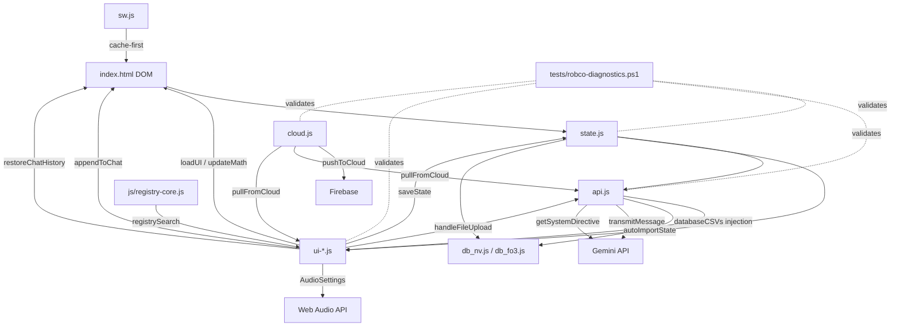

# RobCo U.O.S. — System Architecture

> **Version:** 2.7.0
> **Last Updated:** 2026-07-01
> **Purpose:** Living reference for any engineer (human or AI) working on this project.
> This document maps every system, its dependencies, its persistence contract, and the
> historical lessons that shaped it.

---

## Table of Contents

1. [Project Philosophy](#project-philosophy)
2. [File Map](#file-map)
3. [Script Load Order & Globals](#script-load-order--globals)
4. [State Architecture](#state-architecture)
5. [Persistence Lifecycle](#persistence-lifecycle)
6. [Save/Load/Sync Contract](#saveloadsync-contract)
7. [AI Integration Pipeline](#ai-integration-pipeline)
8. [Audio System](#audio-system)
9. [UI Rendering Pipeline](#ui-rendering-pipeline)
10. [Time System](#time-system)
11. [Faction System](#faction-system)
12. [Undo System](#undo-system)
13. [Settings & localStorage Keys](#settings--localstorage-keys)
14. [System Dependency Map](#system-dependency-map)
15. [Historical Lessons](#historical-lessons)
16. [Service Worker Cache Protocol](#service-worker-cache-protocol)
17. [Adding a New State Field (Checklist)](#adding-a-new-state-field-checklist)
18. [Adding a New Audio Source (Checklist)](#adding-a-new-audio-source-checklist)
19. [Adding a New UI Panel (Checklist)](#adding-a-new-ui-panel-checklist)

---

## Project Philosophy

- **Stability > Features.** A healthy codebase is worth more than a feature-rich broken one.
- **Extend, don't rewrite.** Every rewrite in this project's history introduced new bugs.
- **Immersion is a feature.** The terminal must _feel_ like a real CRT machine — audio, visual effects, and timing matter.
- **One system per concern.** One state object, one save function, one import function, one UI render entry point.
- **Browser-native.** No build step, no framework, no bundler for production. Vanilla HTML/CSS/JS with `<script>` tags.

---

## File Map

```
├── index.html          ~55KB  DOM structure + all inline event handlers
├── css/terminal.css    ~16KB  All styling, animations, CRT effects
├── js/
│   ├── state.js        7.6KB  State definition, persistence, migration
│   ├── api.js          36.5KB System directive, autoImportState, transmitMessage
│   ├── ui-audio.js     ~16KB  Audio engine (geiger, tinnitus, CRT hum, boot/level-up sounds)
│   ├── ui-render.js    ~30KB  All render* functions, CRUD helpers, faction/map/time utilities
│   ├── ui-saves.js     ~14KB  Save slots, file import/export, rolling backups, registry autocomplete
│   ├── ui-account.js   ~3KB   Account panel, cloud save picker, undo-sync
│   ├── ui-core.js      ~43KB  Core UI lifecycle, appendToChat, loadUI, updateMath
│   ├── cloud.js        3.6KB  Firebase push/pull (ES module)
│   ├── registry-core.js ~3KB  Read-only registry engine — FALLOUT_REGISTRY + registrySearch()
│   ├── reg_nv.js       ~87KB  FNV registry data (perks/quests/locations/collectibles/traits/magazines)
│   ├── reg_fo3.js      ~46KB  FO3 registry data (perks/quests/locations/bobbleheads/Lincoln memorabilia)
│   ├── db_nv.js        ~54KB  FNV CSV data (weapons, armor, chems, vendors) + lookupItemInDb()
│   └── db_fo3.js       ~34KB  FO3 CSV data (weapons, armor, chems, vendors) + lookupItemInDb()
├── sw.js               2.0KB  Service worker (cache-first for same-origin)
├── tests/
│   ├── robco-diagnostics.ps1   28KB    1612-test pre-commit audit
│   ├── robco-diagnostics.js    36KB    1612-test Node runner (parity with .ps1)
│   ├── boot-smoke.mjs          CI boot smoke test (zero console errors, booted state)
│   ├── render-check.mjs        Mobile overflow check at 360px and 412px
│   └── run-tests.bat           (Batch launcher)
├── scripts/
│   ├── pre-commit              Versioned pre-commit hook source (installed by prepare)
│   ├── install-hooks.js        Copies pre-commit hook into .git/hooks on npm install
│   └── rollback.sh             Protocol 16 one-command hotfix rollback
├── CHANGELOG.md        ~74KB  Full version history
├── icon.png            68KB   PWA icon
├── manifest.json       592B   PWA manifest
└── ARCHITECTURE.md     THIS FILE
```

---

## Script Load Order & Globals

Scripts are loaded via `<script>` tags in `index.html` in this exact order:

```
   ── Per-game boot manifest (GAME_FILES in index.html; order preserved via script.async = false) ──
1. js/db_nv.js / js/db_fo3.js → defines: databaseCSVs, lookupItemInDb (game-specific CSV data;
                       the active pair is selected by the GAME_FILES manifest, FNV fail-safe)
2. js/state.js      → defines: state, chatHistory, APP_VERSION, GAME_DEFS, FACTION_REGISTRY,
                       SKILL_KEYS, saveState, syncStateFromDom, generateSyncPayload,
                       exportSaveFile, migrateState (game-time helpers live in ui-render.js)
3. js/reg_nv.js / js/reg_fo3.js + js/registry-core.js → defines: FALLOUT_REGISTRY
                       (read-only game data) + registrySearch() (autocomplete search engine)
4. js/ui-audio.js   → defines: audioCtx, all audio functions (geiger/tinnitus/CRT hum,
                       limb/wake/boot/level-up sounds, runBootSequence,
                       triggerPhosphorGhost, changeOpticsColor)
5. js/ui-render.js  → defines: all render*() functions, CRUD helpers (addItem/delItem,
                       addAmmo/removeAmmo, addPerk/removePerk, etc.), FACTION_THRESHOLDS,
                       getFactionStanding, adjustFaction, game-time helpers
                       (ticksToGameTime/_resolveGameDateTime/formatGameTime/getGameDate),
                       map helpers (setMapView/zoomMapToZone/renderWorldMap),
                       _updateContextPanels, _invFilter, setInvFilter
6. js/ui-saves.js   → defines: SLOT_NAMES, saveToSlot, loadFromSlot, handleFileUpload,
                       exportCampaignLog, restoreRollingBackup, restoreChatHistory,
                       initRegistryAutocomplete (wireInput), initAmmoDatalist,
                       addQuest, triggerFileInput, triggerImageUpload
7. js/ui-account.js → defines: renderAccount, renderCloudSavePicker, undoLastSync
8. js/ui-core.js    → defines: AudioSettings, appendToChat, loadUI, updateMath, etc.
9. js/api.js        → defines: autoImportState, transmitMessage, fetchAuthorizedModels
10. js/cloud.js     → loaded as <script type="module"> (ES import from Firebase CDN)
                       attaches: window.pushToCloud, window.pullFromCloud
```

**Critical constraint:** Because these are `<script>` tags (not modules), all globals are shared
in the window scope. The ESLint config (`eslint.config.mjs`) declares every cross-file global
to prevent no-undef errors.

`cloud.js` is the **only** ES module — it uses `import` from the Firebase CDN. It attaches
its exports to `window.*` for the other scripts to call.

**Firebase SDK loading:** `cloud.js` imports the Firebase SDK from version-pinned gstatic CDN URLs (`https://www.gstatic.com/firebasejs/12.15.0/...`). The version pin is the primary supply-chain mitigation — updates are always deliberate, never floating to `latest`. SRI (`integrity=`) cannot be applied to ES module `import` statements in JavaScript source (no HTML element to attach the attribute to), so the pin is the only available guard. **Self-hosting was evaluated and deferred (v2.0.1-r65):** all App Check and reCAPTCHA calls must still reach gstatic/google, so self-hosting the SDK removes zero CSP origins and gains nothing for the current zero-build-step architecture. Revisit only if Firebase ships a bundleable single-origin SDK or the project adopts a build step.

**Auth (Phase 5c-i/ii):** `cloud.js` signs in anonymously on every boot (non-fatal; app stays usable offline). Firebase Auth is tracked via `onAuthStateChanged`; the current `uid` routes all Firestore reads/writes to `users/{uid}/saves/main`. Phase 5c-ii adds Google sign-in: `window.signInWithGoogle()` links the anonymous session to a Google account via popup on all platforms (redirect was removed — iOS/Android storage partitioning blocked the cross-origin iframe used to retrieve the credential, so `getRedirectResult` always returned null on mobile); `window.signOutAccount()` signs out then re-signs in anonymously; `getRedirectResult` is still called at boot to drain any in-flight redirect from a previously cached client before the anon-fallback guard runs; and `auth/credential-already-in-use` collisions fall back to `signInWithCredential`. Boot sequence is a single sequential async IIFE: `await getRedirectResult` → `await authStateReady` → anon fallback if no user. The ACCOUNT panel in the Data tab (`renderAccount()` in ui-account.js, `#accountPanel` in index.html) shows sign-in status and the sign-in/sign-out button. Push to production is gated on the owner enabling the Google provider in the Firebase console.

**Content Security Policy (CSP Stage 2 — enforcing):** The `<meta http-equiv="Content-Security-Policy">` in `index.html` is now in enforcing mode. It was run in report-only mode for Stage 1 and confirmed clean (boot + Firebase + auth + Firestore produced zero violations) before the flip. **`'unsafe-inline'` is intentionally retained** in `script-src` and `style-src`: the app has ~148 inline event handlers, and per CSP Level 2+ a `sha256-` or `nonce-` token in `script-src` silently disables `unsafe-inline`, breaking all of them. Guard 55.10 (tripwire: `'unsafe-inline'` still present) and 55.11 (tripwire: no `sha256-`/`nonce-` token) enforce this invariant. `img-src` includes `blob:` to cover canvas and screenshot-preview images. The suite-55 and suite-30 guards enforce that the enforcing policy is present and report-only is absent.

---

## Fallout Data Registry (`js/registry-core.js` + `js/reg_nv.js` / `js/reg_fo3.js`)

Added in v1.6.5. Read-only canonical Fallout reference data for autocomplete and future validation. The registry is now split: `js/registry-core.js` holds the read-only search engine (`FALLOUT_REGISTRY` accessor + `registrySearch()`), and the per-game data lives in `js/reg_nv.js` (FNV) and `js/reg_fo3.js` (FO3) — the active data file is chosen by the `GAME_FILES` manifest in `index.html`.

### Key Properties

- **Source of truth:** [Independent Fallout Wiki](https://fallout.wiki) — CC-BY-SA 4.0
- **NOT state:** Does not touch `state`, `localStorage`, cloud sync, undo, or the persistence audit.
- **Read-only:** Defined once at startup. Never mutated.
- **No build step:** Consistent with the project's zero-toolchain philosophy — a shared core engine plus one data file per game, loaded directly as `<script>` tags.

### Global: `FALLOUT_REGISTRY`

```js
const FALLOUT_REGISTRY = {
  version: '2.0.0',
  quests:     [ { name, type, dlc }, ... ],       // 130 entries. type: main|side|companion|unmarked
  items:      [ { name, type }, ... ],             // ~280 entries. type: weapon|armor|aid|ammo|misc
  perks:      [ { name, type, level }, ... ],      // ~110 entries. type: regular|companion|challenge|special
  locations:  [ { name, type }, ... ],             // ~120 entries. type: settlement|landmark|cave|vault|camp|other
  companions: [ { name, fullName, location }, ... ] // 10 entries (8 humanoid + Rex + ED-E)
};
```

**Data population status (as of v1.6.5):**

| Category   | Count | Source       | Status       |
| ---------- | ----- | ------------ | ------------ |
| quests     | 130   | fallout.wiki | ✅ Populated |
| items      | ~280  | fallout.wiki | ✅ Populated |
| perks      | ~110  | fallout.wiki | ✅ Populated |
| locations  | ~120  | fallout.wiki | ✅ Populated |
| companions | 10    | fallout.wiki | ✅ Populated |

### Function: `registrySearch(category, query)`

- Returns up to 7 results sorted by relevance (prefix → word-boundary → substring)
- Returns `[]` if query < 2 chars
- No fuzzy matching — deterministic, predictable
- Callers are responsible for debouncing

### What the registry does NOT do

- Does not replace the CSV databases (`db_nv.js` / `db_fo3.js` — combat/trade CSV data, a different concern)
- Does not replace `FACTION_REGISTRY` in `state.js` (drives state structure)
- Does not replace `SKILL_KEYS` in `state.js` (drives state structure)
- Does not add fields to `state` — registry data is never persisted

### Locked Decisions (see architecture_review.md)

| Decision         | Value                                                    |
| ---------------- | -------------------------------------------------------- |
| Global name      | `FALLOUT_REGISTRY`                                       |
| File name        | `js/registry-core.js` + `js/reg_nv.js` / `js/reg_fo3.js` |
| Category keys    | `quests`, `items`, `perks`, `locations`, `companions`    |
| Search function  | `registrySearch(category, query)`                        |
| Max results      | 7                                                        |
| Min query length | 2 chars                                                  |
| Keywords         | Deferred                                                 |

---

## State Architecture

### The `state` Object (js/state.js)

```javascript
let state = {
  // --- Primitives (synced from DOM inputs) ---
  lvl, xp, hpCur, hpMax,           // Character progression
  s, p, e, c, i, a, l,             // S.P.E.C.I.A.L. stats (1-10)
  caps, loc, rads, karma, ticks,    // Economy, location, bio, time

  // --- Limbs (string: "OK" | "CRIPPLED") ---
  la, ra, ll, rl, hd,

  // --- Structured Objects ---
  factions: { ncr: {fame,infamy}, ... },   // 14 factions via FACTION_REGISTRY (pending C6 → 11)
  skills: { barter: 15, ... },              // 13 skills via SKILL_KEYS
  equipped: { weapon, armor, headgear },    // Currently equipped gear
  stats: { kills, capsEarned, damageDealt, sessionStart }, // Session stats
  ammo: {},                                 // Ammo type → count mapping

  // --- Arrays ---
  status: [],           // Active buffs/debuffs [{name, ticks, type}]
  inventory: [],        // Items [{name, qty, wgt, val, type}]
  squad: [],            // Companions [{name, hp, hpMax, weapon, ammo, condition, dt, affinity}]
  campaign_notes: [],   // AI-written tactical notes (strings)
  perks: [],            // [{name, rank, level_taken}]
  quests: [],           // [{name, status, objective, factions}]

  // --- v1.6.8+ fields ---
  locationHistory: [],  // Last 10 distinct locations visited (string[])

  // --- v2.0 fields (C3–C4) ---
  gameContext: 'FNV',       // 'FNV' | 'FO3' — governs FACTION_REGISTRY, SKILL_KEYS, AI context
  collectibles: [],         // Collected item names (game-context-aware, flat string[])
  campaignMode: 'standard', // 'standard' | 'rng' — Complete RNG opt-in flag (binary; Protocol 4)
  playthroughType: 'standard', // 'standard' | 'minmaxed' | 'completionist' | 'casual' | 'speedrun' (Protocol 4)
};
```

### Adding a New Field

Adding a new top-level key to `state` requires changes in **4 files**. The pre-commit
persistence audit will block the commit if any step is missed:

1. **state.js** — Add the field to `let state = { ... }` with its default value
2. **state.js** — Add migration in `migrateState()` for older saves: `if (!s.newField) s.newField = default;`
3. **api.js** — Add import handling in `autoImportState()` so AI responses update the field
4. _(If applicable)_ **ui-render.js** — Add rendering in the appropriate `render*()` function

The pre-commit hook (`tests/robco-diagnostics.ps1`) auto-discovers all keys in `state.js`
and verifies that every key appears in `autoImportState()`.

---

## CAMPG Tab System

Added in C3 (v2.0). A 4th top-level tab alongside STAT, INV, and DATA.

### Tab Architecture

```
TAB_NAMES = ['stat', 'inv', 'data', 'campg']   // declared in ui-core.js

switchTab(tab)                                   // ui-core.js
  → adds/removes .active class on [data-tab="{tab}"] panels
  → updates [data-tab="{tab}"] button active state
  → persists to localStorage('robco_active_tab')
  → restores on page load
```

**Keyboard shortcuts**: `1` = STAT, `2` = INV, `3` = DATA, `4` = CAMPG.

**Security & Config** panel has no `data-tab` attribute — always visible across all tabs.

### CAMPG Panel Content

CAMPG (`id="campgPanel"`, `data-tab="campg"`) is the authority for all campaign lifecycle settings:

| Control                 | ID                      | Storage                                      | Handler                         |
| ----------------------- | ----------------------- | -------------------------------------------- | ------------------------------- |
| Game Context select     | `gameContextSelect`     | `state.gameContext`                          | `onGameContextChange(ctx)`      |
| Playthrough Type select | `playthroughTypeSelect` | `state.playthroughType`                      | `onPlaythroughTypeChange(type)` |
| Complete RNG checkbox   | `completeRngToggle`     | `state.campaignMode` (`'standard'`\|`'rng'`) | `onCampaignModeChange(checked)` |
| Timeline display        | `timelineDisplay`       | Cache only — not persisted                   | `[TIMELINE]` command (C7)       |
| Wipe Terminal button    | `wipeTerminalBtn`       | —                                            | `wipeTerminal()`                |

**Complete RNG and Playthrough Type are independent.** All combinations are valid (e.g. Completionist + RNG, Speedrun + RNG). The playthrough type directive and RNG directive are both injected into the AI system prompt and concatenated when both are active.

---

## Registry Autocomplete System

Added in v1.6.5. A singleton autocomplete panel (`#acPanel`) wired to text inputs in `ui-saves.js`.

### Architecture

```
initRegistryAutocomplete()  ← called once in window.onload
  → creates a single <div id="acPanel"> autocomplete panel
  → wireInput(inputId, category) attaches to each registry-backed input:
      - 'newQuestName' → 'quests'
      - 'newItemName'  → 'items'
      - 'newPerkName'  → 'perks'
  → each input gets: oninput (150ms debounce), onkeydown (arrow/enter/escape),
                     onblur (120ms grace for click-to-select)
  → registrySearch(category, query) drives results (max 7, min 2 chars)
  → panel positions dynamically via getBoundingClientRect()
  → repositions on window scroll and resize
```

### Adding a new autocomplete-backed input

1. Add `<input type="text" id="newXxxName" ...>` in **index.html**
2. In `initRegistryAutocomplete()` in **ui-saves.js**, add: `wireInput('newXxxName', 'category');`
3. If the category is new, add it to `FALLOUT_REGISTRY` in the per-game data files (**reg_nv.js** / **reg_fo3.js**)
4. If it has an add action, create `addXxx()` in **ui-render.js** mirroring `addPerk()`

---

## Persistence Lifecycle

### Save Flow

```
User interaction / AI sync
  → syncStateFromDom()          // Reads DOM inputs → state object (immediate)
  → saveState()                 // Debounced (500ms) localStorage.setItem('robco_v7', ...)
  → beforeunload handler        // Flushes pending save immediately on tab close
```

### Load Flow (window.onload in ui-core.js)

```
localStorage.getItem('robco_v7')
  → JSON.parse
  → migrateState(version, savedState)     // Upgrades old save structure
  → state = { ...state, ...savedState }   // Merge (preserves defaults for missing keys)
  → faction migration (nf/ni/lf/li → state.factions)
  → loadUI()                              // Push state → DOM
```

**`window.onload` composition (Step 2 Phase 0 / U2):** the former ~568-line
monolithic boot block is now 12 named, order-preserving phase functions in
`ui-core.js` (`_hydrateStateFromStorage`, `_restoreApiKeyAndChatHistory`,
`_wireRotaryDialClick`, `_wireStandby`, `_wirePanelPersistence`,
`_restoreOpticsPreference`, `_restoreDevicePrefs`, `_wireKeyboardShortcuts`,
`_runBootSequenceAndBriefing`, `_startAmbientTimers`, `_wireInputHistoryNav`,
`_wireUnloadFlush`), called from a slim `window.onload` in the exact original
source order — zero logic added, removed, or reordered. The standby-mode
shared state (`_standbyActive`/`_uptimeInterval`/`_memCycleInterval`/
`sessionStart`) and its four functions (`_startUptimeClock`/`_startMemCycle`/
`enterStandby`/`exitStandby`) moved to true module scope so `_wireStandby()`
(listener wiring) and the later `_startAmbientTimers()` (boot-time timer
kickoff) share one set of double-start guards, matching the original
DUP-3/DUP-4 invariant. A static structural suite (Suite 132, both runners)
guards the function list, the call order, the module-scope promotion, and
that `window.onload` stays a slim composition; the decomposition was also
verified live via the full Playwright gate (boot-smoke + 360/412 render-check)
with zero console errors and no black screen.

### Export Flow (exportSaveFile in state.js)

```
syncStateFromDom()
  → Build envelope: { version, state, chat, playstyle }
  → JSON.stringify → data URI → download
```

### Import Flow (handleFileUpload in ui-saves.js)

```
FileReader → JSON.parse
  → Detect envelope (has .version + .state) vs legacy bare state
  → autoImportState(JSON.stringify(stateData))
  → restoreChatHistory(parsed.chat)
  → Restore playstyle
```

### Cloud Push (pushToCloud in cloud.js)

```
setDoc(firestore, {
  version: APP_VERSION,
  savedAt: Date.now(),
  state: stateObj,
  chat: JSON.parse(localStorage.getItem('robco_chat')),
  playstyle: localStorage.getItem('robco_playstyle')
})
```

### Cloud Pull (pullFromCloud in cloud.js)

```
getDoc(firestore)
  → Conflict check (cloud vs local timestamp)
  → Detect envelope vs legacy
  → autoImportState(JSON.stringify(stateData))
  → restoreChatHistory(data.chat)
  → Restore playstyle
```

### Save Slots (saveToSlot / loadFromSlot in ui-saves.js)

```
3 slots: robco_slot_1, robco_slot_2, robco_slot_3
Envelope format: { version, state, chat, playstyle, savedAt, slotName }
Load calls: migrateState() → state merge → restoreChatHistory → loadUI
```

---

## Save/Load/Sync Contract

**Every persistence path must:**

1. Serialize the full `state` object (not a subset)
2. Include `chatHistory`, `playstyle`, and `version` in the envelope
3. Call `migrateState()` on load to handle version upgrades
4. Call `autoImportState()` for AI-originated data
5. Call `restoreChatHistory()` for chat data
6. Never silently drop unknown fields (spread operator preserves them)

---

## AI Integration Pipeline

### Outbound (transmitMessage in api.js)

```
User types command → chatInput
  → appendToChat(userText, 'user')
  → generateSyncPayload()                    // Deep clone of current state
  → Token triage: strip inventory if not needed
  → Attach databaseCSVs (always present)
  → Build apiContents from chatHistory        // Full conversation context
  → Inject: [CURRENT STATE] + [COMMAND] into last user message
  → fetch(Gemini API) with:
      - systemInstruction: getSystemDirective()
      - contents: apiContents
      - temperature: 0.2
      - responseMimeType: 'application/json'
  → Parse response as JSON
  → Handle modal (TEXT / GPS / TRADE)
  → appendToChat(narrative, 'ai')            // Typewriter animation
  → autoImportState(parsedNode.state)         // Apply state changes
```

**`getSystemDirective()` composition (Step 2 Phase 0 / U1):** the directive is
assembled from 8 module-scope per-section builder functions in `api.js`
(`_directivePersonaAndContract`, `_directiveCoreTracking`, `_directiveSkills`,
`_directiveFactions`, `_directiveSystems`, `_directiveTrackers`,
`_directiveInjectionBoundary`, plus the internal `_directiveConstraints` helper),
composed via a single array-join in original section order. The per-game tracker
text (FNV: Traits + Skill Magazines; FO3: Lincoln Memorabilia) is no longer an
inline `ctx === 'FO3'/'FNV' ?` ternary — it is data-driven via
`GAME_DEFS[ctx].ai.trackerDirectives` (`state.js`), read by `_directiveTrackers()`.
A future game with no trackers supplies `trackerDirectives: ''` (or omits the
field) — zero code changes to the builders. A Protocol 14 golden-master test
(Suite 131, both runners) evaluates the real builders + real `GAME_DEFS` across
an 11-point state matrix (both games × every playstyle/playthroughType/
campaignMode branch) and asserts SHA-256 equality against the pre-refactor
output, proving the decomposition is byte-identical.

### Inbound (autoImportState in api.js)

```
JSON string → parse
  → Snapshot current state (for undo)
  → Map primitives with case fallback (_g helper)
  → Map SPECIAL stats (clamped 1-10)
  → Map limbs (validated "OK"/"CRIPPLED")
  → Map factions via FACTION_REGISTRY.forEach
  → Map skills via SKILL_KEYS.forEach
  → Map status effects (normalize to {name, ticks, type})
  → Map inventory (direct array replace)
  → Map squad (direct array replace)
  → Map campaign_notes (direct replace)
  → Map perks (normalized {name, rank, level_taken})
  → Map quests (normalized {name, status, objective, factions})
  → Map equipped ({weapon, armor, headgear})
  → Map stats (DELTA accumulation: kills += parsed.kills)
  → Map ammo (direct object replace + auto-expand if changed)
  → State diff display (DELTA log to chat)
  → Status effect tick-down (#7)
  → Faction consequence triggers (#4)
  → Location history tracking (#5)
  → Faction change auto-logging to campaign_notes
  → loadUI()
  → playSyncTone()
  → Auto-expand changed panels (#31)
  → Show undo button
```

---

## Audio System

### Architecture

All audio is procedurally synthesized via the Web Audio API. **No audio files exist.**

```
audioCtx (single AudioContext, created at module load in ui-audio.js)
  ├── playClack()           — Typing sound (square wave, 100-150Hz, 50ms)
  ├── playGeigerClick()     — Radiation Geiger (white noise, bandpass 2200Hz, 3ms)
  ├── scheduleGeiger(rate)  — Poisson-distributed click scheduler
  ├── startTinnitus()       — 5200Hz sine, swells every 12-30s
  ├── stopTinnitus()        — Kills oscillator + timeout
  ├── startCrtHum()         — 60Hz sine with 0.08Hz LFO modulation
  ├── setCrtHumIntensity()  — Shifts freq/gain based on rads + cripple
  ├── playLimbCrippleSound()— Arm: sawtooth 380→60Hz; Leg: sine 75→30Hz
  ├── playHeadCrippleSound()— Triangle 550→40Hz + sine 3800Hz ring
  ├── playLimbRestoreSound()— Ascending arpeggio 440→880→1760Hz
  ├── playWakeTone()        — Square wave arpeggio 220→440→880Hz
  └── playSyncTone()        — Sine 880Hz→1320Hz confirmation
```

### Mute Chain

Every audio function checks TWO guards before playing:

```
if (AudioSettings.masterMute) return;   // Global kill switch
if (AudioSettings.<specific>) return;   // Per-system toggle
```

### AudioSettings Cache (ui-core.js)

```javascript
const AudioSettings = {
  typing: localStorage('robco_sfx_muted'),
  hum: localStorage('robco_hum_muted'),
  geiger: localStorage('robco_geiger_muted'),
  tinnitus: localStorage('robco_tinnitus_muted'),
  ambient: localStorage('robco_ambient_muted'), // Limb SFX
  wake: localStorage('robco_wake_muted'),
  masterMute: localStorage('robco_master_muted'),
};
```

Read once at startup. Updated in-memory by `toggleAudio()` and `toggleMasterMute()`.
**Never call localStorage.getItem() in an audio hot path.**

### Change Guards (ui-core.js)

```javascript
let _lastRads = -1,
  _lastCrippled = false;
```

Audio system updates in `updateMath()` only fire when these values actually change,
preventing redundant oscillator creation on every keystroke.

---

## UI Rendering Pipeline

### Entry Point: `loadUI()` (ui-core.js)

Called after any state change. Pushes state → DOM, then calls all render functions:

```
loadUI()
  → Set all input values from state
  → Decompose ticks → D/H/M time inputs
  → Set skills from state.skills
  → Set limb buttons (OK/CRIPPLED class + text)
  → updateKarmaUI()
  → renderInventory()
  → renderSquad()
  → renderStatus()
  → renderCampaignNotes()
  → renderFactionRep()
  → renderPerks()
  → renderQuests()
  → renderSessionStats()
  → renderEquipped()
  → updateMath()        ← triggers: HP bar, XP bar, karma flash, radiation
                           effects, carry weight, day/night, Geiger, tinnitus,
                           CRT hum, RadAway alert, panel badges, saveState()
  → triggerPhosphorGhost()
  → Radiation SPECIAL debuff coloring
```

### Key Render Functions

| Function                | State Source           | UI Target                                   |
| ----------------------- | ---------------------- | ------------------------------------------- |
| `renderInventory()`     | `state.inventory`      | `#invList` — event-delegated click handlers |
| `renderAmmo()`          | `state.ammo`           | `#ammoList` — sorted grid, X remove buttons |
| `renderSquad()`         | `state.squad`          | `#squadList` — HP bars, affinity, weapon    |
| `renderStatus()`        | `state.status`         | `#statusList` — color-coded buff/debuff     |
| `renderPerks()`         | `state.perks`          | `#perksList` — rank, level taken            |
| `renderQuests()`        | `state.quests`         | `#questsList` — color by status             |
| `renderSessionStats()`  | `state.stats`          | `#sessionStatsList` — grid layout           |
| `renderEquipped()`      | `state.equipped`       | `#equippedDisplay` — weapon/armor/head      |
| `renderCampaignNotes()` | `state.campaign_notes` | `#campaignNotesList`                        |
| `renderFactionRep()`    | `state.factions`       | `#factionContainer` — major/minor grid      |

All render functions use `.innerHTML = items.map(...).join('')` (single assignment,
not `+=` loop) for O(n) performance instead of O(n²).

---

## Time System

```
1 tick = 6 minutes in-game
10 ticks = 1 hour
240 ticks = 1 day

gameTimeToTicks(day, hour, min) → tick count
ticksToGameTime(ticks) → "D1 08:30" string

UI: 3 separate inputs (Day/Hour/Min) with onTimeInputChanged()
    + hidden #stat_ticks for backward compat
```

---

## Faction System

### Registry (state.js)

```javascript
FACTION_REGISTRY = [
  { key: 'ncr', name: 'NCR', tier: 'major' },
  { key: 'legion', name: "Caesar's Legion", tier: 'major' },
  // ... 14 total (6 major, 8 minor)
];
```

### Standing Calculation (ui-render.js)

Canonical FNV 2D fame/infamy matrix. Fame and infamy are independent axes.
Per-faction thresholds sourced from GECK `GetReputationThreshold` documentation (fallout.wiki).

```javascript
// FACTION_THRESHOLDS (ui-render.js) — GECK-sourced, per-faction
const FACTION_THRESHOLDS = {
  ncr: { t1: 4, t2: 20, t3: 50, t4: 80 }, // t4 = Idolized/Vilified threshold
  legion: { t1: 4, t2: 25, t3: 50, t4: 100 },
  house: { t1: 3, t2: 10, t3: 25, t4: 50 },
  bos: { t1: 2, t2: 3, t3: 10, t4: 20 },
  // ... (11 FNV factions + 11 FO3 factions in table)
};

// getFactionStanding(key, fame, infamy) → { label, color }
// Ranks each axis 0–4 against per-faction thresholds, then resolves title:
```

| fameRank | infamyRank | Title              |
| -------- | ---------- | ------------------ |
| 4        | 0          | Idolized           |
| 4        | 1–2        | Merciful Thug      |
| 4        | 3–4        | Wild Child         |
| 3        | 0–1        | Liked              |
| 3        | 2          | Unpredictable      |
| 3        | 3–4        | Wild Child         |
| 2        | 0          | Accepted           |
| 2        | 1          | Mixed              |
| 2        | 2          | Unpredictable      |
| 2        | 3–4        | Dark Hero          |
| 1        | 0          | Accepted           |
| 1        | 1          | Soft-Hearted Devil |
| 1        | 2          | Mixed              |
| 1        | 3–4        | Dark Hero          |
| 0        | 0          | Neutral            |
| 0        | 1          | Sneering Punk      |
| 0        | 2          | Shunned            |
| 0        | 3          | Hated              |
| 0        | 4          | Vilified           |

### Panel Preservation

`renderFactionRep()` saves the `<details open>` state of the minor-factions
collapsible before replacing `container.innerHTML`, then restores it afterward.
This prevents the panel collapsing when the user clicks F+/F-/I+/I- buttons.

### Faction Card Display

Each faction card now shows `F:{fame} / I:{infamy}` rather than a net score.
Fame and infamy are independent and the display reflects this.

### Auto-Logging

`autoImportState()` diffs faction values before/after each AI sync.
Any change is auto-appended to `state.campaign_notes`:
`"[T{ticks}] {FactionName}: fame +N, infamy +N"`

### Consequence Triggers (#4)

When a major faction crosses Vilified (-500 net) or Idolized (+750 net),
a sys alert is appended to chat.

---

## Undo System

### Snapshot

Before `autoImportState()` applies any changes:

```javascript
window._lastStateBeforeSync = JSON.stringify(state);
```

### Restore (undoLastSync in ui-account.js)

```javascript
let prev = JSON.parse(window._lastStateBeforeSync);
state = { ...state, ...prev };
window._lastStateBeforeSync = null;
loadUI();
```

**Only one level of undo.** Each AI sync overwrites the previous snapshot.
The undo button appears after every sync and hides after use.

---

## World Map (G6)

`renderWorldMap()` in `ui-render.js` — a registry-driven CSS grid that shows the Mojave as a 4×4 or 6×6 zone grid.

### Size: state-driven, not viewport-measured

Grid size is a pure function of `state.mapView` ∈ `{'auto','full','core'}` (persisted to `localStorage`). No `offsetWidth` or `window.innerWidth` measurements are made in the size decision.

| `state.mapView`    | Grid     | Rows/Cols          |
| ------------------ | -------- | ------------------ |
| `'auto'` (default) | Core 4×4 | rows 2–5, cols 2–5 |
| `'core'`           | Core 4×4 | rows 2–5, cols 2–5 |
| `'full'`           | Full 6×6 | rows 1–6, cols 1–6 |

The toggle button (`setMapView('full')` / `setMapView('core')`) is always visible and writes `state.mapView` + saves before re-rendering.

### Why state-driven matters

`offsetWidth` is 0 inside a collapsed `<details>` panel, and `window.innerWidth` varies by browser and entry path (cold load vs tab switch). Measuring at render-time caused the grid to flip size on every location change or reload depending on which code path triggered it. Now size is stable across all paths because it is read from the save — not measured.

### Current-zone matching

`scoreZoneForLoc(zone, loc)` scores a zone against the current location string:

- `100` = exact string match
- `50+len` = whole-word token match (at least one word > 2 chars equals a word in zone name/locations)
- `10` = substring-only match (intentionally below the threshold)

The grid highlights **only zones with score ≥ 50** to prevent coincidental substring matches (e.g. "springs" in "goodsprings" wrongly matching Bitter Springs). The detail view uses the same threshold to pick a single-winner [CURRENT] marker per location list.

### AI exclusion

`mapView` is excluded from `getSystemDirective()` — it is a client-side UI preference that the AI has no reason to set or read.

---

## Settings & localStorage Keys

| Key                     | Type      | Used By     | Description                                                                                        |
| ----------------------- | --------- | ----------- | -------------------------------------------------------------------------------------------------- |
| `robco_v7`              | JSON      | state.js    | Full game state                                                                                    |
| `robco_chat`            | JSON      | ui-core.js  | Chat history (up to 200 messages)                                                                  |
| `robco_gemini_key`      | string    | api.js      | Gemini API key                                                                                     |
| `robco_gemini_model`    | string    | api.js      | Selected model name                                                                                |
| `robco_courier_id`      | string    | cloud.js    | Cloud sync identifier                                                                              |
| `robco_optics`          | string    | ui-audio.js | Color theme name (legacy global; per-game keys are `robco_optic_<ctx>`)                            |
| `robco_playstyle`       | string    | api.js      | "any" or "melee"                                                                                   |
| `robco_panel_state`     | JSON      | ui-core.js  | Panel open/closed memory                                                                           |
| `robco_version`         | string    | ui-core.js  | Last seen version (triggers changelog)                                                             |
| `robco_sfx_muted`       | bool      | ui-audio.js | Typing sound mute                                                                                  |
| `robco_hum_muted`       | bool      | ui-audio.js | CRT hum mute                                                                                       |
| `robco_geiger_muted`    | bool      | ui-audio.js | Geiger counter mute                                                                                |
| `robco_tinnitus_muted`  | bool      | ui-audio.js | Tinnitus mute                                                                                      |
| `robco_ambient_muted`   | bool      | ui-audio.js | Limb SFX mute                                                                                      |
| `robco_wake_muted`      | bool      | ui-audio.js | Tab-return wake tone mute                                                                          |
| `robco_master_muted`    | bool      | ui-audio.js | Global audio kill switch                                                                           |
| `robco_radio_on`        | bool      | ui-audio.js | Pip-Boy Radio ON state (WU-F5 — ON-semantics player, not a mute; opt-in)                           |
| `robco_booted_before`   | bool      | ui-audio.js | First-power-on flag (WU-F6 — gates the one-time cold-start POST; degraded boot is NOT gated by it) |
| `robco_typer_speed`     | float     | ui-core.js  | Typewriter speed multiplier                                                                        |
| `robco_last_cloud_push` | timestamp | cloud.js    | Conflict detection                                                                                 |
| `robco_active_tab`      | string    | ui-core.js  | Last active tab (`'stat'`/`'inv'`/`'data'`/`'campg'`)                                              |
| `robco_playstyle_type`  | string    | state.js    | _(deprecated C5)_ Legacy key migrated into `state.playthroughType` on first load                   |
| `robco_slot_1/2/3`      | JSON      | ui-saves.js | Save slots A/B/C                                                                                   |

---

## System Dependency Map



### Critical Paths (modify with extreme care)

1. **autoImportState()** — touches state, UI, audio, factions, quests, status effects,
   location history, undo, campaign notes, and panel auto-expand. The single most
   interconnected function in the codebase.

2. **loadUI()** → **updateMath()** — the full render cascade. Every stat, skill, limb,
   faction, inventory item, and audio system flows through here.

3. **Save envelope format** — shared between `exportSaveFile()`, `handleFileUpload()`,
   `pushToCloud()`, `pullFromCloud()`, `saveToSlot()`, `loadFromSlot()`. Changing the
   format requires updating all six.

4. **AudioSettings cache** — 8 audio functions read from this object. `toggleAudio()`
   and `toggleMasterMute()` maintain it. Adding a new audio source requires adding to
   both the cache and the toggle functions.

---

## Historical Lessons

These are bugs and architectural decisions from the changelog that future work must avoid repeating:

### 1. The `flatten()` Disaster (v1.6.4)

**What happened:** A recursive `flatten()` function lowercased all AI response keys, causing
silent key collisions (e.g., `skills.s` colliding with SPECIAL stat `s`).
**Fix:** Replaced with explicit field mapping in `autoImportState()`.
**Lesson:** Never use recursive key transformation on untrusted data structures.

### 2. The innerHTML O(n²) Bug (v1.6.1)

**What happened:** `renderInventory()` and `renderSquad()` used `innerHTML +=` in a loop,
causing a full DOM reparse on every iteration.
**Fix:** Changed to `map().join('')` with single `innerHTML` assignment.
**Lesson:** Never use `innerHTML +=` in a loop. Always build the full string first.

### 3. The XSS Vector (v1.6.1)

**What happened:** AI text was inserted directly as innerHTML without escaping.
**Fix:** All AI text now goes through `escapeHtml()` before DOM insertion. Typewriter uses
`textContent` during animation and swaps to formatted `innerHTML` only once at the end.
**Lesson:** Always escape untrusted text. Use `textContent` when HTML formatting isn't needed.

### 4. The Inventory Amnesia Bug (v1.5.6)

**What happened:** Token triage accidentally dropped the inventory payload during looting.
**Fix:** Added a critical directive forcing the AI to always return the full inventory array.
**Lesson:** Token optimization must never silently drop critical state.

### 5. The Cloud Sync Spam (v1.6.0)

**What happened:** Auto-pushing to cloud on every stat change caused "CLOUD SYNC COMPLETE"
alert popups every second.
**Fix:** Cloud sync now only triggers on manual button press.
**Lesson:** Never auto-trigger user-facing alerts from high-frequency operations.

### 6. The Save Overwrite Race Condition (v1.5.1)

**What happened:** Uploading a save file immediately overwrote imported data with default
HTML values because the save cycle ran before the DOM was updated.
**Fix:** Import now pushes to DOM first, then saves.
**Lesson:** Always ensure DOM → state sync order is correct during imports.

### 7. The Service Worker Reload Loop (v1.6.4 sw.js comment)

**What happened:** `clients.claim()` forced mid-load pages to switch SW, causing interrupted
fetches and reload loops.
**Fix:** Removed `clients.claim()`. The new SW naturally controls the next page load.
**Lesson:** Never use `clients.claim()` in a cache-first service worker.

### 8. The Silent Update Prompt Bug — `skipWaiting()` in `install` (v2.0.1-r6)

**What happened:** `self.skipWaiting()` was called directly inside the SW `install` handler. The
new SW activated immediately, skipping the "waiting" state. When the update alert fired and the
user tapped OK, `reg.waiting` was `null` (SW already activated), so `postMessage(SKIP_WAITING)`
was silently dropped. Without `clients.claim()`, `controllerchange` never fired for the open
page, so `window.location.reload()` never ran. Users saw the prompt, tapped OK, and nothing
happened — they had to manually clear cache.
**Fix:** Removed `self.skipWaiting()` from `install`. The SW now sits in the "waiting" state
until the main thread explicitly sends `SKIP_WAITING` (after user accepts the prompt). Also added
a `reg.waiting` check on registration resolve to handle SWs already waiting at page load, and
changed the accept handler to call `worker.postMessage()` directly on the known worker reference
rather than re-querying `navigator.serviceWorker.ready.then(r => r.waiting.postMessage(...))`.
**Lesson:** Never call `self.skipWaiting()` in `install` when you want user-gated updates. The
"waiting" state is the mechanism that makes `reg.waiting` non-null and the SKIP_WAITING message
path reachable. `skipWaiting()` belongs only in the `message` listener.

### 9. The Collapsed-Panel Width Trap — `offsetWidth === 0` on mobile (v2.0.1-r8)

**What happened:** `renderWorldMap()` is called from `loadUI()` at boot. On mobile, the World Map
`<details>` panel is closed by default (panels only auto-open on desktop). A closed `<details>`
panel reports `offsetWidth === 0` for any element inside it. The `isNarrow` gate was
`display.offsetWidth > 0 && display.offsetWidth < 490` — the `> 0` guard meant a 0-width
measurement always produced `isNarrow = false`, so the full 6×6 grid was baked in on every mobile
cold load. The FULL MAP toggle was also gated on `isNarrow`, so it never appeared.
**Fix:** `const measuredW = display.offsetWidth || window.innerWidth; const isNarrow = measuredW < 490;`
— falls back to viewport width when the panel is collapsed. Also added a re-render call in the
`<details>` toggle listener for `worldMapPanel` so the correct view loads the first time the user
opens the panel on any device.
**Lesson:** Never trust `element.offsetWidth` as a "is this narrow?" signal inside a collapsed
`<details>` panel. The element is in the DOM but not laid out — offsetWidth is 0. Always have a
layout-independent fallback (viewport width, a CSS media query, or a resize observer).

---

## Service Worker Cache Protocol

> **⚠ This applies to any commit that stages a served/precached file** (index.html, sw.js, manifest.json, icon\*.png, css/, js/). Doc-, config-, and test-only commits are exempt.

The Service Worker (`sw.js`) uses a **cache-first** strategy. Once a user has visited the site, their browser serves files from the SW cache — not the network. The **only** mechanism that forces an update is changing `CACHE_NAME`.

### The Rule

**Bump `CACHE_NAME` in `sw.js` whenever a commit stages a served/precached file.** Doc-only, config-only, and test-only commits do not require a bump. The following always qualify and must never ship without a bump:

- `index.html` (any UI change, new panel, new button, layout tweak)
- `css/terminal.css` (any style change)
- `js/*.js` (any logic change the user will see or interact with)
- `sw.js` itself

### Format

```
'robco-terminal-v{APP_VERSION}-r{N}'
```

- `APP_VERSION` matches the current `APP_VERSION` in `state.js`
- `N` is a monotonically increasing integer, starting at 1 for each new `APP_VERSION`
- Increment `N` whenever a served-file commit is pushed

**Examples:**

| Scenario                     | Before      | After       |
| ---------------------------- | ----------- | ----------- |
| New version released         | `v1.6.5-r3` | `v1.6.6-r1` |
| UI tweak within same version | `v1.6.5-r1` | `v1.6.5-r2` |
| Second UI tweak same version | `v1.6.5-r2` | `v1.6.5-r3` |

### Why It Matters

Forgetting to bump means cached users **silently run the old UI** until they manually clear their browser cache — they will never see the "REBOOT TERMINAL" update prompt.

### Automated Guard

The pre-commit hook enforces this conditionally: it first checks whether any staged file matches the served/precached set (`index.html`, `sw.js`, `manifest.json`, icons, `css/`, `js/`). If matched, it requires a strict monotonic increase in the `-rN` revision number when `APP_VERSION` is unchanged — equal or lower revs are blocked. Non-served commits (doc-only, CI, tests) skip the check. When `APP_VERSION` changes, the revision can reset.

### Historical Note

This protocol was formalized in v1.6.5 after the perk panel (`addPerk()` + `#newPerkName`) was deployed within an existing `1.6.5` cache name, causing the feature to be invisible to cached users.

---

## Hotfix Rollback (Protocol 16)

If a push breaks the live site, restore users **first** — then diagnose. The rollback script handles the revert + cache bump in one step:

```bash
# From repo root in Git Bash:
sh scripts/rollback.sh           # reverts HEAD
sh scripts/rollback.sh <hash>    # reverts a specific commit
git push origin main
```

The script stages `git revert --no-commit`, increments `CACHE_NAME` to a new rev (so all cached clients receive the update prompt), and commits through the pre-commit gate. After pushing, diagnose the root cause, add a regression test (Protocol 13), and record it in CHANGELOG.md before re-attempting the fix.

---

## Adding a New State Field (Checklist)

- [ ] Add field to `let state = { ... }` in **state.js** with default value
- [ ] Add migration in `migrateState()` in **state.js**: `if (!s.field) s.field = default;`
- [ ] Add import handling in `autoImportState()` in **api.js**
- [ ] If the AI should return it: update `getSystemDirective()` schema in **api.js**
- [ ] If it needs UI: add `render*()` function in **ui-render.js** and call it from `loadUI()` in **ui-core.js**
- [ ] If it needs a panel: add `<details class="panel">` in **index.html**
- [ ] **Bump `CACHE_NAME` in `sw.js`** — increment `-rN` suffix (e.g. `-r1` → `-r2`)
- [ ] Run `npm run lint` — no new errors
- [ ] Run `npm run format` — clean formatting
- [ ] `git commit` — pre-commit hook runs the CACHE_NAME guard first (only if a served file is staged; skipped for doc/CI/test-only commits), then the 1612-test persistence audit
- [ ] **Update ARCHITECTURE.md** — version header, any new sections relevant to the change
- [ ] **Update CHANGELOG.md** — add entry under the current version block
- [ ] **Update README.md** — Current State section, feature tables if applicable

---

## Adding a New Audio Source (Checklist)

- [ ] Create function in **ui-audio.js** using the existing `audioCtx`
- [ ] Add `if (AudioSettings.masterMute) return;` as the first line
- [ ] Add a specific mute check: `if (AudioSettings.<key>) return;`
- [ ] Add the mute key to `AudioSettings` initialization in **ui-core.js**
- [ ] Add a checkbox toggle in **index.html** (in the Audio Systems panel)
- [ ] Add the localStorage key to `toggleAudio()`'s `keyMap` in **ui-audio.js**
- [ ] Add the localStorage key to `toggleMasterMute()`'s un-mute logic
- [ ] Add the new localStorage key to the [Settings table](#settings--localstorage-keys)
- [ ] **Bump `CACHE_NAME` in `sw.js`** — increment `-rN` suffix
- [ ] **Update ARCHITECTURE.md** — add to AudioSettings table and Audio System section
- [ ] **Update CHANGELOG.md** and **README.md**

---

## Adding a New UI Panel (Checklist)

- [ ] Add `<details class="panel">` block in **index.html**
- [ ] Create `render*()` function in **ui-render.js**
- [ ] Call `render*()` from `loadUI()` in **ui-core.js**
- [ ] If it shows a count: add to `_updatePanelBadges()` in **ui-core.js**
- [ ] If AI changes should auto-expand it: add to `expandPanelForCategory()` map in **ui-core.js**
- [ ] If it has a text input for adding items: call `wireInput()` in `initRegistryAutocomplete()`
- [ ] **Bump `CACHE_NAME` in `sw.js`** — increment `-rN` suffix
- [ ] Panel memory (#35) works automatically via the `details.panel` selector
- [ ] Keyboard shortcut (#15) works automatically for the first 6 panels
- [ ] **Update ARCHITECTURE.md** — add to UI Rendering Pipeline table
- [ ] **Update CHANGELOG.md** and **README.md**
