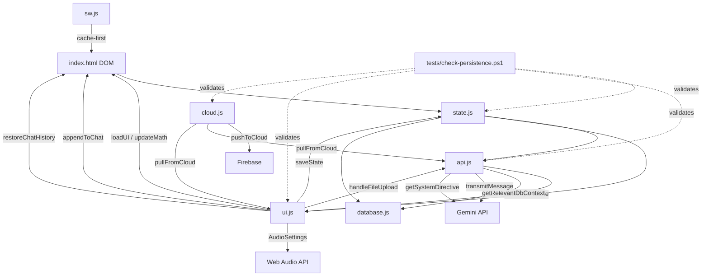

# RobCo U.O.S. — System Architecture

> **Version:** 1.6.4
> **Last Updated:** 2026-06-22
> **Purpose:** Living reference for any engineer (human or AI) working on this project.
> This document maps every system, its dependencies, its persistence contract, and the
> historical lessons that shaped it.

---

## Table of Contents

1. [Project Philosophy](#project-philosophy)
2. [File Map](#file-map)
3. [Script Load Order & Globals](#script-load-order--globals)
4. [State Architecture](#state-architecture)
5. [Persistence Lifecycle](#persistence-lifecycle)
6. [Save/Load/Sync Contract](#saveloadsync-contract)
7. [AI Integration Pipeline](#ai-integration-pipeline)
8. [Audio System](#audio-system)
9. [UI Rendering Pipeline](#ui-rendering-pipeline)
10. [Time System](#time-system)
11. [Faction System](#faction-system)
12. [Undo System](#undo-system)
13. [Settings & localStorage Keys](#settings--localstorage-keys)
14. [System Dependency Map](#system-dependency-map)
15. [Historical Lessons](#historical-lessons)
16. [Adding a New State Field (Checklist)](#adding-a-new-state-field-checklist)
17. [Adding a New Audio Source (Checklist)](#adding-a-new-audio-source-checklist)
18. [Adding a New UI Panel (Checklist)](#adding-a-new-ui-panel-checklist)

---

## Project Philosophy

- **Stability > Features.** A healthy codebase is worth more than a feature-rich broken one.
- **Extend, don't rewrite.** Every rewrite in this project's history introduced new bugs.
- **Immersion is a feature.** The terminal must _feel_ like a real CRT machine — audio, visual effects, and timing matter.
- **One system per concern.** One state object, one save function, one import function, one UI render entry point.
- **Browser-native.** No build step, no framework, no bundler for production. Vanilla HTML/CSS/JS with `<script>` tags.

---

## File Map

```
├── index.html          51KB   DOM structure + all inline event handlers
├── css/terminal.css    ~15KB  All styling, animations, CRT effects
├── js/
│   ├── state.js        7.6KB  State definition, persistence, migration
│   ├── api.js          36.5KB System directive, autoImportState, transmitMessage
│   ├── ui.js           75.4KB Audio, rendering, lifecycle, undo, save slots
│   ├── cloud.js        3.6KB  Firebase push/pull (ES module)
│   └── database.js     2.8KB  CSV data + token triage filter
├── sw.js               2.0KB  Service worker (cache-first for same-origin)
├── tests/
│   ├── check-persistence.ps1   10.3KB  106-test pre-commit audit
│   ├── check-persistence.js    (Node runner)
│   └── run-tests.bat           (Batch launcher)
├── changelog.txt       71.7KB Full version history
├── icon.png            68KB   PWA icon
├── manifest.json       592B   PWA manifest
└── ARCHITECTURE.md     THIS FILE
```

---

## Script Load Order & Globals

Scripts are loaded via `<script>` tags in `index.html` in this exact order:

```
1. js/state.js      → defines: state, chatHistory, APP_VERSION, FACTION_REGISTRY,
                       SKILL_KEYS, saveState, syncStateFromDom, generateSyncPayload,
                       exportSaveFile, migrateState, gameTimeToTicks (via ui.js)
2. js/database.js   → defines: databaseCSVs, getRelevantDbContext
3. js/api.js        → defines: autoImportState, transmitMessage, fetchAuthorizedModels
4. js/ui.js         → defines: appendToChat, loadUI, AudioSettings, all render*(),
                       all audio functions, toggleLimb, updateMath, etc.
5. js/cloud.js      → loaded as <script type="module"> (ES import from Firebase CDN)
                       attaches: window.pushToCloud, window.pullFromCloud
```

**Critical constraint:** Because these are `<script>` tags (not modules), all globals are shared
in the window scope. The ESLint config (`eslint.config.mjs`) declares every cross-file global
to prevent no-undef errors.

`cloud.js` is the **only** ES module — it uses `import` from the Firebase CDN. It attaches
its exports to `window.*` for the other scripts to call.

---

## State Architecture

### The `state` Object (js/state.js)

```javascript
let state = {
  // --- Primitives (synced from DOM inputs) ---
  lvl, xp, hpCur, hpMax,           // Character progression
  s, p, e, c, i, a, l,             // S.P.E.C.I.A.L. stats (1-10)
  caps, loc, rads, karma, ticks,    // Economy, location, bio, time

  // --- Limbs (string: "OK" | "CRIPPLED") ---
  la, ra, ll, rl, hd,

  // --- Structured Objects ---
  factions: { ncr: {fame,infamy}, ... },   // 14 factions via FACTION_REGISTRY
  skills: { barter: 15, ... },              // 13 skills via SKILL_KEYS
  equipped: { weapon, armor, headgear },    // Currently equipped gear
  stats: { kills, capsEarned, damageDealt, sessionStart }, // Session stats
  ammo: {},                                 // Ammo type → count mapping

  // --- Arrays ---
  status: [],           // Active buffs/debuffs [{name, ticks, type}]
  inventory: [],        // Items [{name, qty, wgt, val, type}]
  squad: [],            // Companions [{name, hp, hpMax, weapon, ammo, condition, dt, affinity}]
  campaign_notes: [],   // AI-written tactical notes (strings)
  perks: [],            // [{name, rank, level_taken}]
  quests: [],           // [{name, status, objective, factions}]
  macros: [],           // Saved command strings
};
```

### Adding a New Field

Adding a new top-level key to `state` requires changes in **4 files**. The pre-commit
persistence audit will block the commit if any step is missed:

1. **state.js** — Add the field to `let state = { ... }` with its default value
2. **state.js** — Add migration in `migrateState()` for older saves: `if (!s.newField) s.newField = default;`
3. **api.js** — Add import handling in `autoImportState()` so AI responses update the field
4. _(If applicable)_ **ui.js** — Add rendering in the appropriate `render*()` function

The pre-commit hook (`tests/check-persistence.ps1`) auto-discovers all keys in `state.js`
and verifies that every key appears in `autoImportState()`.

---

## Persistence Lifecycle

### Save Flow

```
User interaction / AI sync
  → syncStateFromDom()          // Reads DOM inputs → state object (immediate)
  → saveState()                 // Debounced (500ms) localStorage.setItem('robco_v7', ...)
  → beforeunload handler        // Flushes pending save immediately on tab close
```

### Load Flow (window.onload in ui.js)

```
localStorage.getItem('robco_v7')
  → JSON.parse
  → migrateState(version, savedState)     // Upgrades old save structure
  → state = { ...state, ...savedState }   // Merge (preserves defaults for missing keys)
  → faction migration (nf/ni/lf/li → state.factions)
  → loadUI()                              // Push state → DOM
```

### Export Flow (exportSaveFile in state.js)

```
syncStateFromDom()
  → Build envelope: { version, state, chat, playstyle }
  → JSON.stringify → data URI → download
```

### Import Flow (handleFileUpload in ui.js)

```
FileReader → JSON.parse
  → Detect envelope (has .version + .state) vs legacy bare state
  → autoImportState(JSON.stringify(stateData))
  → restoreChatHistory(parsed.chat)
  → Restore playstyle
```

### Cloud Push (pushToCloud in cloud.js)

```
setDoc(firestore, {
  version: APP_VERSION,
  savedAt: Date.now(),
  state: stateObj,
  chat: JSON.parse(localStorage.getItem('robco_chat')),
  playstyle: localStorage.getItem('robco_playstyle')
})
```

### Cloud Pull (pullFromCloud in cloud.js)

```
getDoc(firestore)
  → Conflict check (cloud vs local timestamp)
  → Detect envelope vs legacy
  → autoImportState(JSON.stringify(stateData))
  → restoreChatHistory(data.chat)
  → Restore playstyle
```

### Save Slots (saveToSlot / loadFromSlot in ui.js)

```
3 slots: robco_slot_1, robco_slot_2, robco_slot_3
Envelope format: { version, state, chat, playstyle, savedAt, slotName }
Load calls: migrateState() → state merge → restoreChatHistory → loadUI
```

---

## Save/Load/Sync Contract

**Every persistence path must:**

1. Serialize the full `state` object (not a subset)
2. Include `chatHistory`, `playstyle`, and `version` in the envelope
3. Call `migrateState()` on load to handle version upgrades
4. Call `autoImportState()` for AI-originated data
5. Call `restoreChatHistory()` for chat data
6. Never silently drop unknown fields (spread operator preserves them)

---

## AI Integration Pipeline

### Outbound (transmitMessage in api.js)

```
User types command → chatInput
  → appendToChat(userText, 'user')
  → generateSyncPayload()                    // Deep clone of current state
  → Token triage: strip inventory if not needed
  → getRelevantDbContext(userText)            // Attach DB CSVs only for combat/trade
  → Build apiContents from chatHistory        // Full conversation context
  → Inject: [CURRENT STATE] + [COMMAND] into last user message
  → fetch(Gemini API) with:
      - systemInstruction: getSystemDirective()
      - contents: apiContents
      - temperature: 0.2
      - responseMimeType: 'application/json'
  → Parse response as JSON
  → Handle modal (TEXT / GPS / TRADE)
  → appendToChat(narrative, 'ai')            // Typewriter animation
  → autoImportState(parsedNode.state)         // Apply state changes
```

### Inbound (autoImportState in api.js)

```
JSON string → parse
  → Snapshot current state (for undo)
  → Map primitives with case fallback (_g helper)
  → Map SPECIAL stats (clamped 1-10)
  → Map limbs (validated "OK"/"CRIPPLED")
  → Map factions via FACTION_REGISTRY.forEach
  → Map skills via SKILL_KEYS.forEach
  → Map status effects (normalize to {name, ticks, type})
  → Map inventory (direct array replace)
  → Map squad (direct array replace)
  → Map campaign_notes (direct replace)
  → Map perks (normalized {name, rank, level_taken})
  → Map quests (normalized {name, status, objective, factions})
  → Map equipped ({weapon, armor, headgear})
  → Map stats (DELTA accumulation: kills += parsed.kills)
  → Map ammo (direct object replace)
  → Map macros (direct array replace)
  → State diff display (DELTA log to chat)
  → Status effect tick-down (#7)
  → Faction consequence triggers (#4)
  → Location history tracking (#5)
  → Faction change auto-logging to campaign_notes
  → loadUI()
  → playSyncTone()
  → Auto-expand changed panels (#31)
  → Show undo button
```

---

## Audio System

### Architecture

All audio is procedurally synthesized via the Web Audio API. **No audio files exist.**

```
audioCtx (single AudioContext, created at module load in ui.js)
  ├── playClack()           — Typing sound (square wave, 100-150Hz, 50ms)
  ├── playGeigerClick()     — Radiation Geiger (white noise, bandpass 2200Hz, 3ms)
  ├── scheduleGeiger(rate)  — Poisson-distributed click scheduler
  ├── startTinnitus()       — 5200Hz sine, swells every 12-30s
  ├── stopTinnitus()        — Kills oscillator + timeout
  ├── startCrtHum()         — 60Hz sine with 0.08Hz LFO modulation
  ├── setCrtHumIntensity()  — Shifts freq/gain based on rads + cripple
  ├── playLimbCrippleSound()— Arm: sawtooth 380→60Hz; Leg: sine 75→30Hz
  ├── playHeadCrippleSound()— Triangle 550→40Hz + sine 3800Hz ring
  ├── playLimbRestoreSound()— Ascending arpeggio 440→880→1760Hz
  ├── playWakeTone()        — Square wave arpeggio 220→440→880Hz
  └── playSyncTone()        — Sine 880Hz→1320Hz confirmation
```

### Mute Chain

Every audio function checks TWO guards before playing:

```
if (AudioSettings.masterMute) return;   // Global kill switch
if (AudioSettings.<specific>) return;   // Per-system toggle
```

### AudioSettings Cache (ui.js line 6-14)

```javascript
const AudioSettings = {
  typing: localStorage('robco_sfx_muted'),
  hum: localStorage('robco_hum_muted'),
  geiger: localStorage('robco_geiger_muted'),
  tinnitus: localStorage('robco_tinnitus_muted'),
  ambient: localStorage('robco_ambient_muted'), // Limb SFX
  wake: localStorage('robco_wake_muted'),
  masterMute: localStorage('robco_master_muted'),
};
```

Read once at startup. Updated in-memory by `toggleAudio()` and `toggleMasterMute()`.
**Never call localStorage.getItem() in an audio hot path.**

### Change Guards (ui.js line 17-18)

```javascript
let _lastRads = -1,
  _lastCrippled = false;
```

Audio system updates in `updateMath()` only fire when these values actually change,
preventing redundant oscillator creation on every keystroke.

---

## UI Rendering Pipeline

### Entry Point: `loadUI()` (ui.js)

Called after any state change. Pushes state → DOM, then calls all render functions:

```
loadUI()
  → Set all input values from state
  → Decompose ticks → D/H/M time inputs
  → Set skills from state.skills
  → Set limb buttons (OK/CRIPPLED class + text)
  → updateKarmaUI()
  → renderInventory()
  → renderSquad()
  → renderStatus()
  → renderCampaignNotes()
  → renderFactionRep()
  → renderPerks()
  → renderQuests()
  → renderSessionStats()
  → renderEquipped()
  → updateMath()        ← triggers: HP bar, XP bar, karma flash, radiation
                           effects, carry weight, day/night, Geiger, tinnitus,
                           CRT hum, RadAway alert, panel badges, saveState()
  → triggerPhosphorGhost()
  → Radiation SPECIAL debuff coloring
```

### Key Render Functions

| Function                | State Source           | UI Target                                   |
| ----------------------- | ---------------------- | ------------------------------------------- |
| `renderInventory()`     | `state.inventory`      | `#invList` — event-delegated click handlers |
| `renderSquad()`         | `state.squad`          | `#squadList` — HP bars, affinity, weapon    |
| `renderStatus()`        | `state.status`         | `#statusList` — color-coded buff/debuff     |
| `renderPerks()`         | `state.perks`          | `#perksList` — rank, level taken            |
| `renderQuests()`        | `state.quests`         | `#questsList` — color by status             |
| `renderSessionStats()`  | `state.stats`          | `#sessionStatsList` — grid layout           |
| `renderEquipped()`      | `state.equipped`       | `#equippedDisplay` — weapon/armor/head      |
| `renderCampaignNotes()` | `state.campaign_notes` | `#campaignNotesList`                        |
| `renderFactionRep()`    | `state.factions`       | `#factionContainer` — major/minor grid      |

All render functions use `.innerHTML = items.map(...).join('')` (single assignment,
not `+=` loop) for O(n) performance instead of O(n²).

---

## Time System

```
1 tick = 6 minutes in-game
10 ticks = 1 hour
240 ticks = 1 day

gameTimeToTicks(day, hour, min) → tick count
ticksToGameTime(ticks) → "D1 08:30" string

UI: 3 separate inputs (Day/Hour/Min) with onTimeInputChanged()
    + hidden #stat_ticks for backward compat
```

---

## Faction System

### Registry (state.js)

```javascript
FACTION_REGISTRY = [
  { key: 'ncr', name: 'NCR', tier: 'major' },
  { key: 'legion', name: "Caesar's Legion", tier: 'major' },
  // ... 14 total (6 major, 8 minor)
];
```

### Standing Calculation (ui.js)

```
net = fame - infamy
≥ 750  → Idolized (green)
≥ 250  → Liked (green)
≥ 50   → Accepted (green)
≥ -50  → Neutral (amber)
≥ -250 → Tolerated (amber)
≥ -500 → Shunned (red)
< -500 → Vilified (red)
```

### Auto-Logging

`autoImportState()` diffs faction values before/after each AI sync.
Any change is auto-appended to `state.campaign_notes`:
`"[T{ticks}] {FactionName}: fame +N, infamy +N"`

### Consequence Triggers (#4)

When a major faction crosses Vilified (-500 net) or Idolized (+750 net),
a sys alert is appended to chat.

---

## Undo System

### Snapshot

Before `autoImportState()` applies any changes:

```javascript
window._lastStateBeforeSync = JSON.stringify(state);
```

### Restore (undoLastSync in ui.js)

```javascript
let prev = JSON.parse(window._lastStateBeforeSync);
state = { ...state, ...prev };
window._lastStateBeforeSync = null;
loadUI();
```

**Only one level of undo.** Each AI sync overwrites the previous snapshot.
The undo button appears after every sync and hides after use.

---

## Settings & localStorage Keys

| Key                     | Type      | Used By  | Description                            |
| ----------------------- | --------- | -------- | -------------------------------------- |
| `robco_v7`              | JSON      | state.js | Full game state                        |
| `robco_chat`            | JSON      | ui.js    | Chat history (up to 200 messages)      |
| `robco_gemini_key`      | string    | api.js   | Gemini API key                         |
| `robco_gemini_model`    | string    | api.js   | Selected model name                    |
| `robco_courier_id`      | string    | cloud.js | Cloud sync identifier                  |
| `robco_optics`          | string    | ui.js    | Color theme name                       |
| `robco_playstyle`       | string    | api.js   | "any" or "melee"                       |
| `robco_panel_state`     | JSON      | ui.js    | Panel open/closed memory               |
| `robco_version`         | string    | ui.js    | Last seen version (triggers changelog) |
| `robco_sfx_muted`       | bool      | ui.js    | Typing sound mute                      |
| `robco_hum_muted`       | bool      | ui.js    | CRT hum mute                           |
| `robco_geiger_muted`    | bool      | ui.js    | Geiger counter mute                    |
| `robco_tinnitus_muted`  | bool      | ui.js    | Tinnitus mute                          |
| `robco_ambient_muted`   | bool      | ui.js    | Limb SFX mute                          |
| `robco_wake_muted`      | bool      | ui.js    | Tab-return wake tone mute              |
| `robco_master_muted`    | bool      | ui.js    | Global audio kill switch               |
| `robco_typer_speed`     | float     | ui.js    | Typewriter speed multiplier            |
| `robco_last_cloud_push` | timestamp | cloud.js | Conflict detection                     |
| `robco_slot_1/2/3`      | JSON      | ui.js    | Save slots A/B/C                       |

---

## System Dependency Map



### Critical Paths (modify with extreme care)

1. **autoImportState()** — touches state, UI, audio, factions, quests, status effects,
   location history, undo, campaign notes, and panel auto-expand. The single most
   interconnected function in the codebase.

2. **loadUI()** → **updateMath()** — the full render cascade. Every stat, skill, limb,
   faction, inventory item, and audio system flows through here.

3. **Save envelope format** — shared between `exportSaveFile()`, `handleFileUpload()`,
   `pushToCloud()`, `pullFromCloud()`, `saveToSlot()`, `loadFromSlot()`. Changing the
   format requires updating all six.

4. **AudioSettings cache** — 8 audio functions read from this object. `toggleAudio()`
   and `toggleMasterMute()` maintain it. Adding a new audio source requires adding to
   both the cache and the toggle functions.

---

## Historical Lessons

These are bugs and architectural decisions from the changelog that future work must avoid repeating:

### 1. The `flatten()` Disaster (v1.6.4)

**What happened:** A recursive `flatten()` function lowercased all AI response keys, causing
silent key collisions (e.g., `skills.s` colliding with SPECIAL stat `s`).
**Fix:** Replaced with explicit field mapping in `autoImportState()`.
**Lesson:** Never use recursive key transformation on untrusted data structures.

### 2. The innerHTML O(n²) Bug (v1.6.1)

**What happened:** `renderInventory()` and `renderSquad()` used `innerHTML +=` in a loop,
causing a full DOM reparse on every iteration.
**Fix:** Changed to `map().join('')` with single `innerHTML` assignment.
**Lesson:** Never use `innerHTML +=` in a loop. Always build the full string first.

### 3. The XSS Vector (v1.6.1)

**What happened:** AI text was inserted directly as innerHTML without escaping.
**Fix:** All AI text now goes through `escapeHtml()` before DOM insertion. Typewriter uses
`textContent` during animation and swaps to formatted `innerHTML` only once at the end.
**Lesson:** Always escape untrusted text. Use `textContent` when HTML formatting isn't needed.

### 4. The Inventory Amnesia Bug (v1.5.6)

**What happened:** Token triage accidentally dropped the inventory payload during looting.
**Fix:** Added a critical directive forcing the AI to always return the full inventory array.
**Lesson:** Token optimization must never silently drop critical state.

### 5. The Cloud Sync Spam (v1.6.0)

**What happened:** Auto-pushing to cloud on every stat change caused "CLOUD SYNC COMPLETE"
alert popups every second.
**Fix:** Cloud sync now only triggers on manual button press.
**Lesson:** Never auto-trigger user-facing alerts from high-frequency operations.

### 6. The Save Overwrite Race Condition (v1.5.1)

**What happened:** Uploading a save file immediately overwrote imported data with default
HTML values because the save cycle ran before the DOM was updated.
**Fix:** Import now pushes to DOM first, then saves.
**Lesson:** Always ensure DOM → state sync order is correct during imports.

### 7. The Service Worker Reload Loop (v1.6.4 sw.js comment)

**What happened:** `clients.claim()` forced mid-load pages to switch SW, causing interrupted
fetches and reload loops.
**Fix:** Removed `clients.claim()`. The new SW naturally controls the next page load.
**Lesson:** Never use `clients.claim()` in a cache-first service worker.

---

## Adding a New State Field (Checklist)

- [ ] Add field to `let state = { ... }` in **state.js** with default value
- [ ] Add migration in `migrateState()` in **state.js**: `if (!s.field) s.field = default;`
- [ ] Add import handling in `autoImportState()` in **api.js**
- [ ] If the AI should return it: update `getSystemDirective()` schema in **api.js**
- [ ] If it needs UI: add `render*()` function in **ui.js** and call from `loadUI()`
- [ ] If it needs a panel: add `<details class="panel">` in **index.html**
- [ ] Run `npm run lint` — no new errors
- [ ] Run `npm run format` — clean formatting
- [ ] `git commit` — pre-commit audit must pass (all 106+ tests)

---

## Adding a New Audio Source (Checklist)

- [ ] Create function in **ui.js** using the existing `audioCtx`
- [ ] Add `if (AudioSettings.masterMute) return;` as the first line
- [ ] Add a specific mute check: `if (AudioSettings.<key>) return;`
- [ ] Add the mute key to `AudioSettings` initialization (line 6-14 of ui.js)
- [ ] Add a checkbox toggle in **index.html** (in the Audio Systems panel)
- [ ] Add the localStorage key to `toggleAudio()`'s `keyMap` in **ui.js**
- [ ] Add the localStorage key to `toggleMasterMute()`'s un-mute logic
- [ ] Add the new localStorage key to the [Settings table](#settings--localstorage-keys)

---

## Adding a New UI Panel (Checklist)

- [ ] Add `<details class="panel">` block in **index.html**
- [ ] Create `render*()` function in **ui.js**
- [ ] Call `render*()` from `loadUI()` in **ui.js**
- [ ] If it shows a count: add to `_updatePanelBadges()` in **ui.js**
- [ ] If AI changes should auto-expand it: add to `expandPanelForCategory()` map in **ui.js**
- [ ] Panel memory (#35) works automatically via the `details.panel` selector
- [ ] Keyboard shortcut (#15) works automatically for the first 6 panels
