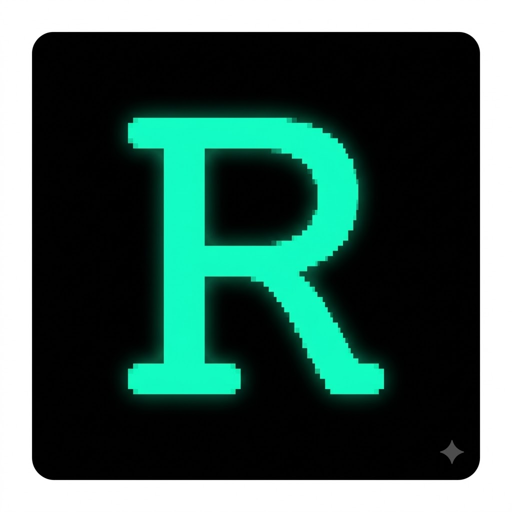

<div align="center">



# RobCo U.O.S.

### **Unified Operating System**

_An AI-powered tactical companion terminal for Fallout: New Vegas_


**A full CRT terminal emulation that connects directly to the Gemini API,**
**turning a browser tab into a living, breathing Pip-Boy companion.**

[Live Demo](https://zerckzzyHD.github.io/Robco-UOS/) · [Features](#-features) · [Architecture](#-architecture) · [Getting Started](#-getting-started) · [Development](#-development) · [Project History](#-project-history)

---

</div>

## What Is This?

RobCo U.O.S. is a standalone web application that functions as a real-time tactical companion for Fallout: New Vegas playthroughs. It connects directly to the Google Gemini API and acts as an AI game master — tracking your character state, running combat math from authentic game databases, managing inventory and faction reputation, and narrating your adventure through a fully immersive CRT terminal interface.

It started as a Google Gemini Gem (chat preset) and evolved into a complete browser-native application with its own state management, save system, cloud sync, procedural audio engine, and PWA installation support.

**This is not a chatbot skin.** It is a structured game engine where the AI is locked into strict JSON output, every stat is mathematically validated, and the terminal itself physically reacts to your character's condition.

---

## ✦ Features

### 🎮 Character & Combat Systems

| System                 | Description                                                                    |
| ---------------------- | ------------------------------------------------------------------------------ |
| **S.P.E.C.I.A.L.**     | All 7 attributes tracked and synced, hard-clamped 1–10                         |
| **13 Skills**          | Barter through Unarmed — used for speech checks, crafting gates, VATS accuracy |
| **Limb Tracking**      | 5 limbs (head, arms, legs) with cripple/restore states and unique trauma audio |
| **Perk System**        | Tracked with rank and level taken, awarded every 2 levels                      |
| **Quest Log**          | Active/complete/failed quests with objectives and faction associations         |
| **Session Statistics** | Kills, caps earned, damage dealt, session timer                                |
| **Equipped Items**     | Weapon, armor, headgear tracked and displayed                                  |

### 💰 Inventory & Economy

| System             | Description                                                                            |
| ------------------ | -------------------------------------------------------------------------------------- |
| **Full Inventory** | Name, quantity, weight, value, and category (weapon/armor/aid/ammo/misc)               |
| **Ammo Reserves**  | Track ammo counts by caliber type — auto-updated by AI, editable manually              |
| **Carry Weight**   | Real-time calculation: `150 + (STR × 10)` with UI deformation at capacity              |
| **Item Quick-Use** | One-tap `[USE]` buttons on every inventory row                                         |
| **Category Tags**  | Color-coded `[TYPE]` badges per item                                                   |
| **Token Triage**   | Inventory payload is stripped from AI calls when not needed, saving ~1,500 tokens/turn |

### 🏛️ Faction & Reputation

| System                   | Description                                                        |
| ------------------------ | ------------------------------------------------------------------ |
| **14 Factions**          | 6 major + 8 minor, each with independent fame/infamy tracking      |
| **Standing Labels**      | Idolized → Vilified with color-coded display                       |
| **Auto-Logging**         | Faction changes automatically appended to campaign notes           |
| **Consequence Triggers** | Alerts when crossing Vilified (-500) or Idolized (+750) thresholds |

### 🤖 AI Integration

| System                 | Description                                                                      |
| ---------------------- | -------------------------------------------------------------------------------- |
| **Gemini API**         | Direct connection via API key (stored locally, never exposed)                    |
| **Tri-Node JSON**      | AI locked into `{narrative, state, modal}` structured output                     |
| **Database Injection** | Weapons, armor, bestiary, chems, recipes, vendors CSVs injected only when needed |
| **State Diff Display** | Every AI sync shows a `[DELTA]` of what changed                                  |
| **Auto-Retry**         | One silent retry on transient 500/502/503 errors                                 |
| **45s Timeout**        | AbortController with cancel button during API calls                              |
| **Model Selection**    | Auto-fetches available Gemini models from your API key                           |

### 💾 Save System

| System                | Description                                                                 |
| --------------------- | --------------------------------------------------------------------------- |
| **Auto-Save**         | Debounced localStorage write (500ms) on every state change                  |
| **3 Save Slots**      | Named slots A/B/C with full envelope (state + chat + playstyle + timestamp) |
| **File Export**       | Download `.json` save files as physical backups                             |
| **File Import**       | Upload saves with automatic version migration                               |
| **Cloud Sync**        | Firebase Firestore push/pull with timestamp conflict detection              |
| **Version Migration** | `migrateState()` chain upgrades any save from any version                   |
| **Quota Detection**   | Warns when localStorage is full instead of silently failing                 |
| **Undo**              | One-click rollback of the last AI sync (full state snapshot)                |

### 🔊 Procedural Audio Engine

Every sound is synthesized in real-time via the Web Audio API. **No audio files exist in this project.**

| Sound               | Trigger                     | Implementation                                               |
| ------------------- | --------------------------- | ------------------------------------------------------------ |
| **Keyboard Clicks** | Every typewriter character  | Square wave, 100-150Hz, 50ms                                 |
| **Geiger Counter**  | Rads ≥ 200                  | Poisson-distributed white noise bursts                       |
| **Tinnitus**        | Rads ≥ 600 or crippled head | 5200Hz sine with periodic swells                             |
| **CRT Hum**         | Always on                   | 60Hz sine with LFO modulation                                |
| **Limb Cripple**    | Toggling a limb to CRIPPLED | Arm: sawtooth clang / Leg: sine thud / Head: triangle + ring |
| **Limb Restore**    | Healing a limb              | Ascending arpeggio 440→880→1760Hz                            |
| **Wake Tone**       | Returning from tab standby  | Square wave 220→440→880Hz                                    |
| **Sync Tone**       | After AI state update       | Two-note sine confirmation                                   |

All sounds respect a master mute toggle and individual per-system mute controls. Audio settings are cached in memory at startup to avoid localStorage reads on audio hot paths.

### 🖥️ Terminal Immersion

<details>
<summary><b>Visual Effects</b></summary>

- **CRT Scanlines** — Repeating gradient overlay with opacity flicker animation
- **Phosphor Persistence** — Ghost glow on stat fields after AI updates
- **Thermal Load** — Background shifts from teal to amber while API is processing
- **Day/Night Cycle** — Blue tint applied during in-game night hours (20:00–06:00)
- **Radiation Interference** — Screen tearing escalates with rad level (200 → 600 → 1000)
- **Carry Weight Deformation** — UI panel sags and jitters at encumbrance thresholds
- **Limb Trauma Glitches** — Crippled limb buttons periodically blink and blur
- **Karma Flash** — Screen-edge glow (green/red) on ≥50 karma change
- **Critical HP Flash** — Red background pulse when HP drops below 25%
- **Stat Delta Ghosts** — Old values rise and fade from changed stat fields

</details>

<details>
<summary><b>Terminal Features</b></summary>

- **Boot Sequence** — Cold-boot animation with memory check on every page load
- **Tab Standby** — Terminal dims on tab switch; ascending wake tone on return
- **Session Uptime Clock** — Live HH:MM:SS counter in the header
- **Memory Cycle** — Screen flicker + "64K STABLE" log every 15 minutes
- **6 Color Themes** — RobCo Green, New Vegas Amber, Vault-Tec Blue, Legion Red, Ghoul Green, Neon Purple
- **Typewriter Speed** — Adjustable 0.25×–3× with context-aware velocity (combat = fast, rest = slow)
- **Narrative Formatting** — Bold rendering, skill check indicators with pass/fail marks
- **Session Resume Briefing** — Status summary appended to chat on load

</details>

### 📱 Progressive Web App

- Installable on iOS, Android, and desktop via the browser install prompt
- Offline-capable with Service Worker cache-first strategy
- Automatic update detection with "REBOOT TERMINAL" prompt on new versions
- Portrait-optimized mobile layout with collapsible panels

---

## 🏗 Architecture

### Technology Stack

| Layer           | Technology                    | Purpose                                   |
| --------------- | ----------------------------- | ----------------------------------------- |
| **Frontend**    | Vanilla HTML5 / CSS3 / ES2022 | Zero-framework browser-native app         |
| **Styling**     | CSS Custom Properties         | Dynamic theming via `--robco-*` variables |
| **Audio**       | Web Audio API                 | Procedural synthesis — no audio files     |
| **AI**          | Google Gemini API             | Structured JSON game engine               |
| **Cloud**       | Firebase Firestore            | Cross-device save synchronization         |
| **PWA**         | Service Worker + Manifest     | Installable offline-capable app           |
| **Dev Tooling** | ESLint + Prettier + Vite      | Linting, formatting, dev server           |
| **Testing**     | PowerShell persistence audit  | 178-test pre-commit gate                  |

### File Structure

```
├── index.html              DOM structure + inline event handlers
├── css/terminal.css        All styling, animations, CRT effects
├── js/
│   ├── state.js            State definition, persistence, migration
│   ├── registry.js         Read-only Fallout Data Registry (~280 items, 130 quests, 110 perks, 120 locations)
│   ├── api.js              System directive, AI import, API communication
│   ├── ui.js               Audio engine, rendering, lifecycle, save slots, autocomplete
│   ├── cloud.js            Firebase push/pull (ES module)
│   └── database.js         Game CSV data (~170 weapons, ~68 armors, ~45 chems) + lookupItemInDb()
├── sw.js                   Service Worker (cache-first, same-origin only)
├── tests/
│   └── check-persistence.ps1  Pre-commit 178-test persistence audit
├── ARCHITECTURE.md         Full system dependency map & patterns
├── changelog.txt           Complete version history (v1.1.7 → present)
├── icon.png                PWA icon
└── manifest.json           PWA manifest
```

### Script Load Order

Scripts are loaded as `<script>` tags in strict order. All globals are shared via the window scope:

```
1. state.js      →  state, chatHistory, APP_VERSION, saveState, migrateState
2. database.js   →  databaseCSVs, lookupItemInDb
3. registry.js   →  FALLOUT_REGISTRY, registrySearch
4. api.js        →  autoImportState, transmitMessage, fetchAuthorizedModels
5. ui.js         →  appendToChat, loadUI, AudioSettings, all render/audio functions
6. cloud.js      →  window.pushToCloud, window.pullFromCloud (ES module)
```

### Persistence Architecture

```
                    ┌─────────────────┐
                    │   User / AI     │
                    └────────┬────────┘
                             │
                    ┌────────▼────────┐
                    │  syncStateFromDom│  ← reads DOM inputs into state
                    └────────┬────────┘
                             │
              ┌──────────────┼──────────────┐
              │              │              │
     ┌────────▼───┐  ┌──────▼──────┐  ┌────▼────────┐
     │ saveState  │  │ exportSave  │  │ pushToCloud  │
     │ (localStorage)│ (JSON file) │  │ (Firestore)  │
     └────────────┘  └─────────────┘  └──────────────┘

              ┌──────────────┼──────────────┐
              │              │              │
     ┌────────▼───┐  ┌──────▼──────┐  ┌────▼────────┐
     │ onload     │  │ fileUpload  │  │ pullFromCloud│
     │ (localStorage)│ (JSON file) │  │ (Firestore)  │
     └──────┬─────┘  └──────┬──────┘  └──────┬──────┘
            │               │                │
            └───────────────┼────────────────┘
                            │
                   ┌────────▼────────┐
                   │  migrateState   │  ← upgrades old save formats
                   └────────┬────────┘
                            │
                   ┌────────▼────────┐
                   │    loadUI()     │  ← pushes state → DOM
                   └─────────────────┘
```

### Testing & Quality Gates

**Commits are blocked if any test fails.** Additional tooling:

- **ESLint** — Static analysis catching undefined variables and unreachable code
- **Prettier** — Consistent formatting across all files

---

## 🚀 Getting Started

### Prerequisites

- [Node.js](https://nodejs.org/) v18+ (for dev tooling only — not required for production)
- A [Google Gemini API key](https://aistudio.google.com/apikey)

### Installation

```bash
# Clone the repository
git clone https://github.com/zerckzzyHD/Robco-UOS.git
cd Robco-UOS

# Install dev dependencies
npm install
```

### Local Development

```bash
# Start the Vite dev server with hot reload
npm run dev
```

Open the URL shown in your terminal (typically `http://localhost:5173`).

### Production Deployment

This is a **static site** — no build step required.

**GitHub Pages** is deployed automatically on every push to `main` via GitHub Actions.
The live site is available at: **https://zerckzzyHD.github.io/Robco-UOS/**

You can also deploy to any other static host:

- **Netlify** — Drag and drop the folder, or connect the GitHub repo
- **Vercel** — Import the repository
- **Any HTTP server** — Just serve the files

### First Run

1. Open the terminal in your browser
2. Wait for the boot sequence to complete
3. Paste your Gemini API key in the Configuration panel
4. Click **VALIDATE KEY & FETCH ENGINES**
5. Select a model from the dropdown
6. Start playing — type commands or free-form text in the Comm-Link

---

## 🛠 Development

### Available Scripts

```bash
npm run lint      # ESLint static analysis
npm run format    # Prettier auto-formatting
npm run dev       # Vite dev server with hot reload
```

### Adding a New State Field

> See [ARCHITECTURE.md](ARCHITECTURE.md#adding-a-new-state-field-checklist) for the full checklist.

1. Add to `let state = { ... }` in `state.js`
2. Add migration in `migrateState()` in `state.js`
3. Add import handling in `autoImportState()` in `api.js`
4. Update `getSystemDirective()` schema if the AI should return it
5. Add UI rendering if needed in `ui.js`
6. Commit — the pre-commit audit will verify coverage

### Adding a New Audio Source

> See [ARCHITECTURE.md](ARCHITECTURE.md#adding-a-new-audio-source-checklist) for the full checklist.

Every audio function must check `AudioSettings.masterMute` and its specific mute toggle before playing. The `AudioSettings` cache is initialized once at startup — never read `localStorage` in audio hot paths.

### Commit Workflow

```
npm run lint        ← catch bugs
npm run format      ← enforce style
git add -A
git commit          ← persistence audit runs automatically (203 tests)
git push origin main
```

---

## 📜 Project History

<details>
<summary><b>Full Evolution Timeline</b></summary>

### Phase 1 — The Gemini Gem (v1.0 – v1.3)

RobCo U.O.S. began as a **Google Gemini Gem** — a system prompt preset that turned the Gemini chat interface into a Fallout: New Vegas game master. All state was tracked in the AI's context window using ASCII art and text formatting.

Key milestones:

- **v1.1.7** — Architecture split: dev manual moved to external knowledge files
- **v1.2.0** — Token compression: ASCII footers replaced with minified JSON
- **v1.3.0** — Core math hardcoded: XP scaling, carry weight, skill formulas
- **v1.3.9** — Mobile geometry overhaul with Unicode box-drawing characters

### Phase 2 — The Web Application (v1.4 – v1.5)

The project evolved from a chat preset into a standalone browser application with its own state management and API integration.

Key milestones:

- **v1.4.7** — State offloaded from AI context to browser-side JavaScript
- **v1.5.0** — Native Gemini API integration (no more copy-pasting JSON)
- **v1.5.5** — Tri-Node JSON architecture, campaign notes, modals
- **v1.5.6** — Modular architecture: monolith split into 5 JS files
- **v1.5.8** — PWA integration with Service Worker

### Phase 3 — The Living Machine (v1.6)

The terminal became an immersive experience with procedural audio, visual effects, and comprehensive character tracking.

Key milestones:

- **v1.6.0** — Playstyle toggle, PWA deep integration, CRT visual overhaul
- **v1.6.1** — Procedural Geiger counter, tinnitus, CRT hum, limb trauma audio
- **v1.6.2** — Skill matrix, status effects, campaign notes, undo system
- **v1.6.3** — 14-faction network, save envelope format, cloud sync envelope
- **v1.6.4** — Quest log, equipped tracking, save slots, session stats, 48 features
- **v1.6.5** — Fallout Data Registry fully populated: 130 quests, 110+ perks, 120 locations, 10 companions, ~280 items (wiki-sourced). Perk autocomplete wired.
- **v1.6.6** — THREAT database remediation: [TH] shorthand fixed, [THREAT] inventory context, all 9 CSV tables fully expanded, QUEST_ITEMS table added, databaseCSVs moved to systemInstruction.
- **v1.6.7** — Modernization pass: dead code removal (getRelevantDbContext, macros), CSV full expansion (~170 weapons, ~68 armors, ~45 chems), Ammo Reserves panel (renderAmmo/addAmmo/removeAmmo), DB-backed autoImportState weight normalization, APP_VERSION 1.6.7.

</details>

### Current State (v1.6.8)

The project is a **production-quality browser application** with:

- 33 tracked state fields across 5 structured systems
- 203-test automated persistence audit (DOM binding, Protocol 4 enforcement, migrateState mock execution, reputation 2D matrix, CRUD function existence, CAMPG tab DOM binding, campaignMode Protocol 4 binary + separation)
- 14-faction reputation network
- 13-skill character sheet
- Full save/load/export/import/cloud sync/undo pipeline
- 8 procedural audio sources
- 6 color themes
- 3 save slots
- Installable PWA with offline support
- **Fallout Data Registry** — 130 quests · ~110 perks · ~120 locations · 10 companions · ~280 items (all wiki-sourced, CC-BY-SA 4.0)
- **Registry Autocomplete** — live CRT-styled dropdown on Quest Name, Item Name, and Perk Name inputs (keyboard + click)
- **Combat Database** — 9 CSV tables: 66 enemies · ~170 weapons · 47 ammo subtypes · ~68 armors · ~45 chems · 18 misc items · 10 recipes · 19 quest items · 14 vendors (all wiki-sourced)
- **Ammo Reserves Panel** — track ammo counts per caliber, manually added or AI-updated, with badge count and auto-expand on AI sync
- **DB-backed weight normalization** — `lookupItemInDb()` auto-corrects 0-weight items on every AI sync using canonical CSV data
- **Reliable DB injection** — databaseCSVs always present in systemInstruction (guaranteed model attention, no long-session drift)

---

## 🗂 Additional Documentation

| Document                           | Description                                                                                                                              |
| ---------------------------------- | ---------------------------------------------------------------------------------------------------------------------------------------- |
| [ARCHITECTURE.md](ARCHITECTURE.md) | System dependency map, persistence lifecycle, audio chain, historical lessons, and checklists for adding state fields, audio, and panels |
| [changelog.txt](changelog.txt)     | Complete version history from v1.1.7 to present                                                                                          |

---

<div align="center">

_RobCo Industries (TM) — Unified Operating System_
_Copyright 2075-2077 RobCo Industries_

_Built with vanilla JavaScript, procedural audio, and an unhealthy obsession with CRT aesthetics._

_Game data sourced from the [Independent Fallout Wiki](https://fallout.wiki) under [CC-BY-SA 3.0](https://creativecommons.org/licenses/by-sa/3.0/)._

</div>
