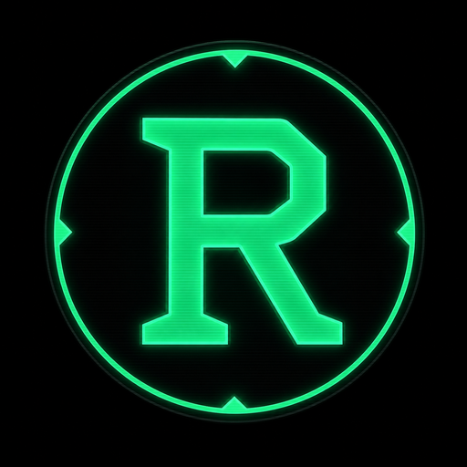

<div align="center">



# RobCo U.O.S.

### **Unified Operating System**

_An AI-powered tactical companion terminal for Fallout: New Vegas **and** Fallout 3_

[](https://github.com/zerckzzyHD/Robco-UOS/actions/workflows/deploy-staging.yml)
[](https://github.com/zerckzzyHD/Robco-UOS/actions/workflows/ci.yml)
[](https://github.com/zerckzzyHD/Robco-UOS/actions/workflows/nightly-tests.yml)


**A full CRT terminal emulation that turns a browser tab into a living Pip-Boy companion —**
**now with two Wastelands, an offline native toolset, and an AI Director that's optional, not required.**

[Live Demo](https://zerckzzyHD.github.io/Robco-UOS/) · [Features](#-features) · [Architecture](#-architecture) · [Getting Started](#-getting-started) · [Development](#-development) · [Project History](#-project-history)

**Current version: 2.7.0 — "Native Systems & Two Wastelands"**

---

</div>

## What Is This?

RobCo U.O.S. is a standalone, browser-native web application that acts as a real-time tactical companion for **Fallout: New Vegas** and **Fallout 3** playthroughs. It tracks your character, inventory, factions, quests, and world state inside a fully immersive CRT terminal, and — when you want it — connects to the Google Gemini API to act as an AI game master that narrates your adventure and updates your sheet through strict, validated JSON.

It began as a Google Gemini Gem (a chat preset) and grew into a complete application with its own state engine, save system, cloud sync, procedural audio, and PWA install support.

**This is not a chatbot skin.** It is a structured game engine where the AI is locked into JSON output and every value is validated before it touches your campaign — and where the heaviest, most-used tools (combat math, barter, threat assessment, lookups, medical advisories, looting) now run **entirely offline with no AI call at all**. The terminal itself physically reacts to your character's condition.

### Two games, one engine

Both games are first-class and fully data-driven. A single `GAME_DEFS` table plus per-game data files (`reg_nv`/`reg_fo3`, `db_nv`/`db_fo3`) drive everything — factions, skills, registries, databases, collectibles, theming, identity. New Vegas and Fallout 3 each get their own registries, bestiary, item data, default terminal colour, boot identity, and save-manager banner. Adding a future Fallout title is a data drop-in (a `GAME_DEFS` entry + its two data files), not a code rewrite.

---

## ✦ Features

### 🛠️ Native Offline Tools (no AI, deterministic, free)

Six in-terminal tools compute their results **on-device from the game's own data** — zero network, zero AI, the same answer every time. Reachable from the Tool Deck (a small button beside the Comm-Link message box) or typed commands.

| Tool                      | What it does                                                                                                                                                 |
| ------------------------- | ------------------------------------------------------------------------------------------------------------------------------------------------------------ |
| **V.A.T.S.**              | Hit-% per body part, crit bonus (+5% NV / +15% FO3), and an exact melee/unarmed AP-strike optimiser; reads the equipped weapon + SPECIAL + a TARGET DT input |
| **THREAT**                | Bestiary stat card for any creature + estimated time-to-neutralize and ammo/strike burn against your equipped weapon                                         |
| **TRADE** (BARTER UPLINK) | Full offline barter terminal — buy/sell at real Fallout Barter-skill prices, confirm-gated, never auto-syncs                                                 |
| **CONSULT**               | Databank lookup across items, perks, quests, locations, companions, and creatures, with key stats; says so plainly if nothing matches                        |
| **BIO-SCAN**              | Medical advisory — HP tier, radiation, per-limb OK/CRIPPLED, addiction flags, and the right healing/rad/cure items (sourced from the game's own chem data)   |
| **LOOT**                  | Salvage intake — search the item database and add anything to your pack at its canonical value (additive + confirm-gated)                                    |

A `[FEATURES]` command registry lists every command the terminal supports and is kept honest by the build gate.

### 📟 Device Capabilities

Nine capabilities, each with a graceful fallback when the device/browser doesn't support it:

- **Sustained Power Cell** — Screen Wake Lock (keep the display awake while reading)
- **Haptic Solenoid** — Vibration feedback on level-up, faction flips, and critical HP (honours reduced-motion)
- **Eject Holotape** — Web Share of your comm-link transcript (falls back to clipboard, then file)
- **Pending-Directives Tally** — app-icon Badging with your unresolved-quest count
- **Pip-Boy Radio** — a zero-byte, fully synthesized ambient station (WebAudio)
- **Cold-Start / Degraded-Tube Boot** — a first-ever full POST plus a rare (~1 in 100) glitchy boot variant, reduced-motion-safe
- **Overseer's Log** — local device telemetry (uptime, longest session, total power-on, boot count) merged with your campaign statistics
- **High-Lumen Optics** — a high-contrast display mode (auto-on under `prefers-contrast`)
- **Immersion dial** — a Full/Balanced/Minimal control for how much ambient atmosphere the terminal runs; a per-device preference (never rides your saves), defaulting to Full. A born-compliant seam the ambient layer will subscribe to

### 🎮 Character, Combat & World

| System               | Description                                                                                                                 |
| -------------------- | --------------------------------------------------------------------------------------------------------------------------- |
| **S.P.E.C.I.A.L.**   | All 7 attributes, editable and hard-clamped 1–10                                                                            |
| **Skills**           | Per-game skill sets (NV's 13 incl. Guns/Survival; FO3's incl. Small Guns/Big Guns)                                          |
| **Limb Tracking**    | 5 limbs with cripple/restore states and unique trauma audio                                                                 |
| **Perks & Quests**   | Perk log (rank + level taken); quest log with objectives, status, and DLC tagging                                           |
| **Factions**         | Per-game reputation networks with fame/infamy, standing labels, and threshold alerts                                        |
| **World Grid Map**   | Region map with fog-of-war discovery, collectible markers, zoom, and a native "LOG VISIT" mark-visited control              |
| **Trackers**         | Collectibles (snow globes / bobbleheads), FO3 Lincoln memorabilia, NV traits, skill books (READ/UNREAD), NV skill magazines |
| **Crafting**         | Recipe + breakdown registry with a batch craft/scrap panel (workbench/campfire/recycling)                                   |
| **Inventory & Ammo** | Categorised inventory, per-caliber ammo reserves, carry weight `150 + STR×10`, one-tap USE                                  |

### 🎨 Per-Game Theming

- **Per-game default optic** — New Vegas boots in the bright RobCo green; Fallout 3 in a distinct, duller Pip-Boy green (both WCAG-AA contrast-verified). Driven by `GAME_DEFS[ctx].theme`.
- **Dynamic "(Default)" label** — the OPTICS picker tags the active game's default colour.
- **Per-game optic memory** — each game remembers its own chosen colour independently (keyed by game context; a 3rd game needs no code change).
- **Per-game identity** — a boot identity line (e.g. "PIP-BOY 3000 — MOJAVE WASTELAND UPLINK") and a save-manager banner per game.
- All colour options (RobCo Green, Pip-Boy Green, Amber, Vault-Tec Blue, Legion Red, Ghoul Green, Neon Violet) are selectable in either game.

### 🤖 The AI Director (optional)

| System                 | Description                                                                                                                                                                                                                                                         |
| ---------------------- | ------------------------------------------------------------------------------------------------------------------------------------------------------------------------------------------------------------------------------------------------------------------- |
| **Gemini API**         | Direct connection via your API key (stored locally, never exposed)                                                                                                                                                                                                  |
| **Tri-Node JSON**      | The Director is locked to `{narrative, state, modal}` structured output (`application/json`)                                                                                                                                                                        |
| **Validated import**   | `autoImportState()` explicitly field-maps + validates every value before it persists — the AI is never the sole source of truth                                                                                                                                     |
| **Database injection** | The active game's full weapons/armor/bestiary/chems/recipes/vendors CSVs are sent to the AI on every message as a dedicated part of the system instruction (alongside the directive). The same per-game data also powers the native offline tools via local lookups |
| **Resilience**         | Bounded auto-retry with backoff, clear auth-error messaging, prompt-injection hardening, input caps                                                                                                                                                                 |
| **Fully optional**     | The six native tools and the whole UI work with no key and no network                                                                                                                                                                                               |

### 💾 Saves & Cloud

- **Auto-save** (debounced localStorage), **A/B/C slots**, **file export/import** with version migration, **rolling backups** with FNV-1a checksums.
- **Save version history** — each slot retains up to 5 prior revisions in IndexedDB (riding its headroom, never the localStorage ceiling); view and restore any earlier version from the saves list. Restoring is confirm-gated and takes a rolling backup first; if IndexedDB is unavailable the feature is simply not offered and save/load is unchanged.
- **Full backup bundle** — a one-file "EXPORT FULL BACKUP" of your entire history (live campaign + all slots with their version rings + rolling backups + chat + playstyle), version-stamped and checksummed. IMPORT SAVE auto-detects a bundle and restores it — confirm-gated, integrity-checked (a bad or edited file is refused with no partial apply), and a rolling backup of your current state is taken first. Campaign/save data only — device preferences are never included (the two-store boundary holds).
- **Cloud sync** via Firebase Firestore — additive writes only (never a blind overwrite), confirm-gated destructive actions, Google sign-in (popup-only), anonymous boot, and a Gemini-key sync option.
- **Offline cloud-push queue** — a manual "Save to Cloud" pressed while offline (or that fails on network) is queued device-locally and flushed automatically on reconnect. Retry-only: it _never_ auto-pushes on a state change — cloud sync stays a manual button. Bounded + contentHash-deduped (no duplicate cloud saves), uid-scoped, kill-switch-gated, and fully fail-safe (no IndexedDB / flag off → the button behaves exactly as before).
- **Remote kill-switch** — a fail-open feature-flag config that can disable a networked feature remotely, always defaulting to last-known-good / features-enabled so it can never black-screen the app.

### ♿ Accessibility & PWA

- Keyboard `:focus-visible` rings, full `prefers-reduced-motion` freeze (CRT flicker/scanlines), `aria-live` chat, `role="dialog"` focus-trapped modals, AA-contrast tab states, and descriptive labels on every control (inventory, faction, limb buttons).
- Installable PWA (iOS / Android / desktop), offline-capable (cache-first Service Worker), with a **reliable "REBOOT TERMINAL" auto-update flow** — a focus/visibility re-check plus a durable "has-updated-before" record surface a waiting update even in an installed standalone PWA.
- Touch-first responsive layout (verified at 360 px / 412 px, no horizontal overflow); the desktop two-column shell is gated to real mouse/hover devices so a phone never boots the desktop layout.

### 🔊 Procedural Audio

Every sound is synthesized live via the Web Audio API — **no audio files ship in this project.** Typewriter clicks, Geiger counter (rads ≥ 200), tinnitus (rads ≥ 600 / crippled head), CRT hum, limb-trauma/restore tones, wake/sync tones, the boot drone, and the Pip-Boy Radio station. All respect a master mute + per-source toggles, read from an in-memory cache (never localStorage on hot paths).

### 🖥️ Terminal Immersion

CRT scanlines, phosphor persistence ghosting, thermal-load tint while the Director is thinking, day/night cycle, radiation interference, carry-weight deformation, limb-trauma glitches, karma/critical-HP flashes, a live uptime clock, a periodic memory-cycle flicker, and the redesigned in-app **FIRMWARE REVISION LOG** changelog viewer (environment-aware: staging shows in-progress notes, production shows only released versions).

---

## 🏗 Architecture

### Technology Stack

| Layer           | Technology                                       | Purpose                                                      |
| --------------- | ------------------------------------------------ | ------------------------------------------------------------ |
| **Frontend**    | Vanilla HTML5 / CSS3 / ES2022                    | Zero-framework, browser-native (global-scope script tags)    |
| **Styling**     | CSS Custom Properties                            | Dynamic theming via `--robco-*` variables                    |
| **Audio**       | Web Audio API                                    | Procedural synthesis — no audio files                        |
| **AI**          | Google Gemini API                                | Optional structured-JSON game master                         |
| **Cloud**       | Firebase Auth + Firestore                        | Cross-device save sync, sign-in, remote feature flags        |
| **PWA**         | Service Worker + Manifest                        | Installable, offline-capable, reliable auto-update           |
| **Hosting**     | GitHub Pages (prod) + Cloudflare Pages (staging) | Release-gated production; auto-deployed staging              |
| **Dev Tooling** | ESLint + Prettier + Vite                         | Linting, formatting, dev server                              |
| **Testing**     | Node + PowerShell + Playwright                   | 2312-test gate at parity + boot-smoke / render / a11y checks |

### Per-game data system

`GAME_DEFS` (in `state.js`) declares each game's factions, skills, collectible label, theme, calculator coefficients, and seed inventory. `_activeDef()` returns the active game's config; a one-line `GAME_FILES` boot manifest in `index.html` selects which per-game data files to load. Feature code reads `GAME_DEFS[ctx]` rather than hardcoding game literals (Protocol 38), so the engine scales to N games by data alone.

### File Structure

```
├── index.html              DOM, inline handlers, GAME_FILES boot manifest, SW registration
├── css/terminal.css        All styling, CRT effects, responsive + reduced-motion layers
├── js/
│   ├── db_nv.js            FNV game CSV data + lookups
│   ├── db_fo3.js           FO3 game CSV data + lookups
│   ├── idb.js              Async IndexedDB durability engine (device-pref write-through shadow)
│   ├── state.js            State, persistence, migration, GAME_DEFS, THEMES, _activeDef()
│   ├── reg_nv.js           FNV Fallout Data Registry (read-only)
│   ├── reg_fo3.js          FO3 Fallout Data Registry (read-only)
│   ├── registry-core.js    Shared registrySearch() (game-agnostic, both contexts)
│   ├── ui-audio.js         Audio engine, boot sequence, optics (THEMES table)
│   ├── ui-render.js        render*() functions, CRUD helpers, map/faction/time utilities
│   ├── ui-saves.js         Save slots, file import/export, rolling backups, autocomplete
│   ├── ui-account.js       Account/UPLINK panel, cloud save picker, save-manager header
│   ├── runtime.js          Ambient Runtime — lifecycle state machine + heartbeat + observer registry
│   ├── ui-core.js          UI lifecycle, COMMAND_REGISTRY, native command surfaces, badges
│   ├── api.js              System directive, NATIVE_COMMAND_ROUTER, autoImportState, transmit
│   └── cloud.js            Firebase auth + Firestore push/pull + remote config (ES module)
├── sw.js                   Service Worker (cache-first, atomic precache, reliable update)
├── manifest.json           PWA manifest (version-less name + app shortcuts)
├── tests/
│   ├── robco-diagnostics.js   Node persistence/structure audit (2312 tests, 184 suites)
│   ├── robco-diagnostics.ps1  PowerShell mirror (parity-locked)
│   ├── test.html              Browser-side runtime import-contract audit
│   └── *.mjs                  Playwright boot-smoke / render-check / a11y-baseline
├── scripts/gate.js         The full local gate (lint, format, both runners, browser checks)
├── ARCHITECTURE.md         Full system dependency map & patterns
├── CHANGELOG.md            Version history (in-app FIRMWARE REVISION LOG reads this)
└── assets/                 PWA icon + app-shortcut icons
```

### Script Load Order

Global-scope `<script>` tags load in strict order (per-game db/reg pair is chosen by the boot manifest):

```
0. idb.js                →  window.IdbStore (async IndexedDB engine; loaded before the boot manifest)
1. db_nv.js / db_fo3.js  →  databaseCSVs, lookupItemInDb (active game)
2. state.js              →  state, APP_VERSION, GAME_DEFS, THEMES, saveState, migrateState
3. reg_nv.js / reg_fo3.js→  FALLOUT_REGISTRY (active game, read-only)
4. registry-core.js      →  registrySearch (shared, game-agnostic)
5. ui-audio.js           →  AudioSettings, audio + boot + optics functions
6. ui-render.js          →  render*() functions, CRUD helpers, map/faction/time
7. ui-saves.js           →  save slots, file import/export, autocomplete
8. ui-account.js         →  renderAccount, renderSavesList, undoLastSync
9. runtime.js            →  window.AmbientRuntime (lifecycle state machine + observer scheduler)
10. ui-core.js           →  appendToChat, loadUI, updateMath, COMMAND_REGISTRY
11. api.js               →  autoImportState, transmitMessage, NATIVE_COMMAND_ROUTER
12. cloud.js             →  window.pushToCloud / pullFromCloud (ES module)
```

`ARCHITECTURE.md` is the canonical deep reference (persistence lifecycle, audio chain, boundaries, and add-a-field/audio/panel checklists).

---

## 🚀 Getting Started

### Prerequisites

- [Node.js](https://nodejs.org/) v18+ (dev tooling only — not required to run the app)
- A [Google Gemini API key](https://aistudio.google.com/apikey) — **optional**; the native tools and the whole terminal work without one

### Installation

```bash
git clone https://github.com/zerckzzyHD/Robco-UOS.git
cd Robco-UOS
npm install        # dev dependencies (ESLint, Prettier, Vite, Playwright)
```

### Local Development

```bash
npm run dev        # Vite dev server with hot reload (typically http://localhost:5173)
```

### First Run

1. Open the terminal and let the boot sequence finish.
2. Pick your game (New Vegas or Fallout 3).
3. _(Optional)_ Paste a Gemini key in Configuration → **VALIDATE KEY & FETCH ENGINES**, then pick a model — only needed for the AI Director.
4. Start playing: type commands or free text in the Comm-Link, or use the native tools (VATS, TRADE, THREAT, CONSULT, BIO-SCAN, LOOT) with no key at all.

### Hosting & Release Flow

This is a **static site** — no build step to run it.

- **Production:** GitHub Pages at **https://zerckzzyHD.github.io/Robco-UOS/**, built from `main` and **release-gated** — it publishes only on a version release.
- **Staging:** a private Cloudflare Pages build from `dev` (`robco-uos-dev.pages.dev`) for real-device testing, auto-deployed on every dev push and stamped as a DEV BUILD.

---

## 🛠 Development

### Available Scripts

```bash
npm run lint        # ESLint (zero warnings)
npm run format      # Prettier
npm run dev         # Vite dev server
npm run gate        # FULL gate: lint + format + both runners + boot-smoke + render + a11y + test.html
npm run gate:fast   # Fast subset run by the pre-commit hook
npm run gate:iter   # OPT-IN iteration pre-check (lint changed + format + Node runner); never a commit/push gate
```

### Quality Gate

Commits and pushes are blocked unless the gate is green. The pre-commit hook runs the fast subset (lint, format, **both** test runners at parity); the pre-push hook + CI run the full gate (adds Playwright boot-smoke, a 360/412 render-check, an accessibility baseline-diff, and the `test.html` runtime audit). A `CACHE_NAME` bump is required whenever a served file changes, and the test count is kept in sync across every doc in the same commit.

### Commit Workflow (dev-branch model)

All unreleased work goes to **`dev`**; **`main` is release-only**. Each commit keeps docs + the 2206-test count in sync and bumps `CACHE_NAME` when a served file changes.

```
npm run lint && npm run format
git add -A
git commit          # pre-commit: cache-bump guard, then fast gate (both runners)
git push origin dev # pre-push: full gate (+ Playwright + a11y + test.html)
```

---

## 📜 Project History

<details>
<summary><b>Full Evolution Timeline</b></summary>

### Phase 1 — The Gemini Gem (v1.0 – v1.3)

Began as a **Google Gemini Gem** — a system prompt that turned the Gemini chat into a Fallout: New Vegas game master, with all state tracked in the AI's context window via ASCII art.

### Phase 2 — The Web Application (v1.4 – v1.5)

Evolved into a standalone browser app: state offloaded to JavaScript, native Gemini API integration, the Tri-Node JSON contract, a modular file split, and PWA integration.

### Phase 3 — The Living Machine (v1.6)

Procedural audio, CRT visual effects, the 14-faction network, the save envelope + cloud sync, the quest log, and the wiki-sourced Fallout Data Registry + combat database.

### Phase 4 — Two Wastelands & Self-Reliance (v2.0 – v2.7)

The browser-native era: a second game (**Fallout 3**) added as a first-class, fully data-driven context; the six heavy tools (VATS, TRADE, THREAT, CONSULT, BIO-SCAN, LOOT) converted to **offline native calculators**; nine device capabilities; per-game theming + identity; a comprehensive accessibility pass; cloud auth + a remote kill-switch; a hardened PWA auto-update flow; and a self-improving test gate.

</details>

### Current State (v2.7.0)

A **production-quality, two-game browser application** with:

- **Both Fallout: New Vegas and Fallout 3** as fully data-driven game contexts (`GAME_DEFS`, per-game registries/databases/theming/identity)
- **Six native offline tools** (V.A.T.S., TRADE, THREAT, CONSULT, BIO-SCAN, LOOT) — deterministic, no AI, plus a self-checked command registry
- **Eight device capabilities** (Wake Lock, Vibration, Web Share, Badging, Pip-Boy Radio, cold-start/degraded boot, Overseer's Log, High-Lumen Optics)
- **Per-game theming** — per-game default optic, dynamic "(Default)" label, per-game colour memory, per-game boot/save identity
- **Device bezel chrome** _(Design Overhaul, dev-only)_ — the app renders inside a physical RobCo terminal casing, with the old tab bar replaced by an illuminated subsystem selector (OPERATOR/OPERATIONS/DATABANK/UPLINK/CHASSIS/SETTINGS + a flat DIRECTORY fallback) that routes through the same underlying tab router; CHASSIS hosts device telemetry + firmware/carrier/feature-flag status, and SETTINGS is the one home for Account, the Module Bay, Save Archive, and Campaign Configs
- **Director Uplink — the living Overseer** _(Design Overhaul, dev-only)_ — the Comm-Link is reskinned as a phosphor-oscilloscope presence whose waveform reacts to the real AI lifecycle (listening/thinking/speaking/no-carrier/offline), with a per-game status strip and a self-contained mobile view
- **Tool Deck + Quick-Draw Holster** _(Design Overhaul, dev-only)_ — a zero-footprint launcher key beside the Comm-Link message box raises a bottom-sheet deck for the six native tools, and the old blind D-Pad shortcuts are redesigned into four gear-vector sockets that show, fire, and let you rebind your quick-draw gear
- **Full character/world systems** — SPECIAL, per-game skills, limbs, perks, quests, factions, world-grid map with mark-visited, and trackers (collectibles, Lincoln memorabilia, traits, skill books, magazines) + a crafting panel
- **Optional AI Director** — Tri-Node JSON, validated import, resilient + prompt-injection-hardened
- **Saves & cloud** — auto-save, A/B/C slots (with confirm-gated overwrite/delete + version history), export/import + migration, rolling checksummed backups, additive Firestore sync (with its own confirm-gated overwrite/delete + version history), Google sign-in, remote kill-switch, per-game filtered saves list
- **Accessibility + PWA** — focus rings, reduced-motion, live regions, dialog focus traps, AA contrast; installable, offline, reliable auto-update; touch-first responsive
- **Wiki-sourced data** — per-game Fallout Data Registries + combat databases (weapons, armor, bestiary, chems, recipes, vendors, quest items), all from the Independent Fallout Wiki
- **A self-improving gate** — **2312 tests across 184 suites**, mirrored in the Node and PowerShell runners at exact parity (per-suite composition, not just the grand total), plus Playwright boot-smoke / render-check / a11y baseline and a `test.html` runtime audit; CI + a nightly run back it up

---

## 🗂 Additional Documentation

| Document                           | Description                                                                                   |
| ---------------------------------- | --------------------------------------------------------------------------------------------- |
| [ARCHITECTURE.md](ARCHITECTURE.md) | System dependency map, persistence lifecycle, audio chain, boundaries, and add-a-X checklists |
| [PRIVACY.md](PRIVACY.md)           | Plain-English privacy policy — what is stored, where, and how to delete it                    |
| [CHANGELOG.md](CHANGELOG.md)       | Full version history (also read by the in-app FIRMWARE REVISION LOG viewer)                   |

---

<div align="center">

_RobCo Industries (TM) — Unified Operating System_
_Copyright 2075-2077 RobCo Industries_

_Built with vanilla JavaScript, procedural audio, and an unhealthy obsession with CRT aesthetics._

_Game data sourced from the [Independent Fallout Wiki](https://fallout.wiki) under [CC-BY-SA 3.0](https://creativecommons.org/licenses/by-sa/3.0/)._

</div>
