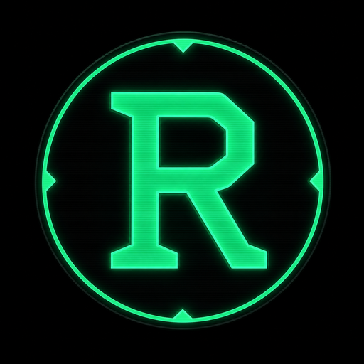

<div align="center">



# RobCo U.O.S.

### **Unified Operating System**

_An AI-powered tactical companion terminal for Fallout: New Vegas **and** Fallout 3_

[](https://github.com/zerckzzyHD/Robco-UOS/actions/workflows/deploy-staging.yml)
[](https://github.com/zerckzzyHD/Robco-UOS/actions/workflows/ci.yml)
[](https://github.com/zerckzzyHD/Robco-UOS/actions/workflows/nightly-tests.yml)


**A full CRT terminal emulation that turns a browser tab into a living Pip-Boy companion —**
**a physical RobCo device that reacts to your character's condition, with two Wastelands, an offline native toolset, and an AI Director that's optional, not required.**

[Live Demo](https://zerckzzyHD.github.io/Robco-UOS/) · [Museum](#-the-museum) · [Features](#-features) · [Architecture](#-architecture) · [Getting Started](#-getting-started) · [Development](#-development) · [Project History](#-project-history)

**Current version: 2.8.5 — "Foundations & Fidelity"**

---

</div>

## What Is This?

RobCo U.O.S. is a standalone, browser-native web application that acts as a real-time tactical companion for **Fallout: New Vegas** and **Fallout 3** playthroughs. It tracks your character, inventory, factions, quests, and world state inside a fully immersive CRT terminal, and — when you want it — connects to the Google Gemini API to act as an AI game master that narrates your adventure and updates your sheet through a strict, validated [Tri-Node JSON contract](#-the-ai-director-optional).

It began as a Google Gemini Gem (a chat preset) and grew into a complete application with its own state engine, save system, cloud sync, procedural audio, and PWA install support.

**This is not a chatbot skin.** It is a structured game engine where the AI is locked into JSON output and every value is validated before it touches your campaign — and where the heaviest, most-used tools (combat math, barter, threat assessment, lookups, medical advisories, looting) now run **entirely offline with no AI call at all**. The terminal itself physically reacts to your character's condition.

### Two games, one engine

Both games are first-class and fully data-driven. A single `GAME_DEFS` table plus per-game data files (`reg_nv`/`reg_fo3`, `db_nv`/`db_fo3`) drive everything — factions, skills, registries, databases, collectibles, theming, identity. New Vegas and Fallout 3 each get their own registries, bestiary, item data, default terminal colour, boot identity, and save-manager banner. Adding a future Fallout title is a data drop-in (a `GAME_DEFS` entry + its two data files), not a code rewrite — see [Per-game data system](#per-game-data-system) below for how it's wired.

---

## 🏛 The Museum

There's a companion site that tells the _other_ story — not what the app does, but **how it was built and kept correct**: the workflow, the failures that turned into guards, the protocols and gates, and the reasoning behind each one. It's **generated from the project's own archive** (nothing hand-narrated) and browsable like an exhibit.

**Live:** [robco-exhibit.pages.dev](https://robco-exhibit.pages.dev/) · **Source:** [zerckzzyHD/Robco-Exhibit](https://github.com/zerckzzyHD/Robco-Exhibit)

---

## ✦ Features

### 🛠️ Native Offline Tools (no AI, deterministic, free)

Six in-terminal tools compute their results **on-device from the game's own data** — zero network, zero AI, the same answer every time. Reachable from the Tool Deck (a small button beside the Comm-Link message box) or typed commands.

| Tool                      | What it does                                                                                                                                                 |
| ------------------------- | ------------------------------------------------------------------------------------------------------------------------------------------------------------ |
| **V.A.T.S.**              | Hit-% per body part, crit bonus (+5% NV / +15% FO3), and an exact melee/unarmed AP-strike optimiser; reads the equipped weapon + SPECIAL + a TARGET DT input |
| **THREAT**                | Bestiary stat card for any creature + estimated time-to-neutralize and ammo/strike burn against your equipped weapon                                         |
| **TRADE** (BARTER UPLINK) | Full offline barter terminal — buy/sell at real Fallout Barter-skill prices, confirm-gated, never auto-syncs                                                 |
| **CONSULT**               | Databank lookup across items, perks, quests, locations, companions, and creatures, with key stats; says so plainly if nothing matches                        |
| **BIO-SCAN**              | Medical advisory — HP tier, radiation, per-limb OK/CRIPPLED, addiction flags, and the right healing/rad/cure items (sourced from the game's own chem data)   |
| **LOOT**                  | Salvage intake — search the item database and add anything to your pack at its canonical value (additive + confirm-gated)                                    |

A `[FEATURES]` command registry lists every command the terminal supports and is kept honest by the build gate.

### 📟 Device Capabilities

Nine capabilities, each with a graceful fallback when the device/browser doesn't support it:

- **Sustained Power Cell** — Screen Wake Lock (keep the display awake while reading)
- **Haptic Solenoid** — Vibration feedback on level-up, faction flips, and critical HP (honours reduced-motion)
- **Eject Holotape** — Web Share of your comm-link transcript (falls back to clipboard, then file)
- **Pending-Directives Tally** — app-icon Badging with your unresolved-quest count
- **Pip-Boy Radio** — a zero-byte, fully synthesized ambient station (WebAudio)
- **Cold-Start / Degraded-Tube Boot** — a first-ever full POST plus a rare (~1 in 100) glitchy boot variant, reduced-motion-safe
- **Overseer's Log** — local device telemetry (uptime, longest session, total power-on, boot count) merged with your campaign statistics
- **High-Lumen Optics** — a high-contrast display mode (auto-on under `prefers-contrast`)
- **Immersion dial** — a Full/Balanced/Minimal control for how much ambient atmosphere the terminal runs; a per-device preference (never rides your saves), defaulting to Full. A born-compliant seam the ambient layer will subscribe to

### 🎮 Character, Combat & World

| System               | Description                                                                                                                 |
| -------------------- | --------------------------------------------------------------------------------------------------------------------------- |
| **S.P.E.C.I.A.L.**   | All 7 attributes, editable and hard-clamped 1–10                                                                            |
| **Skills**           | Per-game skill sets (NV's 13 incl. Guns/Survival; FO3's incl. Small Guns/Big Guns)                                          |
| **Limb Tracking**    | 5 limbs with cripple/restore states and unique trauma audio                                                                 |
| **Perks & Quests**   | Perk log (rank + level taken); quest log with objectives, status, and DLC tagging                                           |
| **Factions**         | Per-game reputation networks with fame/infamy, standing labels, and threshold alerts                                        |
| **World Grid Map**   | Region map with fog-of-war discovery, collectible markers, zoom, and a native "LOG VISIT" mark-visited control              |
| **Trackers**         | Collectibles (snow globes / bobbleheads), FO3 Lincoln memorabilia, NV traits, skill books (READ/UNREAD), NV skill magazines |
| **Crafting**         | Recipe + breakdown registry with a batch craft/scrap panel (workbench/campfire/recycling)                                   |
| **Inventory & Ammo** | Categorised inventory, per-caliber ammo reserves, carry weight `150 + STR×10`, one-tap USE                                  |

### 🎨 Per-Game Theming

- **Per-game default optic** — New Vegas boots in the bright RobCo green; Fallout 3 in a distinct, duller Pip-Boy green (both WCAG-AA contrast-verified). Driven by `GAME_DEFS[ctx].theme`.
- **Dynamic "(Default)" label** — the OPTICS picker tags the active game's default colour.
- **Per-game optic memory** — each game remembers its own chosen colour independently (keyed by game context; a 3rd game needs no code change).
- **Per-game identity** — a boot identity line (e.g. "PIP-BOY 3000 — MOJAVE WASTELAND UPLINK") and a save-manager banner per game.
- All colour options (RobCo Green, Pip-Boy Green, Amber, Vault-Tec Blue, Legion Red, Ghoul Green, Neon Violet) are selectable in either game.

### 🤖 The AI Director (optional)

| System                 | Description                                                                                                                                                                                                                                                                                                                                             |
| ---------------------- | ------------------------------------------------------------------------------------------------------------------------------------------------------------------------------------------------------------------------------------------------------------------------------------------------------------------------------------------------------- |
| **Gemini API**         | Direct connection via your API key. **Local-at-rest by default** — the key lives on your device; it is **transmitted to Google's Gemini API** on the calls you ask for (that is what makes it work); **optionally** synced to your own uid-scoped Firestore secret doc if you turn key-sync on; and **never committed to the repo or publicly exposed** |
| **Tri-Node JSON**      | The Director is locked to `{narrative, state, modal}` structured output (`application/json`)                                                                                                                                                                                                                                                            |
| **Validated import**   | `autoImportState()` explicitly field-maps + validates every value before it persists — the AI is never the sole source of truth                                                                                                                                                                                                                         |
| **Database injection** | The active game's full weapons/armor/bestiary/chems/recipes/vendors CSVs are sent to the AI on every message as a dedicated part of the system instruction (alongside the directive). The same per-game data also powers the native offline tools via local lookups                                                                                     |
| **Resilience**         | Bounded auto-retry with backoff, clear auth-error messaging, prompt-injection hardening, input caps                                                                                                                                                                                                                                                     |
| **Fully optional**     | The six native tools and the whole UI work with no key and no network                                                                                                                                                                                                                                                                                   |

Full outbound/inbound request lifecycle: [ARCHITECTURE.md § AI Integration Pipeline](ARCHITECTURE.md#ai-integration-pipeline).

### 💾 Saves & Cloud

- **Auto-save** (debounced localStorage), **A/B/C slots**, **file export/import** with version migration, **rolling backups** with FNV-1a checksums.
- **Live-campaign durability mirror** — the campaign you're actively playing is continuously shadowed into IndexedDB (the same durable store slots and backups already use), so if a phone reclaims the browser's local storage under memory pressure, your campaign is automatically restored on the next startup instead of starting over. Recovery-only and one-directional (a saved-behind mirror can never overwrite newer progress), and a graceful no-op when IndexedDB is unavailable.
- **Save version history** — each slot retains up to 5 prior revisions in IndexedDB (riding its headroom, never the localStorage ceiling); view and restore any earlier version from the saves list. Restoring is confirm-gated and takes a rolling backup first; if IndexedDB is unavailable the feature is simply not offered and save/load is unchanged.
- **Full backup bundle** — a one-file "EXPORT FULL BACKUP" of your entire history (live campaign + all slots with their version rings + rolling backups + chat + playstyle), version-stamped and checksummed. IMPORT SAVE auto-detects a bundle and restores it — confirm-gated, integrity-checked (a bad or edited file is refused with no partial apply), and a rolling backup of your current state is taken first. Campaign/save data only — device preferences are never included (the two-store boundary holds).
- **Read-side fail-loud save integrity (Layer 3)** — a save that can't be read at boot is **quarantined whole, never deleted**: the exact bytes are preserved (localStorage + a durable IndexedDB copy), a READ FAULT banner announces it every boot until resolved, and a QUARANTINED RECORD row in the saves list offers EXPORT (recover the raw data) and confirm-gated PURGE. A detected storage **eviction** (the browser reclaimed local data while the cold-storage boot marker survived) gets its own banner — gated behind a strict signature so a new visitor never sees a false alarm. Slot saves that only ONE of the two stores accepted post a once-per-session degraded-write notice instead of reporting plain success.
- **Cloud sync** via Firebase Firestore — additive writes only (never a blind overwrite), confirm-gated destructive actions, Google sign-in (popup-only), anonymous boot, and a Gemini-key sync option. Full save/load/sync mechanics: [ARCHITECTURE.md § Persistence Lifecycle](ARCHITECTURE.md#persistence-lifecycle).
- **Offline cloud-push queue** — a manual "Save to Cloud" pressed while offline (or that fails on network) is queued device-locally and flushed automatically on reconnect. Retry-only: it _never_ auto-pushes on a state change — cloud sync stays a manual button. Bounded + contentHash-deduped (no duplicate cloud saves), uid-scoped, kill-switch-gated, and fully fail-safe (no IndexedDB / flag off → the button behaves exactly as before).
- **Remote kill-switch** — a fail-open feature-flag config that can disable a networked feature remotely, always defaulting to last-known-good / features-enabled so it can never black-screen the app.

### ♿ Accessibility & PWA

- Keyboard `:focus-visible` rings, full `prefers-reduced-motion` freeze (CRT flicker/scanlines), `aria-live` chat, `role="dialog"` focus-trapped modals, AA-contrast tab states, and descriptive labels on every control (inventory, faction, limb buttons).
- Installable PWA (iOS / Android / desktop), offline-capable (cache-first Service Worker), with a **reliable "REBOOT TERMINAL" auto-update flow** — a focus/visibility re-check plus a durable "has-updated-before" record surface a waiting update even in an installed standalone PWA.
- Touch-first responsive layout (verified at 360 px / 412 px, no horizontal overflow); the desktop two-column shell is gated to real mouse/hover devices so a phone never boots the desktop layout.

### 🔊 Procedural Audio

Every sound is synthesized live via the Web Audio API — **no audio files ship in this project.** Typewriter clicks, Geiger counter (rads ≥ 200), tinnitus (rads ≥ 600 / crippled head), CRT hum, limb-trauma/restore tones, wake/sync tones, the boot drone, and the Pip-Boy Radio station. All respect a master mute + per-source toggles, read from an in-memory cache (never localStorage on hot paths).

### 🖥️ Terminal Immersion

CRT scanlines, phosphor persistence ghosting, thermal-load tint while the Director is thinking, day/night cycle, radiation interference, carry-weight deformation, limb-trauma glitches, karma/critical-HP flashes, a live uptime clock, a periodic memory-cycle flicker, and the redesigned in-app **FIRMWARE REVISION LOG** changelog viewer (environment-aware: staging shows in-progress notes, production shows only released versions).

---

## 🏗 Architecture

### Technology Stack

| Layer           | Technology                                       | Purpose                                                                         |
| --------------- | ------------------------------------------------ | ------------------------------------------------------------------------------- |
| **Frontend**    | Vanilla HTML5 / CSS3 / ES2022                    | Zero-framework, browser-native (global-scope script tags)                       |
| **Styling**     | CSS Custom Properties                            | Dynamic theming via `--robco-*` variables                                       |
| **Audio**       | Web Audio API                                    | Procedural synthesis — no audio files                                           |
| **AI**          | Google Gemini API                                | Optional structured-JSON game master                                            |
| **OCR**         | Tesseract.js (Apache-2.0, self-hosted, lazy)     | On-device Visual Upload text recognition (primary path, AI-vision fallback)     |
| **Cloud**       | Firebase Auth + Firestore                        | Cross-device save sync, sign-in, remote feature flags                           |
| **PWA**         | Service Worker + Manifest                        | Installable, offline-capable, reliable auto-update                              |
| **Hosting**     | GitHub Pages (prod) + Cloudflare Pages (staging) | Release-gated production; auto-deployed staging                                 |
| **Dev Tooling** | ESLint + Prettier + Vite                         | Linting, formatting, dev server                                                 |
| **Testing**     | Node + Playwright                                | Node gate (behavioural + static invariants) + boot-smoke / render / a11y checks |

### Per-game data system

`GAME_DEFS` (in `state.js`) declares each game's factions, skills, collectible label, theme, calculator coefficients, and seed inventory. `_activeDef()` returns the active game's config; a one-line `GAME_FILES` boot manifest in `index.html` selects which per-game data files to load. Feature code reads `GAME_DEFS[ctx]` rather than hardcoding game literals (Protocol 38), so the engine scales to N games by data alone.

### File Structure

`css/` is flat with a gapped numeric prefix (not subfoldered like `js/`) because in CSS the file order is load-bearing — equal-specificity ties resolve by source order, so the listing itself has to show what loads after what. `99-mobile.css` sits alone at the end on purpose.

```
├── index.html              DOM, inline handlers, GAME_FILES boot manifest, SW registration
├── css/                    13 order-prefixed files (2.8.5 U-A2 split + the FO3 Pip-Boy build), source order = cascade order —
│   ├── 05-base.css            Tokens, reset, layout, app-shell
│   ├── 10-chrome.css          Device chrome (bezel/casing/glass) + per-game identity
│   ├── 15-overseer.css        Director Uplink / Overseer presence
│   ├── 20-diagnostic-shell.css Diagnostic Shell mobile overlay (dev-only)
│   ├── 25-toolbar.css         Tool Deck + Quick-Draw Holster (+ global a11y/reduced-motion)
│   ├── 30-modulebay.css       Module Bay (Security & Configuration)
│   ├── 35-operator-boards.css Phase 3 Operator boards (batches 1-3)
│   ├── 40-curio-operations.css Curio Archive + Operations console
│   ├── 45-databank.css        Databank / Records Bay
│   ├── 50-chassis.css         Chassis diagnostic bay + Living Core
│   ├── 55-feedback-animations.css Feedback Animation Waves 1-3
│   ├── 60-fo3-pipboy.css      FO3 landscape Pip-Boy casing/glass skin — [data-game='FO3'] only, NV untouched
│   └── 99-mobile.css          Mobile Density Standard — MUST stay last (cascade order)
├── js/                     Reorganized into subfolders by responsibility (2.8.5 U-A2)
│   ├── data/               Fallout game content: item DBs + registries
│   │   ├── db_nv.js            FNV game CSV data + lookups
│   │   ├── db_fo3.js           FO3 game CSV data + lookups
│   │   ├── reg_nv.js           FNV Fallout Data Registry (read-only)
│   │   ├── reg_fo3.js          FO3 Fallout Data Registry (read-only)
│   │   └── registry-core.js    Shared registrySearch() (game-agnostic, both contexts)
│   ├── core/               The engine: campaign state, ambient runtime, storage layer
│   │   ├── state.js            State, persistence, migration, GAME_DEFS, THEMES, _activeDef()
│   │   ├── runtime.js          Ambient Runtime — lifecycle state machine + heartbeat + observer registry
│   │   └── idb.js              Async IndexedDB durability engine (device-pref write-through shadow)
│   ├── ui/                 UI lifecycle hub, panels, render/audio/save/account modules
│   │   ├── ui-core.js          UI lifecycle hub — AudioSettings, loadUI, updateMath, window.onload boot orchestrator
│   │   ├── ui-core-nav.js      Bezel subsystem nav — selectSubsystem, switchTab, SHORTCUT_ROUTES
│   │   ├── ui-core-overseer.js Director Uplink — setOverseerState, scope canvas, composer wiring, Tool Deck launcher
│   │   ├── ui-core-chassis.js  THE LIVING CORE + CHASSIS panel — _coreRefresh, System Status, Service & Fault Console
│   │   ├── ui-core-modulebay.js Module Bay wiring, phosphor-tube/immersion-dial/wake-lock clusters, campaign-config board
│   │   ├── ui-core-cmd.js      Command layer — native stat setters, COMMAND_REGISTRY, core event-bus subscriber wiring
│   │   ├── ui-render.js        Render-pipeline hub (2.8.5 U-A4 split) — only _updateContextPanels
│   │   ├── ui-render-inventory.js  Cargo Manifest & Ammo — addItem/delItem/renderInventory/renderAmmo
│   │   ├── ui-render-character.js  Character & Field Status — squad, clock/calendar, faction standing, status, perks, quests
│   │   ├── ui-render-record.js     Personal Record — session tally, equipped gear, collectibles, Lincoln memorabilia, traits
│   │   ├── ui-render-ledger.js     Field Ledger — skill books/magazines tracker, campaign notes, chronicle event log
│   │   ├── ui-render-map.js        Cartography Table — renderWorldMap SVG, zone zoom/travel, node keyboard nav
│   │   ├── ui-render-factions.js   Faction Reputation & Karma — adjustFaction, renderFactionRep, Karma Center
│   │   ├── ui-render-economy.js    Resource Economy — Craft panel, native Trade barter terminal
│   │   ├── ui-render-loot.js       Item Acquisition — native Loot terminal, Visual Upload OCR apply flow
│   │   ├── ui-render-databank.js   Native Databank Tools — Threat, Consult, Eligible Perks, Databank panel, Bio-Scan
│   │   ├── ui-audio.js         Audio engine, boot sequence, optics (THEMES table)
│   │   ├── ui-saves.js         Save slots, file import/export, rolling backups, autocomplete
│   │   └── ui-account.js       Account/UPLINK panel, cloud save picker, save-manager header
│   ├── services/           Everything that talks to the outside world
│   │   ├── api.js              Network-layer hub — transmitMessage lifecycle, comm-config cache, fetchAuthorizedModels
│   │   ├── api-directive.js    getSystemDirective + its 8 _directive* section builders (Suite 131 golden-master)
│   │   ├── api-import.js       AI → state import — autoImportState, sanitizeImportedContainer
│   │   ├── api-router.js       Offline native command routing — NATIVE_COMMAND_ROUTER, quick-log, transmitTerminal
│   │   ├── cloud.js            Firebase auth + Firestore push/pull + remote config (ES module)
│   │   └── ocr.js              Visual Upload on-device OCR: lazy Tesseract.js, parser, hybrid routing + kill-switch
│   ├── dev/                Dev-only tooling
│   │   └── test-console.js     Diagnostic Shell (gated by _devConsoleUnlocked())
│   └── vendor/             Self-hosted Tesseract.js (Apache-2.0) — main API, worker, wasm core
├── sw.js                   Service Worker (cache-first, atomic precache, reliable update)
├── manifest.json           PWA manifest (version-less name + app shortcuts)
├── tests/
│   ├── robco-diagnostics.js   Node persistence/structure audit (the single canonical runner)
│   ├── test.html              Browser-side runtime import-contract audit
│   └── *.mjs                  Playwright boot-smoke / render-check / a11y-baseline
├── scripts/gate.js         The full local gate (lint, format, the Node runner, browser checks)
├── ARCHITECTURE.md         Full system dependency map & patterns
├── CHANGELOG.md            Version history (in-app FIRMWARE REVISION LOG reads this)
├── CLAUDE.md               Agent rulebook — the universal contract + the retrieval map
├── SPINE.md                The shared facts, written once: repo map, visibility, doctrine sentences, canonical file locations (every instruction file points here)
├── rules/                  Subsystem rule notes, loaded only when that surface is touched
│   ├── state-and-save.md      State fields, saves, migration, durability
│   ├── deploy-and-cache.md    Service worker, CACHE_NAME, deploy verification
│   ├── auth-and-cloud.md      Auth hard rules, cloud write safety, kill-switch
│   ├── ui-and-mobile.md       Panels, mobile baseline, UX stability, the UI-* protocols
│   ├── audio.md               Adding an audio source
│   ├── game-data.md           Provenance + game-agnostic feature code
│   ├── ai-contract.md         Tri-Node schema safety + AI determinism
│   ├── file-layout.md         Boot order (machine-checked), repomix, UTF-8 integrity
│   ├── testing-and-gates.md   Static guards, test.html sync, Diagnostic Shell triggers
│   └── docs-and-library.md    Changelog style, doc-reference integrity, the library model
└── assets/                 PWA icon + app-shortcut icons, ocr/ (vendored OCR language data)
```

### Script Load Order

Global-scope `<script>` tags load in strict order (per-game db/reg pair is chosen by the boot manifest). The canonical, gate-checked list lives in one place — `rules/file-layout.md`'s `LOAD-ORDER-GUARD` block — machine-verified against `index.html` on every commit (Suite 220.3/220.4). This file previously carried its own hand-copied third copy of that same list; it was deleted rather than kept in sync, to remove a drift surface rather than add a third check to police it (Protocol 36b, QUEUE.md item U candidate #13).

`ARCHITECTURE.md` is the canonical deep reference (persistence lifecycle, audio chain, boundaries) — task-retrieved by section (R10 Step 3), not read wholesale. The current add-a-field/audio/panel checklists live in `rules/*.md`.

---

## 🚀 Getting Started

### Prerequisites

- [Node.js](https://nodejs.org/) — the version pinned in `.nvmrc` (currently Node 24, the active LTS line). Dev tooling only; not required to run the app. Both the local gate and CI (Linux + Windows) read this same file so every environment runs one Node version.
- A [Google Gemini API key](https://aistudio.google.com/apikey) — **optional**; the native tools and the whole terminal work without one

### Installation

```bash
git clone https://github.com/zerckzzyHD/Robco-UOS.git
cd Robco-UOS
npm install        # dev dependencies (ESLint, Prettier, Vite, Playwright)
```

### Local Development

```bash
npm run dev        # Vite dev server with hot reload (typically http://localhost:5173)
```

**Testing on a real phone (the fast inner loop).** One command starts everything:

```bash
npm.cmd run dev:start     # start Vite detached + ensure the tailnet proxy
npm.cmd run dev:status    # running? on which branch? is the proxy aimed at it?
npm.cmd run dev:stop      # stop it and free the port
```

`npm.cmd`, not `npm` — PowerShell's execution policy blocks `npm.ps1` over SSH; `node scripts/dev-server.js start` works too. The server is started **detached**, so it survives closing the SSH tab, and `dev:start` is safe to re-run: it no-ops if the server is already up and refuses outright rather than stacking a second one on a busy port. It reports the checked-out **branch** and warns loudly when that is not `dev`, but never switches branches for you. It is a detached process and not a service, so it does **not** survive a reboot, the machine sleeping, or Tailscale dropping — run `dev:start` again after any of those.

The dev server binds to loopback, so a phone cannot reach it directly. With [Tailscale](https://tailscale.com/) on both the PC and the phone, `tailscale serve` puts an HTTPS origin with a valid cert on the tailnet in front of it — `dev:start` re-ensures that proxy every time, and you open that URL on the phone. The HTTPS is the whole point: Chrome grants secure-context only on `https://`, `localhost` and `127.0.0.1`, so over plain HTTP `navigator.serviceWorker` does not exist at all and the entire PWA layer (service worker, update prompt, offline, install-to-home-screen) is untestable. Two settings in `vite.config.mjs` make this work and **both are required**, because each fixes a different half: `server.allowedHosts` names the tailnet hostname (Vite blocks any Host header it was not told about), and `server.host` pins the bind to `127.0.0.1` (Vite defaults to the bare name `localhost`, which resolves to the IPv6 loopback first, leaving nothing on IPv4 for the proxy to reach). The two failures look alike but are not: a bare **502** means the bind is wrong, a **Blocked request** page means the host list is. Fixing only one leaves it just as broken. A different machine or tailnet needs its own `allowedHosts` entry. Requires `tailscale serve` to be running; the config entry alone does nothing. This **complements** the staging deploy below rather than replacing it — staging is still the route for anything other people need to see.

### First Run

1. Open the terminal and let the boot sequence finish.
2. Pick your game (New Vegas or Fallout 3).
3. _(Optional)_ Paste a Gemini key in Configuration → **VALIDATE KEY & FETCH ENGINES**, then pick a model — only needed for the AI Director.
4. Start playing: type commands or free text in the Comm-Link, or use the native tools (VATS, TRADE, THREAT, CONSULT, BIO-SCAN, LOOT) with no key at all.

### Hosting & Release Flow

This is a **static site** — no build step to run it.

- **Production:** GitHub Pages at **https://zerckzzyHD.github.io/Robco-UOS/**, built from `main` and **release-gated** — it publishes only on a version release.
- **Staging:** a private Cloudflare Pages build from `dev` (`robco-uos-dev.pages.dev`) for real-device testing, auto-deployed on every dev push and stamped as a DEV BUILD.
- **Post-deploy release receipt:** `npm run release-receipt` — a manual after-a-deploy check (not a gate step) that fetches the LIVE site and confirms the served version + cache stamp match the deployed commit, so a silently-failed update ("pushed ≠ live") is caught loudly instead of leaving users on stale code. It names the parts only a real device can confirm (installed-PWA upgrade, save survival, auth) and leaves those to you.

---

## 🛠 Development

### Available Scripts

```bash
npm run lint        # ESLint (zero warnings)
npm run format      # Prettier
npm run dev         # Vite dev server
npm run dev:start   # start the dev server DETACHED (survives closing the tab) + ensure the tailnet proxy;
                    # idempotent, reports the checked-out branch, never switches it
npm run dev:stop    # stop the detached dev server and free its port (kills the whole process tree)
npm run dev:status  # branch + whether it is running + whether the tailnet proxy points at it
npm run gate        # FULL gate: lint + format + Node runner + boot-smoke + render + a11y + test.html
npm run gate:fast   # Fast subset run by the pre-commit hook
npm run gate:docs   # CPB4 doc-only push fast path (lint + format + Node runner + static checks, NO browser); selected automatically by the pre-push hook when a push touches only docs
npm run gate:iter   # OPT-IN iteration pre-check (lint changed + format + Node runner); never a commit/push gate
npm run push        # ACT3/DG2 — route this push through the control-plane controlled-push wrapper (L4 lock + intent/verify receipt + clean-push counter); delegates the gate to the pre-push hook (CPB4 fast path preserved) and degrades to a plain `git push` when the private wrapper is absent. With DG2 active, a raw `git push` is REFUSED — this is the required path (see Push Guard below)
npm run cloud-check   # A3 — modeled cloud-serialization guard against the live state literal; also runs as gate step 4b
npm run test:emulator # A4 — OPTIONAL real-Firebase-emulator round-trip (save→sync→load); needs a JDK/JRE 11+ installed
                       # on your machine + the firebase-tools/firebase dev deps (already in package.json); NOT a gate
                       # step — confirmation upgrade over cloud-check, run on demand (QUEUE.md item A4)
```

### Quality Gate

Commits and pushes are blocked unless the gate is green. The pre-commit hook runs the fast subset (lint, format, the Node test runner); the pre-push hook + CI run the full gate (adds Playwright boot-smoke, a 360/412 render-check, an accessibility baseline-diff, and the `test.html` runtime audit). A push whose diff touches **only** docs (`*.md` / `planning/**`) skips the browser checks and runs `gate:docs` instead — a fail-closed fast path (CPB4): any app-code, mixed, renamed/deleted-code, or uncertain diff runs the full gate. A `CACHE_NAME` bump is required whenever a served file changes. No test count is tracked anywhere — the runner's exit status is the only signal that matters (`CLAUDE.md`, Protocol 2a).

### Commit Workflow (dev-branch model)

All unreleased work goes to **`dev`**; **`main` is release-only**. Each commit keeps the docs current and bumps `CACHE_NAME` when a served file changes.

```
npm run lint && npm run format
git add -A
git commit          # pre-commit: cache-bump guard, then fast gate (Node runner)
npm run push        # DG2: pushes route through the controlled-push wrapper (a raw `git push` is refused)
```

### Push Guard (DG2 — raw-push refusal)

Once the controlled-push wrapper had run **≥10 clean pushes** (the ACT3 counter), push-guard enforcement was activated (2026-07-30). A pre-push hook now **refuses a raw `git push`** — any push not routed through the wrapper (`npm run push`) — in both the app repo and the private control repo, and tells you to use `npm run push`. The wrapper takes an L4 push lock, records a push intent, pushes, independently re-verifies the remote with `git ls-remote`, and files a receipt. The guard requires two independent proofs (the wrapper's env token **and** a live L4 process-ancestor), so a bare env var can't forge it.

It never blocks a checkout that lacks the private control plane (e.g. a public clone): the hook `[ -f ]`-guards the guard script on the `../_RobCo-Control` sibling (overridable with `ROBCO_PUSH_GUARD`) and simply skips it when absent.

**Break-glass — you can never be locked out of your own repo** (two independent escapes):

```
ROBCO_PUSH_OVERRIDE="<reason>" git push   # allowed AND recorded to the control-plane ledger (never silent)
git push --no-verify                       # bypasses ALL git hooks — the absolute fallback if the wrapper/guard itself is broken
```

**Honest ceiling:** the guard enforces _routing_ (advisory against an accidental raw push; `--no-verify` bypasses it by design — that is the point of the break-glass).

**Control-repo gate (CPB6 — shipped in the same session):** the control repo now runs its own test suite as the wrapper's gate. A control-repo wrapper push runs `node test/run-tests.js` **before** pushing and **aborts on failure**, recording `gate.passed`, not `gate.skipped` — so a control-repo push is both routed through the wrapper (DG2) **and** genuinely gated (CPB6). The app repo is unchanged: it still delegates its own gate to this pre-push hook (CPB4 fast path intact).

### Naming Domains (ND1 — cross-repo reserved terms)

This app and the private control plane share a project name but not a runtime, and both were circling the word **"events"**: the app owns `RobcoEvents` (the client-side game/UI bus in `js/core/state.js`), the control plane owns **"ledger events"** (its appended, replayable records). Nothing clashes in code today; ND1 keeps it that way as both grow.

`tests/naming-domains.json` declares which vocabulary belongs to which domain — and, just as importantly, which terms are **shared** and may never be reserved (`ledger`, `event`, `receipt`, `incident`, `proposal` — this app has shipped a Field Ledger panel and a release-receipt script for months, so only the compound "ledger event" is the control plane's). The file is duplicated byte-identical into the control repo; the two repos share no package, so **each self-checks**: **Suite 257** here scans `js/**` for control-plane-reserved names, and the control repo's test group **ND** does the mirror-image scan of its own sources. No cross-repo runtime coupling, and each side degrades to "sync unverified" — never a failure — when the sibling checkout is absent. Full design → [`ARCHITECTURE.md`](ARCHITECTURE.md#cross-repo-naming-domains).

---

## 📜 Project History

For the full history — how this went from a Google Gemini chat preset to a two-game physical RobCo terminal, the failures that turned into guards, and the reasoning behind each protocol — see [the Museum](https://robco-exhibit.pages.dev/) ([source](https://github.com/zerckzzyHD/Robco-Exhibit)). It's generated from the project's own archive, not hand-narrated.

## Current State (v2.8.5)

A **production-quality, two-game browser application** with:

- **Both Fallout: New Vegas and Fallout 3** as fully data-driven game contexts (`GAME_DEFS`, per-game registries/databases/theming/identity)
- **Six native offline tools** (V.A.T.S., TRADE, THREAT, CONSULT, BIO-SCAN, LOOT) — deterministic, no AI, plus a self-checked command registry
- **Nine device capabilities** (Wake Lock, Vibration, Web Share, Badging, Pip-Boy Radio, cold-start/degraded boot, Overseer's Log, High-Lumen Optics, Immersion dial)
- **Per-game theming** — per-game default optic, dynamic "(Default)" label, per-game colour memory, per-game boot/save identity
- **Device bezel chrome** — the app renders inside a physical RobCo terminal casing, with the old tab bar replaced by an illuminated subsystem selector (OPERATOR/OPERATIONS/DATABANK/UPLINK/CHASSIS/SETTINGS + a flat DIRECTORY fallback) that routes through the same underlying tab router; CHASSIS hosts device telemetry + firmware/carrier/feature-flag status, and SETTINGS is the one home for Account, the Module Bay, Save Archive, and Campaign Configs
- **Fallout 3 landscape Pip-Boy** — rotate a Fallout 3 campaign sideways and the same three subsystem keys, the UPLINK/CHASSIS/SETTINGS controls, and a flat directory recast as a real Pip-Boy 3000 casing: three domed lamps reading STATS/ITEMS/DATA (with their real names riding along underneath), a radio knob with a swinging tuner pointer, a status gauge with a needle and chrome ring, and a toggle switch with a real lever, all set in a dark, weathered metal casing that now wraps the glass on both sides with a system-status gauge, an embossed nameplate, and a brand plate above the screen, matching the real device's housing. Each of the six main screens is noticeably denser and closer to the game — S.P.E.C.I.A.L. shows a fill bar per attribute, body-part health boxes are labeled, and your Vault Boy figure now shows a dashed outline and the word CRIPPLED on a damaged limb, exactly like the real damage screen. Each screen's sub-sections get their own dash-separated row of tabs on the glass, scroll inside a bounded display that the casing can never cover, and remember which one you last had open. Portrait keeps today's layout untouched, and New Vegas is unaffected either way; a hand-inked Vault Boy figure (with distressed face and dashed CRIPPLED states) is now drawn in, while indicator sway and a working knob detent are still to come
- **Schematic View — the flat fallback, per machine** — the Module Bay's hardware boards have a permanent plain-list alternative that now covers every control the bay owns (all 14 sound-channel chips derived live from the bay itself, the AI key/engine/handshake, and the campaign-log export + app installer), sized to the mobile tap-target floor, and framed in each machine's own voice (a RobCo field service schematic on New Vegas, a Vault-Tec maintenance diagram on Fallout 3) while keeping identical control names and slot numbers so the two views can never disagree. Your choice of view is remembered across reloads. A build check enforces bay↔schematic parity, so a new board can't quietly go missing from the flat list
- **Director Uplink — the living Overseer** — the Comm-Link is reskinned as a phosphor-oscilloscope presence whose waveform reacts to the real AI lifecycle (listening/thinking/speaking/no-carrier/offline), with a per-game status strip and a self-contained mobile view
- **Tool Deck + Quick-Draw Holster** — a zero-footprint launcher key beside the Comm-Link message box raises a bottom-sheet deck for the six native tools, and the old blind D-Pad shortcuts are redesigned into four gear-vector sockets that show, fire, and let you rebind your quick-draw gear
- **OPERATIONS — the quartermaster's freight console** — your inventory screen reads as freight-handling hardware: a LOAD-CELL WEIGH BRIDGE bends a physical load beam in live proportion to your carry weight (nominal/amber/SEIZED), a six-drawer CARGO MANIFEST replaces the flat item filter with pull-drawers that scroll in place (every item reachable, nothing capped), items can be equipped or bumped in quantity right from their row, and FIELD FABRICATION/BARTER UPLINK/SQUAD ROSTER/CURIO ARCHIVE match the same hardware language (with SQUAD ROSTER's companion list now correctly reading each game's own roster)
- **OPERATOR — SKILL MATRIX / STATUS EFFECTS / FACTION STANDING reskins** — your skills show as a 13-channel drag-to-set VU meter array, active status effects light up as color-coded compound lamps (buff/debuff/neutral) with a tick countdown and purge key, and faction standing is one shared INFAMY◂▸FAME reputation console with a per-faction channel selector and an all-faction mini-pin strip so nothing is hidden
- **DATABANK — The Records Bay** — your world map is a real spatial "Phosphor Cartography" chart: surveyed locations glow as connected nodes tracing a known-route trail, a radar sweep and a blinking "YOU ARE HERE" marker bring it to life, and uncollected snow globes/bobbleheads/Lincoln memorabilia show as distinct signal-return glyphs; your quest log is a numbered directive rack with status lamps, a filterable status drawer bank, and a native CYCLE key to advance a quest's status yourself; the databank search, campaign record, campaign notes, and session stats all match with an amber query terminal, a tape-spool chronicle, a filterable field-notes ledger, and a mechanical odometer counter bank
- **Full character/world systems** — SPECIAL, per-game skills, limbs, perks, quests, factions, world-grid map with mark-visited, and trackers (collectibles, Lincoln memorabilia, traits, skill books, magazines) + a crafting panel
- **Native USE + TERMINAL stat edits** — using an aid item now applies its real effect (heal, rads, limb repair, a timed buff, clearing an addiction or poison) instantly and offline, with no AI round-trip; typing straight into the TERMINAL command line can set or nudge any stat, SPECIAL attribute, or skill, or grant a level, all deterministic and fully offline
- **[GPS]/[MAP] and eligible-perks lookup — native, no AI** — the compass-grid command now jumps straight to the CARTOGRAPHY TABLE instead of round-tripping to the AI; leveling up reports your real skill-point pool (10 + INT/2) so you can allocate it yourself via SKILL MATRIX, without moving your scroll position; and a new `[PERKS]`/`[PK]` command lists every perk you already qualify for at your current level, straight from the registry
- **TRAVEL HERE on the world map — native, no AI** — tapping a location's sector sheet on the CARTOGRAPHY TABLE now offers a TRAVEL HERE button beside MARK SURVEYED, instantly setting that location as your CURRENT position (and marking it visited) with no AI round-trip
- **Visual Upload — native on-device OCR, AI-vision fallback** — attaching a screenshot now scans it right on your device by default (self-hosted, lazy-loaded Tesseract.js), works fully offline after first use, and shows a review screen you confirm before anything is added; if the on-device scan is unavailable or fails, it hands off to the existing Gemini-vision path automatically, or on request via a TRY AI VISION button — both are remotely kill-switched with a graceful "add items manually" fallback if neither is available
- **Ceremony Moments** — starting a new campaign runs a short, skippable commissioning sequence instead of two bare reset lines; the Director now greets you the first time you open the Uplink each session; a post-update boot calls out the update with a POST line, a casing glint, and a highlighted revision-log button; returning after a few days away gets a quiet "recalibrating" boot line; and Module Bay/cartridge/Tool Deck installs now get a consistent physical settle flourish (SEAT, the third Protocol UI-9 motion verb)
- **Tighter mobile boards** — on narrow phones, board spacing, faction/status/perk/skill tiles, and the Director Uplink transcript all sit a little closer together, trimming a noticeable amount of scrolling with every tap target still comfortably above the minimum touch size
- **Diagnostic Shell** _(dev/staging-only)_ — the developer console is re-founded on a data-driven tool registry with a two-signal environment gate, so a future non-destructive sandbox and an owner-only toolbench can share one panel without ever leaking a destructive tool to a live player; every existing dev control still works exactly as before
- **Optional AI Director** — Tri-Node JSON, validated import, resilient + prompt-injection-hardened
- **Saves & cloud** — auto-save, A/B/C slots (with confirm-gated overwrite/delete + version history), export/import + migration, rolling checksummed backups, additive Firestore sync (with its own confirm-gated overwrite/delete + version history), Google sign-in, remote kill-switch, per-game filtered saves list, read-side fail-loud integrity (corrupt saves quarantined + recoverable, eviction detection, degraded-write notices)
- **Isolated boot** — each of the ~50 startup phases runs under its own guard, classified fatal or degradable: a non-essential phase that fails no longer silently abandons every phase after it (the terminal carries on and names the failed subsystem in the transcript + the FAULT ring-buffer), and one of the three genuinely unrecoverable phases paints a self-contained BOOT FAILURE screen naming the phase, with a RETRY control, instead of a blank terminal. Design: [ARCHITECTURE.md § Boot Isolation](ARCHITECTURE.md#boot-isolation-hg2)
- **Accessibility + PWA** — focus rings, reduced-motion, live regions, dialog focus traps, AA contrast; installable, offline, reliable auto-update; touch-first responsive
- **Wiki-sourced data** — per-game Fallout Data Registries + combat databases (weapons, armor, bestiary, chems, recipes, vendors, quest items), all from the Independent Fallout Wiki
- **A self-improving gate** — a broad behavioural and static-invariant suite in the canonical Node runner, plus Playwright boot-smoke / render-check / a11y baseline and a `test.html` runtime audit; CI + a nightly run back it up

---

## 🗂 Additional Documentation

| Document                           | Description                                                                                                  |
| ---------------------------------- | ------------------------------------------------------------------------------------------------------------ |
| [ARCHITECTURE.md](ARCHITECTURE.md) | System dependency map, persistence lifecycle, audio chain, boundaries — rationale, task-retrieved by section |
| [PRIVACY.md](PRIVACY.md)           | Plain-English privacy policy — what is stored, where, and how to delete it                                   |
| [CHANGELOG.md](CHANGELOG.md)       | Full version history (also read by the in-app FIRMWARE REVISION LOG viewer)                                  |

---

<div align="center">

_RobCo Industries (TM) — Unified Operating System_
_Copyright 2075-2077 RobCo Industries_

_Built with vanilla JavaScript, procedural audio, and an unhealthy obsession with CRT aesthetics._

_Game data sourced from the [Independent Fallout Wiki](https://fallout.wiki) under [CC-BY-SA 3.0](https://creativecommons.org/licenses/by-sa/3.0/)._

</div>
